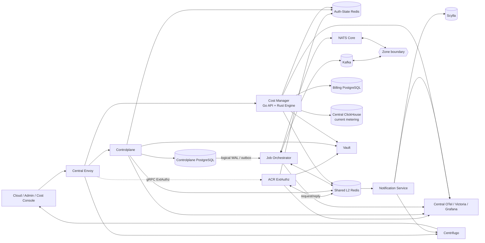
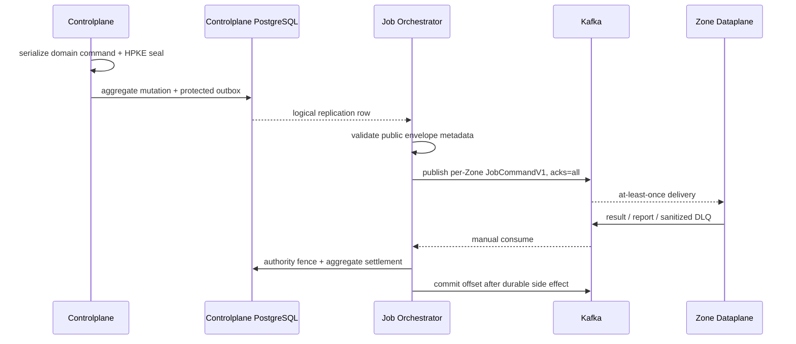
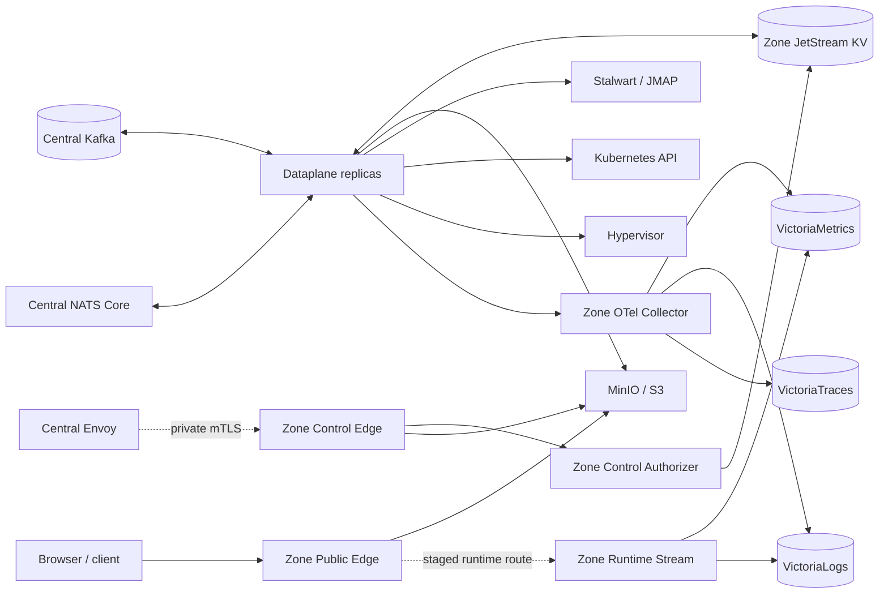

# Aurora Architecture

Aurora separates runtime into one Central cluster and one or more Zones.
Central owns business authority and orchestration. A Zone executes only the
workload assigned to that Zone, stores runtime projections, and serves the
data/read plane at the edge.

Detailed workflow contracts live in [`god_view/`](./god_view/). Shared wire
contracts live in [`proto/`](./proto/). This document describes system-level
topology and ownership.

Detailed architecture contracts are maintained separately for [Central–Zone
transport](./architecture/CENTRAL_ZONE_TRANSPORT.md), [Vault connection and
crypto bootstrap](./architecture/VAULT_CONNECTION_BOOTSTRAP.md), [Zone
Edge](./architecture/ZONE_EDGE.md), and [platform telemetry](./TELEMETRY.md).

## 1. Central

### Topology



Storage metering is being moved to a Zone-local journal and a versioned report
transport. The staged path is `Zone Public Edge -> Zone OTel -> Zone
ClickHouse -> Zone Control report outbox -> Kafka -> Job Orchestrator -> Shared
Redis -> Cost Engine -> Billing PostgreSQL`. The Zone Control publisher and
Cost Engine relay are implemented but remain opt-in; until the settlement and
reconciliation gates pass, the Central ClickHouse edge above remains the
current billing dependency and the new path must not run concurrently with it.

### Components and ownership

| Component | Owns | Does not own |
| --- | --- | --- |
| Central Envoy | TLS, virtual hosts, route selection, body bounds, ExtAuthz invocation | Password/session verification or business authorization |
| ACR | Trinity/Billing/SRE session, proof, cookie issuance, and trusted identity headers | IAM PostgreSQL or business aggregates |
| Controlplane | IAM, hierarchy, workspace, storage, mail, hypervisor, and managed-service desired state/outbox | Zone runtime state or billing ledger |
| Job Orchestrator | WAL changefeed, command dispatch, result settlement, repair, and reconciliation | Zone private keys, Zone KV, or workload side effects |
| Notification Service | Self-user timeline/inbox projection and realtime publish adapter | IAM, job lifecycle, or resource aggregates |
| Cost Manager | Pricing, plans, wallet, ledger, payment, ownership projection, and usage rating | Controlplane PostgreSQL |
| Zone Control | Fenced Zone-wide orchestration, transfer tickets, and opt-in closed-window storage report outbox/Kafka relay | Wallet mutation, payer inference, Central ClickHouse billing |
| Vault | Workload bootstrap identity, connection records, and Transit keys | User or resource business state |

### Request plane

```text
Browser -> Envoy -> ACR ExtAuthz -> Controlplane | Cost Manager | Centrifugo
```

1. Envoy terminates TLS and selects the virtual host.
2. The API request is sent to ACR through Envoy gRPC ExtAuthz.
3. ACR verifies session, proof, and Zone context using Auth-State Redis, Shared
   Redis request/reply, and Vault.
4. ACR removes or overwrites identity headers supplied by the client.
5. Envoy forwards the request to the selected backend.
6. The backend still performs domain authorization; frontend visibility never
   replaces backend enforcement.

Static frontend routes disable ExtAuthz. The Cloud Billing prefix routes to
Cost Manager. Cost Console uses a host-bound Billing Alias and reuses IAM
Render Context only through a narrow route.

### Controlplane module graph

Controlplane bootstraps in this order:

```text
Security -> Observability -> PostgreSQL/Redis/Kafka -> Migrations
         -> HTTP engine -> Module graph -> gRPC -> Routes
```

Dependency direction inside a domain:

```text
HTTP handler -> domain service -> repository -> PostgreSQL
```

The principal modules are:

- Critical tier: `hierarchy`, `iam`, `managedservice`.
- Graceful degradation: `hypervisor`, `mail`, `storage`.
- Shared support: `cacheengine`, `observability`, `security`, and global HTTP
  middleware.

Migrations run in one transaction under an advisory lock:

```text
Hierarchy -> IAM -> Managed Service -> Mail -> Hypervisor -> Storage
```

### Durable command and result plane



Controlplane seals every Zone-bound payload with HPKE. JO does not decrypt; it
relays the committed ciphertext byte-for-byte. Results are compared with
authoritative outbox metadata before the aggregate changes.

### Notification and timeline plane

```text
ACR / Controlplane / Cost -> stream:{user_activity}
Job Orchestrator          -> stream:{job_notifications}
Shared Redis Streams      -> Notification Service -> Scylla
Notification Service      -> Centrifugo -> Browser
```

Activity and job notifications use at-least-once Stream consumers. Notification
Service persists to Scylla before ACK/publish. Runtime wake-up uses Shared
Redis Pub/Sub, which is soft state and does not replace the authoritative
API/snapshot.

### Billing plane

Cost Manager API and Engine use a separate Billing PostgreSQL:

- The Go API runs migrations, REST workflows, the authorization projection, and
  the Redis consumer.
- The Go API starts the Rust Engine with a separate Vault identity.
- The Engine reads usage from ClickHouse, pins an immutable pricing version, and
  writes the wallet/ledger.
- A Redis lease, durable fencing, a wallet row lock, and a deterministic ledger
  ID prevent duplicate debits.

### Central state map

| Store/transport | Role |
| --- | --- |
| Controlplane PostgreSQL | Business Source of Truth for identity/resource desired state |
| Billing PostgreSQL | Billing Source of Truth |
| Auth-State Redis | Runtime security state and authorization projection; failure must fail closed |
| Shared L2 Redis | Request/reply, cache, Pub/Sub, bounded Stream, lock, and checkpoint |
| Kafka | Durable Central↔Zone command/result/report transport |
| NATS Core | Central↔Zone soft-state transport; JetStream is not enabled |
| Scylla | Durable self-user timeline/inbox projection |
| ClickHouse | Usage/OLAP input for billing |
| Victoria stack | Diagnostic telemetry, not business state |

### Current deployment state

- Local Central Compose runs three Controlplane replicas but only one Kafka KRaft
  broker with replication `1`.
- Notification Service is already used by Centrifugo as the connect proxy.
  Dev Envoy has no separate upstream for timeline HTTP routes; generic `/api/`
  currently routes to Controlplane.
- Cost Compose/Kubernetes publishes `9094`, but the Go API does not currently
  initialize or serve gRPC; the active API surface is HTTP `8084`.
- Notification code currently uses Vault to resolve Redis/Scylla connections,
  although an older God View describes a boundary without a Vault connection.
- [`k8s/`](./k8s/) is a selected manifest set and is not yet at parity with the
  complete Central Compose stack.

## 2. Zone

### Topology



### Components and ownership

| Component | Owns | Boundary |
| --- | --- | --- |
| Dataplane | Job intake, worker pool, leader election, admission, executor, and result/report | Exactly one Zone; no Central DB/Redis credential |
| Zone JetStream KV | Metadata/config projection, current health, and CAS lease/fencing | Zone-local; not Central NATS |
| Zone Public Edge | Ticket-gated object/image transfer and runtime ingress | Does not receive Central cookies, ACR assertions, or Zone KV credentials |
| Zone Transfer Ticket Issuer | Issue/revoke one-time ticket state in Zone KV | Receives only grants injected by Zone Control Authorizer |
| Zone Public Authorizer | Consume and CAS the ticket before a data stream | Reads only Zone transfer KV; does not infer ownership |
| Zone Control Edge | Private control capability over mTLS | Accepts only the Central Envoy workload identity |
| Zone Control Authorizer | Signed assertions, request binding, and Zone access policy | Not a gateway or ownership database |
| Zone Runtime Stream | Stateless SSE read plane from Victoria | Read-only telemetry; does not change lifecycle state |
| Zone OTel/Victoria | Zone-local logs, metrics, and traces | Diagnostic-only |

### Central ↔ Zone contract

Only two transports cross the boundary:

| Transport | Data | Durability |
| --- | --- | --- |
| Kafka | Per-Zone command, result, report, metadata query/snapshot, and storage size | Durable, at-least-once, manual commit |
| NATS Core | Runtime watch/report and soft-state updates | Best effort; messages may be lost |

There is no shared platform command topic. Each Dataplane subscribes only to:

```text
aurora.jobs.commands.zone.<zone_uuid>.v1
```

The topic, `target_zone_id` envelope, and Zone configuration must agree.
Cross-Zone or malformed messages fail closed and settle only after a sanitized
durable DLQ record is written.

JO has no Zone KV credential or HPKE private key. Dataplane has no
Controlplane/Billing PostgreSQL, Auth Redis, Shared Redis, or Vault credential.

### Dataplane runtime

Dataplane startup:

```text
Load config + read-only HPKE keyring
-> connect Kafka / NATS Core / Zone KV
-> bootstrap Zone projection
-> build worker/leader/executor graph
-> accept jobs
```

Execution path:

1. Poll the per-Zone Kafka command with a manual consumer.
2. Validate size, schema, trace context, route, and Zone binding.
3. Open the HPKE payload with the private key from the read-only Zone mount.
4. Admit the job through the bounded queue and Ready-worker budget.
5. Acquire a fenced job lease in the Zone Coordination KV.
6. Execute the idempotent storage/mail/hypervisor/managed-service adapter.
7. Publish a durable result, retry, or DLQ record.
8. Commit the contiguous terminal offset; a result that is not durable cannot
   settle its source.

The Zone leader holds a separate lease, runs infrastructure probes, repairs
metadata, emits the Zone report, and decides worker scaling. Pod death or a
rebalance recovers through Kafka replay, assignment epochs, and lease expiry.

### Zone network isolation

Zone Compose uses separate `internal` networks:

| Network | Main components | Purpose |
| --- | --- | --- |
| `zone-infra` | Dataplane, Zone KV, MinIO, Stalwart, OTel | Private runtime dependencies |
| `zone-telemetry-ingest` | OTel and Victoria backends | Telemetry write path |
| `zone-runtime-read` | Runtime Stream, VictoriaMetrics/Logs | Read-only runtime queries |
| `zone-edge-storage` | Public Edge, ticket services, and MinIO | One-time ticket object transfer |
| `zone-edge-runtime` | Public Edge and Runtime Stream | SSE ingress |
| `aurora-transport` | Dataplane, Central Kafka/NATS Core | Only Central↔Zone transport bridge |

Runtime Stream has no DNS or network path to Dataplane, Zone KV, MinIO,
Stalwart, or Central transport. Public Edge uses separate storage and runtime
networks so that an upstream capability cannot be granted accidentally.

### Zone state map

| Store | Role |
| --- | --- |
| `AURORA_ZONE_CONFIG` | Zone metadata and immutable runtime projection |
| `AURORA_ZONE_HEALTH` | Rebuildable current health |
| `AURORA_ZONE_COORDINATION` | CAS lease and fencing |
| Pod memory | Worker registry, admission counters, mail L1, and dynamic lag |
| MinIO/Stalwart/Kubernetes/Hypervisor | External workload side effects |
| Zone Victoria | Read-only diagnostic telemetry |

### Public and private edge

Public data path:

```text
Browser -> Zone Control -> Ticket Issuer -> Zone Public Edge -> MinIO
Browser -> Zone Public Edge -> Zone Runtime Stream -> Victoria
```

Private control path:

```text
Central Envoy -> mTLS Zone Control Edge -> ExtAuthz -> allow-listed Zone capability
```

Envoy does not automatically retry object mutations. Large bytes travel through
the ticket-gated Public Edge; the Control Edge receives only bounded ticket
metadata. Runtime Stream receives a trusted scope injected by the Edge and does
not accept arbitrary PromQL/LogsQL from a browser.

### Current deployment state

- Zone Compose runs Public Edge, Ticket Issuer, Public Authorizer, and Runtime
  Stream, but does not run the private Control Edge/Authorizer.
- Central Envoy dev points the private Control Edge at Kubernetes DNS, so
  `/zone-control/v1/*` is not end-to-end with Compose alone.
- Runtime Stream does not publish a host port directly; the public route/ticket
  is a separate gate.
- Local Zone KV uses one NATS node/replica; the production contract requires
  appropriate HA and file storage.
- Zone Kubernetes manifests focus on the edge/runtime boundary; Dataplane and
  full infrastructure deployment parity require a separate audit.
