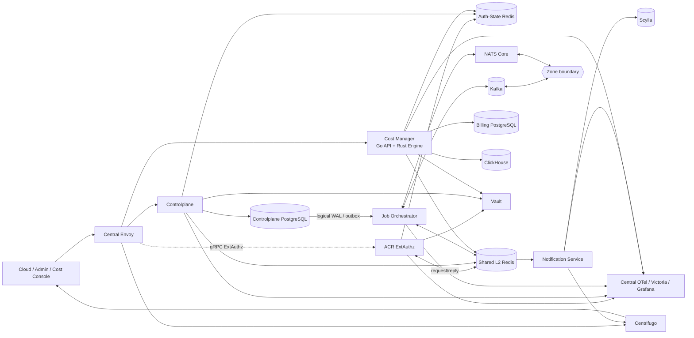
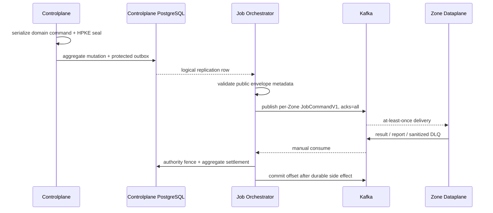
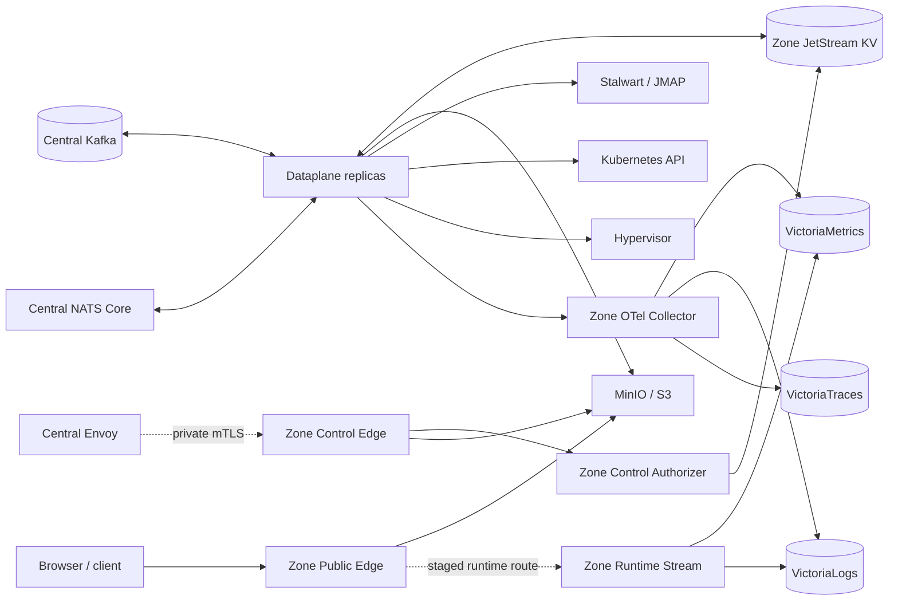

# Aurora Architecture

Aurora tách runtime thành một Central cluster và một hoặc nhiều Zone. Central giữ business authority và điều phối; Zone chỉ thực thi workload thuộc đúng Zone, lưu runtime projection và phục vụ data/read plane tại biên.

Các contract chi tiết theo workflow nằm trong [`god_view/`](./god_view/). Shared wire contract nằm tại [`contracts/proto/`](./contracts/proto/); tài liệu này mô tả topology và ownership ở cấp hệ thống.

## 1. Central

### Topology



### Components and ownership

| Thành phần | Sở hữu | Không sở hữu |
| --- | --- | --- |
| Central Envoy | TLS, virtual host, route selection, body bounds, ExtAuthz invocation | Password/session verification và business authorization |
| ACR | Trinity/Billing/SRE session, proof, cookie issuance, trusted identity headers | IAM PostgreSQL và business aggregate |
| Controlplane | IAM, hierarchy, workspace, storage, mail, hypervisor, managed-service desired state/outbox | Zone runtime state và billing ledger |
| Job Orchestrator | WAL changefeed, command dispatch, result settlement, repair/reconcile | Zone private key, Zone KV và workload side effect |
| Notification Service | Self-user timeline/inbox projection và realtime publish adapter | IAM, job lifecycle và resource aggregate |
| Cost Manager | Pricing, plan, wallet, ledger, payment, ownership projection và usage rating | Controlplane PostgreSQL |
| Vault | Workload bootstrap identity, connection record và Transit keys | User/resource business state |

### Request plane

```text
Browser -> Envoy -> ACR ExtAuthz -> Controlplane | Cost Manager | Centrifugo
```

1. Envoy terminate TLS và chọn virtual host.
2. API request được gửi sang ACR bằng Envoy gRPC ExtAuthz.
3. ACR xác minh session/proof/Zone context bằng Auth-State Redis, Shared Redis request/reply và Vault.
4. ACR xóa hoặc overwrite identity headers do client gửi.
5. Envoy forward request tới backend đã chọn.
6. Backend vẫn thực hiện domain authorization; frontend visibility không thay backend enforcement.

Static frontend route tắt ExtAuthz. Cloud Billing prefix được route tới Cost Manager. Cost Console sử dụng host-bound Billing Alias và chỉ tái sử dụng IAM Render Context qua một route hẹp.

### Controlplane module graph

Controlplane bootstrap theo thứ tự:

```text
Security -> Observability -> PostgreSQL/Redis/Kafka -> Migrations
         -> HTTP engine -> Module graph -> gRPC -> Routes
```

Dependency direction bên trong domain:

```text
HTTP handler -> domain service -> repository -> PostgreSQL
```

Các module chính:

- Tier critical: `hierarchy`, `iam`, `managedservice`.
- Graceful degradation: `hypervisor`, `mail`, `storage`.
- Shared support: `cacheengine`, `observability`, `security`, global HTTP middleware.

Migrations chạy trong một transaction và advisory lock:

```text
Hierarchy -> IAM -> Managed Service -> Mail -> Hypervisor -> Storage
```

### Durable command and result plane



Controlplane seal toàn bộ Zone-bound payload bằng HPKE. JO không decrypt; nó relay đúng ciphertext đã commit. Result được đối chiếu với authoritative outbox metadata trước khi thay đổi aggregate.

### Notification and timeline plane

```text
ACR / Controlplane / Cost -> stream:{user_activity}
Job Orchestrator          -> stream:{job_notifications}
Shared Redis Streams      -> Notification Service -> Scylla
Notification Service      -> Centrifugo -> Browser
```

Activity và job notification dùng at-least-once Stream consumer. Notification Service persist Scylla trước ACK/publish. Runtime wake-up dùng Shared Redis Pub/Sub, là soft state và không thay API/snapshot authoritative.

### Billing plane

Cost Manager API và Engine dùng Billing PostgreSQL riêng:

- Go API chạy migration, REST workflow, authz projection và Redis consumer.
- Go API spawn Rust Engine với Vault identity riêng.
- Engine đọc usage từ ClickHouse, pin immutable pricing version và ghi wallet/ledger.
- Redis lease, durable fencing, wallet row lock và deterministic ledger ID chống duplicate debit.

### Central state map

| Store/transport | Vai trò |
| --- | --- |
| Controlplane PostgreSQL | Business Source of Truth cho identity/resource desired state |
| Billing PostgreSQL | Billing Source of Truth |
| Auth-State Redis | Runtime security state và authz projection; failure phải fail-closed |
| Shared L2 Redis | Request/reply, cache, Pub/Sub, bounded Stream, lock/checkpoint |
| Kafka | Durable Central↔Zone command/result/report transport |
| NATS Core | Central↔Zone soft-state transport; không bật JetStream |
| Scylla | Durable self-user timeline/inbox projection |
| ClickHouse | Usage/OLAP input cho billing |
| Victoria stack | Diagnostic telemetry, không phải business state |

### Current deployment state

- Local Central Compose chạy ba Controlplane replica nhưng chỉ một Kafka KRaft broker với replication `1`.
- Notification Service đã được Centrifugo dùng làm connect proxy. Envoy dev chưa có upstream riêng cho timeline HTTP routes; generic `/api/` hiện route tới Controlplane.
- Cost Compose/Kubernetes publish `9094`, nhưng Go API hiện chưa initialize/serve gRPC; active API surface là HTTP `8084`.
- Notification code hiện dùng Vault để resolve Redis/Scylla connections dù một God View cũ mô tả boundary không kết nối Vault.
- [`k8s/`](./k8s/) là tập manifest chọn lọc, chưa có parity với toàn bộ Central Compose.

## 2. Zone

### Topology



### Components and ownership

| Thành phần | Sở hữu | Boundary |
| --- | --- | --- |
| Dataplane | Job intake, worker pool, leader election, admission, executor, result/report | Chỉ đúng một Zone; không có Central DB/Redis credential |
| Zone JetStream KV | Metadata/config projection, current health, CAS lease/fencing | Zone-local; không phải Central NATS |
| Zone Public Edge | Presigned object/image transfer; runtime route được mở qua gate riêng | Không nhận Central cookie, ACR assertion hay Zone KV credential |
| Zone Control Edge | Private control capability qua mTLS | Chỉ nhận Central Envoy workload identity |
| Zone Control Authorizer | Signed assertion, request binding và Zone access policy | Không phải gateway hoặc ownership database |
| Zone Runtime Stream | Stateless SSE read-plane từ Victoria | Read-only telemetry; không thay lifecycle state |
| Zone OTel/Victoria | Zone-local logs, metrics và traces | Diagnostic-only |

### Central ↔ Zone contract

Chỉ hai transport đi qua boundary:

| Transport | Dữ liệu | Durability |
| --- | --- | --- |
| Kafka | Per-Zone command, result, report, metadata query/snapshot và storage size | Durable, at-least-once, manual commit |
| NATS Core | Runtime watch/report và soft-state update | Best effort; có thể mất |

Không có shared platform command topic. Mỗi Dataplane chỉ subscribe:

```text
aurora.jobs.commands.zone.<zone_uuid>.v1
```

Topic, envelope `target_zone_id` và Zone cấu hình phải khớp. Cross-Zone hoặc malformed message bị fail-closed và chỉ settle sau sanitized durable DLQ.

JO không có Zone KV credential hoặc HPKE private key. Dataplane không có Controlplane/Billing PostgreSQL, Auth Redis, Shared Redis hay Vault credential.

### Dataplane runtime

Dataplane startup:

```text
Load config + read-only HPKE keyring
-> connect Kafka / NATS Core / Zone KV
-> bootstrap Zone projection
-> build worker/leader/executor graph
-> accept jobs
```

Execution path:

1. Poll per-Zone Kafka command bằng manual consumer.
2. Validate size, schema, trace context, route và Zone binding.
3. HPKE-open payload bằng private key từ read-only Zone mount.
4. Admission qua bounded queue và Ready worker budget.
5. Acquire fenced job lease trong Zone Coordination KV.
6. Execute idempotent storage/mail/hypervisor/managed-service adapter.
7. Publish result/retry/DLQ durable.
8. Commit contiguous terminal offset; result chưa durable thì source chưa được settle.

Leader của Zone giữ lease riêng, thực hiện infrastructure probes, metadata repair, Zone report và worker scaling decision. Pod chết hoặc rebalance dựa vào Kafka replay, assignment epoch và lease expiry để recover.

### Zone network isolation

Zone Compose dùng các network `internal` riêng:

| Network | Thành phần chính | Mục đích |
| --- | --- | --- |
| `zone-infra` | Dataplane, Zone KV, MinIO, Stalwart, OTel | Private runtime dependencies |
| `zone-telemetry-ingest` | OTel và Victoria backends | Telemetry write path |
| `zone-runtime-read` | Runtime Stream, VictoriaMetrics/Logs | Read-only runtime queries |
| `zone-edge-storage` | Public Edge và MinIO | Presigned object transfer |
| `zone-edge-runtime` | Public Edge và Runtime Stream | SSE ingress |
| `aurora-transport` | Dataplane, Central Kafka/NATS Core | Only Central↔Zone transport bridge |

Runtime Stream không có DNS/network path tới Dataplane, Zone KV, MinIO, Stalwart hoặc Central transport. Public Edge dùng network storage và runtime tách nhau để không cấp nhầm upstream access.

### Zone state map

| Store | Vai trò |
| --- | --- |
| `AURORA_ZONE_CONFIG` | Zone metadata và immutable runtime projection |
| `AURORA_ZONE_HEALTH` | Rebuildable current health |
| `AURORA_ZONE_COORDINATION` | CAS lease và fencing |
| Pod memory | Worker registry, admission counters, mail L1 và dynamic lag |
| MinIO/Stalwart/Kubernetes/Hypervisor | External workload side effects |
| Zone Victoria | Read-only diagnostic telemetry |

### Public and private edge

Public data path:

```text
Browser -> Zone Public Edge -> MinIO presigned transfer
Browser -> Zone Public Edge -> Zone Runtime Stream -> Victoria
```

Private control path:

```text
Central Envoy -> mTLS Zone Control Edge -> ExtAuthz -> allow-listed Zone capability
```

Object mutation không được Envoy tự retry. Large bytes đi qua presigned Public Edge; Control Edge chỉ nhận bounded control body. Runtime Stream nhận trusted scope do Edge inject, không nhận PromQL/LogsQL tùy ý từ browser.

### Current deployment state

- Zone Compose chạy Public Edge và Runtime Stream nhưng không chạy private Control Edge/Authorizer.
- Central Envoy dev trỏ private Control Edge tới Kubernetes DNS, nên `/zone-control/v1/*` chưa end-to-end chỉ với Compose.
- Runtime Stream không publish host port trực tiếp; public route/ticket là một gate riêng.
- Local Zone KV dùng một NATS node/replica; production contract yêu cầu HA/file storage phù hợp.
- Zone Kubernetes manifests tập trung vào edge/runtime boundary; deployment parity của Dataplane và toàn bộ infrastructure cần được audit riêng.
