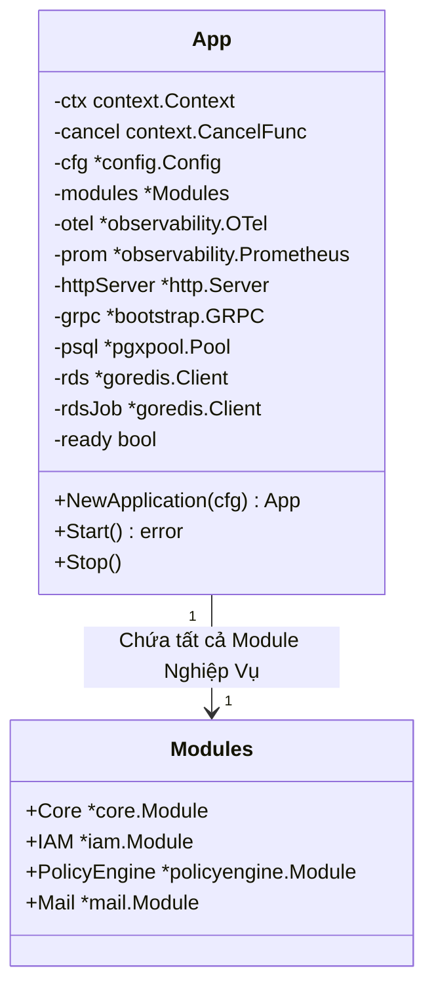
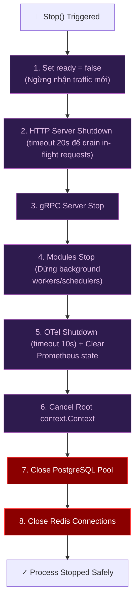

# Application Graph Canonical Contract

Status: Draft v1  
Owner: Platform/Controlplane team  
Scope: App Initialization Sequence, Dependency Wiring, and Resource Teardown Lifecycle  

---

## Overview

Tài liệu này đặc tả **Sơ đồ cấu trúc Container ứng dụng** (Application Graph Contract) chịu trách nhiệm quản lý vòng đời runtime của Controlplane (`controlplane/internal/app/app.go`). Hợp đồng này quy định chi tiết thứ tự khởi động (Startup Ordering) bất khả dịch chuyển, cách tích hợp các middleware, và quy trình giải phóng tài nguyên ngược (LIFO-like Shutdown).

---

## 1. Application Container Topology (Cấu Trúc Thành Phần)

Thành phần `App` là một Root Runtime Container duy nhất giữ liên kết trực tiếp tới toàn bộ tài nguyên hạ tầng và các module dịch vụ:

---

## 2. Bootstrapping & Wiring Sequence (Trình tự khởi động & Đấu nối)

Thứ tự khởi tạo trong `NewApplication` tuân thủ nghiêm ngặt mô hình phân tầng từ **Hạ Tầng -> Cấu hình Động -> Đo lường -> Nghiệp Vụ -> Giao Tiếp**:

```mermaid
flowchart TD
    %% Styling
    classDef infraStyle fill:#161625,stroke:#FF9100,stroke-width:1px,color:#FFD180;
    classDef policyStyle fill:#2E1B4E,stroke:#BA68C8,stroke-width:2px,color:#E1BEE7;
    classDef obsStyle fill:#1F1F35,stroke:#7C4DFF,stroke-width:2px,color:#FFFFFF,font-weight:bold;
    classDef moduleStyle fill:#161625,stroke:#4CAF50,stroke-width:1px,color:#B2FF59;
    classDef transportStyle fill:#003366,stroke:#33b5e5,stroke-width:2px,color:#E0F7FA;

    Start["🚀 NewApplication(cfg)"] --> Key["1. Security Master Key <br/> (validate Base64 to 32 bytes)"]:::infraStyle
    
    %% Infra
    Key --> DB["2. PostgreSQL Pool"]:::infraStyle
    DB --> Redis["3. Redis Client"]:::infraStyle
    Redis --> RedisJob["4. Redis Job Client"]:::infraStyle
    RedisJob --> Mig["5. Run Schema Migrations"]:::infraStyle

    %% Policy Engine
    Mig --> Policy["6. Policy Engine <br/> (Loads Dynamic Config Set)"]:::policyStyle

    %% Observability
    Policy --> OTel["7. OpenTelemetry Tracing <br/> (Dynamic Fail-Open/Close)"]:::obsStyle
    OTel --> Prom["8. Prometheus Metrics <br/> (Dynamic Fail-Open/Close)"]:::obsStyle
    Prom --> RL["9. Rate Limiter <br/> (Fail-Open: False)"]:::obsStyle

    %% HTTP Engine & Mid
    RL --> Gin["10. Gin HTTP Engine & Trusted Proxies"]:::transportStyle
    Gin --> Mid["11. Global HTTP Middlewares <br/> (Recovery, ID, Trace, Metrics, RL, AccessLog)"]:::transportStyle

    %% Modules
    Mid --> Mod["12. Global Modules Graph <br/> (NewGlobalModules)"]:::moduleStyle
    Mod --> Hooks["13. Run Module Bootstrap Hooks"]:::moduleStyle

    %% Transport entry
    Hooks --> gRPC["14. gRPC Server Init & Register"]:::transportStyle
    gRPC --> Route["15. Register HTTP Routes <br/> (NewGlobalRoutes)"]:::transportStyle
    Route --> Ready["✓ App Container Ready to Start"]:::obsStyle
```

### Quy tắc xử lý lỗi khi khởi động (Fail-Safe Cleanup Invariant)

Nếu phát sinh bất kỳ lỗi nào ở bất cứ bước nào trong chuỗi trên:

1. Tiến trình bootstrap ngay lập tức bị dừng lại.
2. Hàm `app.Stop()` được gọi để dọn dẹp tất cả tài nguyên đã khởi tạo thành công trước đó (tránh rò rỉ kết nối).
3. Lỗi được trả ngược lại cho luồng `main()` để crash tiến trình (`logger.SysFatal`).

---

## 3. Global Middleware Execution Order (Thứ tự thực thi Middleware)

Tất cả request HTTP đi vào Controlplane bắt buộc phải đi qua chuỗi Middleware toàn cục đã cấu hình theo thứ tự sau (không được thay đổi):

1. **`gin.Recovery()`**: Bọc ngoài cùng để bắt panic và giữ tiến trình không bị crash do lỗi code runtime.
2. **`middleware.RequestID()`**: Trích xuất hoặc sinh mới `X-Request-ID` cho request.
3. **`middleware.OTelTraceContext`**: Kế thừa trace context từ Envoy và gắn Server Span con.
4. **`middleware.PrometheusHTTPMetrics`**: Đo đạc latency và đếm số lượng HTTP request.
5. **`middleware.CookieOriginGuard`**: Ngăn chặn tấn công CSRF thông qua kiểm tra Origin và Host Header.
6. **`middleware.RateLimitPreAuth`**: Chặn đứng các request spam tần suất cao ngay từ biên trước khi vào nghiệp vụ.
7. **`middleware.AccessLog()`**: Ghi nhận Access log có cấu trúc.
8. **`middleware.AdminXSSI()`**: Chống tấn công JSON Hijacking bằng cách tiêm chuỗi bypass (`)]}',\n`).

---

## 4. Teardown & Graceful Shutdown Chain (Quy trình đóng tài nguyên)

Hàm `Stop()` chịu trách nhiệm giải phóng tài nguyên. Để tránh lỗi tắt đột ngột làm mất dữ liệu hoặc hỏng session, hệ thống giải phóng tài nguyên theo mô hình gần như LIFO (Last-In, First-Out):

### Invariants của quy trình Stop()

- **Nil-safe:** Toàn bộ lệnh đóng tài nguyên phải kiểm tra `nil` trước khi gọi (để chạy an toàn cả khi lỗi xảy ra giữa chừng lúc khởi động).
- **Idempotent:** Việc gọi `Stop()` nhiều lần không được gây ra panic hay treo tiến trình.
