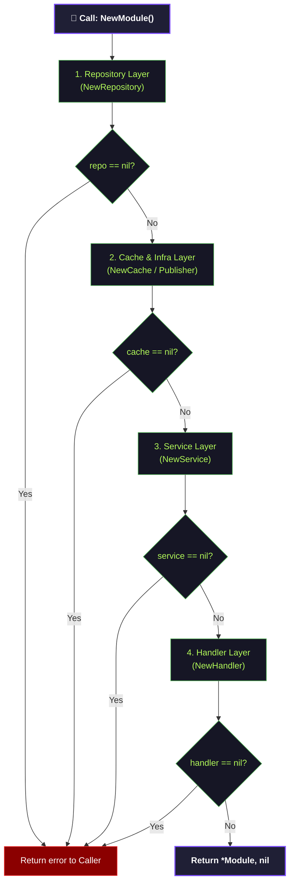
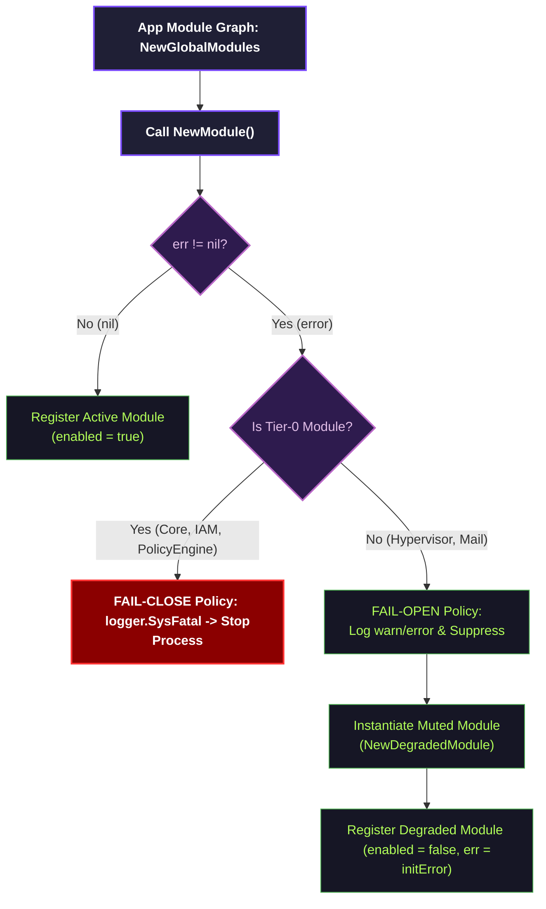

# Constructor Graph Canonical Contract

Status: Draft v1  
Owner: Platform/Controlplane team  
Scope: Internal Module Component instantiation, validation order, and Graceful Degradation logic  

---

## 1. Layered Component Constructor Flow (Sơ đồ khởi tạo phân lớp)

Việc khởi tạo các thành phần bên trong một Module nghiệp vụ được tổ chức tuần tự theo các lớp từ dưới lên trên. Bản thân constructor của các lớp con **không tự ý panic**, mà trả lỗi về cho hàm khởi tạo Module (`NewModule`) tổng hợp:

---

## 2. Caller-Side Decision Flow (Quy trình quyết định của Caller)

Hàm khởi tạo Module Graph tổng (`NewGlobalModules` tại `controlplane/internal/app/module.go`) tiếp nhận kết quả khởi tạo `(*Module, error)` từ mỗi module và đưa ra quyết định dựa trên cấp độ Module (Tier):

---

## 3. Constructor Dependency Invariants (Nguyên Tắc Khởi Tạo)

### 3.1 Trình tự và Trách nhiệm (Responsibility Delegation)

- **Constructors nghiệp vụ (Repo, Service, Handler):**
  - Phải kiểm tra đầu vào nghiêm ngặt. Nếu thiếu dependency bắt buộc, **trả về error có cấu trúc hoặc nil object** thay vì tự ý `panic` hoặc gọi `os.Exit`.
  - Mục đích: Giữ cho các module con độc lập về mặt logic xử lý lỗi và trao toàn quyền quyết định cho Caller.
- **Hàm NewModule:**
  - Tổng hợp lỗi từ các lớp con. Nếu bất kỳ lớp con nào lỗi, trả về lỗi rõ ràng lên Module Graph.

### 3.2 Cơ chế Degraded Module (Muted/Fallback Mode)

Khi một module Tier-1 bị lỗi khởi tạo, caller sẽ bọc nó bằng `NewDegradedModule(err)`:

- Trường `enabled` được gán thành `false`.
- Trường `err` được gán bằng lỗi khởi tạo gốc để phục vụ ghi log/audit.
- Các handler/service của module này sẽ từ chối nhận request hoặc trả về HTTP `503 Service Unavailable` tại tầng định tuyến, giữ cho toàn bộ phần còn lại của Controlplane không bị crash.
