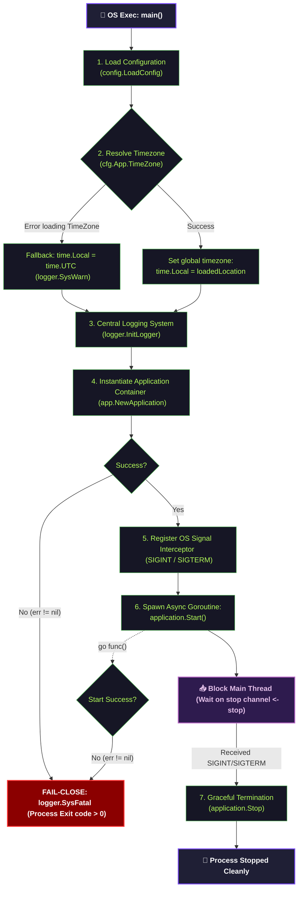

# Entry Graph Canonical Contract

Status: Draft v1  
Owner: Platform/Controlplane team  
Scope: Main Entrypoint Startup, Timezone Resolution, Signal Handling, and Graceful Shutdown  

---

## Overview

Tài liệu này đặc tả **Sơ đồ luồng khởi chạy hệ thống** (Entry Graph Contract) tại điểm khởi đầu của tiến trình Controlplane (`controlplane/cmd/server/main.go`). Đây là hợp đồng thiết kế quy định thứ tự khởi tạo môi trường cơ bản, phân phối tín hiệu OS, và cơ chế dọn dẹp tài nguyên trước khi tiến trình dừng hoàn toàn (Graceful Shutdown).

---

## 1. Entrypoint Lifecycle Flow (Sơ đồ luồng khởi chạy)

Sơ đồ dưới đây mô tả chi tiết các bước thực hiện trong hàm `main()` của `main.go`:

---

## 2. Startup Phasing & Fatal Boundaries (Ranh Giới Báo Lỗi Hạt Nhân)

Tiến trình khởi chạy áp dụng nguyên tắc **phản hồi lỗi tức thì ở pha bootstrap (Fail-Close)** để bảo vệ hệ thống không rơi vào trạng thái không nhất quán (inconsistent state):

1. **TimeZone Resolution (Thiết lập múi giờ toàn cục):**
   - Múi giờ (`time.Local`) được phân giải và áp dụng toàn cục cho toàn bộ tiến trình ứng dụng.
   - **Tác động toàn hệ thống:** Vì Go sử dụng biến toàn cục `time.Local` cho mọi lệnh gọi `time.Now()`, việc gán giá trị này tại `main.go` đảm bảo **bất kỳ chỗ nào trong toàn bộ mã nguồn gọi `time.Now()` về sau** đều tự động tính toán và trả về thời gian theo múi giờ đã cấu hình. Điều này đồng nhất hoạt động của audit logs, schedulers, token expiries, và database queries.
   - Lỗi nạp Timezone được coi là lỗi không nghiêm trọng (Non-critical error). Ứng dụng sẽ tự động chuyển về múi giờ chuẩn quốc tế `UTC` thông qua `time.Local = time.UTC`, ghi log cảnh báo (`logger.SysWarn`) và tiếp tục khởi chạy nhằm đảm bảo tính HA.
2. **Application Instantiation Boundary (`app.NewApplication`):**
   - Lỗi phân giải cấu hình, khởi tạo pool Database/Redis, hoặc thiếu khóa giải mã đều được xem là lỗi hạt nhân nghiêm trọng.
   - Luồng chính gọi `logger.SysFatal` để terminate (thoát ngay lập tức) tiến trình. Không cho phép ứng dụng chạy thiếu dependency cốt lõi.
3. **Application Server Startup Boundary (`application.Start`):**
   - HTTP Engine hoặc gRPC Server không bind được cổng mạng (port conflict, permission denied).
   - Goroutine chạy nền gọi `logger.SysFatal` để buộc toàn bộ container crash ngay lập tức.

---

## 3. Signal Handling & Resource Release (Xử Lý Tín Hiệu & Giải Phóng Tài Nguyên)

Hợp đồng vận hành HA (High Availability) yêu cầu hệ thống luôn phản hồi đúng tín hiệu kết thúc từ bộ điều phối hạ tầng (e.g., Kubernetes, Docker):

- **Tín hiệu đăng ký:** Chỉ bắt và xử lý hai tín hiệu `syscall.SIGINT` (Ctrl+C thủ công) và `syscall.SIGTERM` (Orchestrator dọn dẹp pod).
- **Graceful Shutdown Sequence (Trình tự tắt nguồn an toàn):**
  1. Main thread nhận tín hiệu từ stop channel.
  2. Main thread gọi `application.Stop()`.
  3. Lớp HTTP Router dừng nhận các kết nối Client mới (reject new traffic).
  4. Lớp gRPC dừng nhận các yêu cầu điều phối RPC mới.
  5. Đợi các công việc hiện tại xử lý nốt (drain connection).
  6. Giải phóng các connection pool Database, Cache, giải phóng file descriptors.
  7. Ghi log `Application stopped gracefully.` và tắt hoàn toàn tiến trình.
