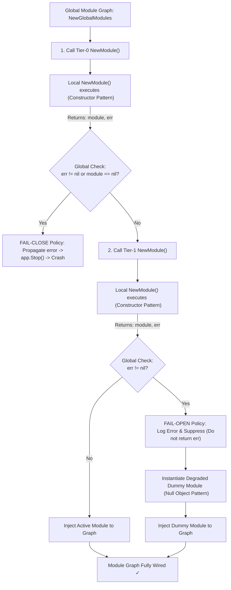
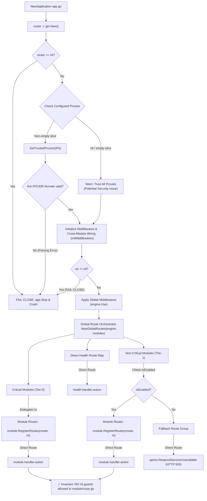
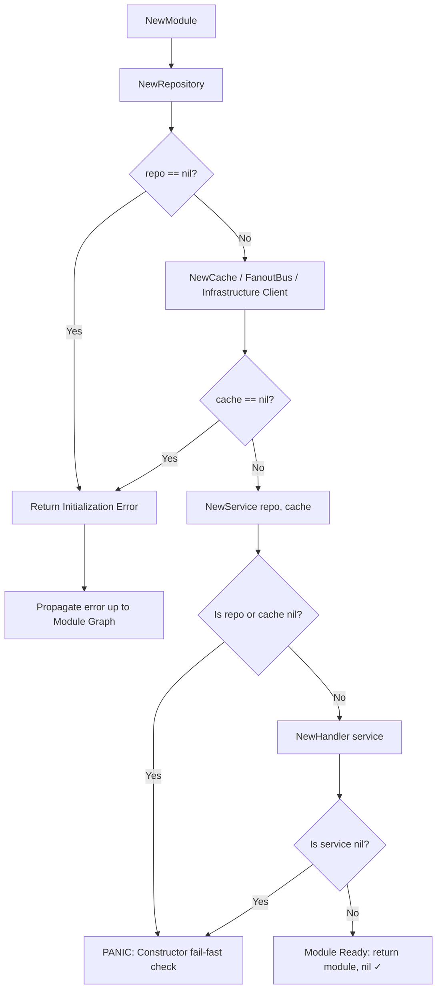

# Fail Dependency Graph Canonical Contract

Status: Draft v1  
Owner: Platform/Controlplane team  
Scope: Dependency Graph and Lifecycle Fail-Fast Rules for Controlplane Services  

---

## Fail-Fast Architectural Diagrams

### 1. Global & Local Module Dependency Flow (Module Graph)

Describes how the global application bootstrap sequence loads Tier-0 (critical) and Tier-1 (non-critical) modules down to their internal structures.

---

### 2. HTTP Engine & Route Registration Flow (Router Flow)

Illustrates the HTTP engine lifecycle from router initialization and proxy configuration to direct route handler registration.

---

### 3. Component Constructor Flow (Constructor Pattern)

Details the generic internal module dependency tree construction, showing where dependencies (Repository, Cache, Service, Handler) are validated.

---

## 0) Contract Governance

### Contract Item

- `DEPGRAPH-GOV-001` Canonical ownership and validation policy.

### Owner

- Platform/Controlplane team, Module owners.

### Rules

- The Global Application Graph (`controlplane/internal/app/module.go`) is the single source-of-truth for cross-module dependency configuration.
- Any critical component failure during startup MUST result in an immediate fail-close behavior (blocking deployment/startup).
- No silent recovery or hidden default states are allowed for Tier-0 services.

### Invariants

- Fail-fast decisions MUST happen at the call-site / initialization phase, not at the execution/routing phase.
- Route handlers (`NewGlobalRoutes` / `module.RegisterRoutes`) are guaranteed by contract to receive valid, fully-initialized, non-nil modules and handler instances.

### Failure Semantics

- Mismatched failure strategy (e.g., Tier-0 failure treated as degraded/fail-open) will block continuous delivery pipeline.

### Verification Evidence

- Bootstrapping tests, compiler checks, and startup probe integrity tests.

---

## 1) Tier Classification Contract

### Contract Item

- `DEPGRAPH-TIER-001` Tier-0 vs Tier-1 Service Segmentation.

### Owner

- SRE Platform Engineering / Architecture.

### Rules

- **Tier-0 (Critical Services)**:
  - Modules: `Core`, `IAM`, `PolicyEngine`, and HTTP Router (`gin.Engine`).
  - Strategy: **Fail-Close**. Any initialization failure (e.g., database pool unreachable, Redis client nil, required cryptographic keys missing) must panic or return a terminal error, causing the container to crash immediately. This allows Kubernetes `StartupProbes` or orchestrators to restart/halt the pod and notify SRE.
- **Tier-1 (Non-Critical Services)**:
  - Modules: `Hypervisor`, `Mail`.
  - Strategy: **Fail-Open (Graceful Degradation)**. Network connection failures or infrastructure configuration mismatches must be caught at the initialization boundary. The system must log a system-level error and inject a degraded dummy instance (Null Object Pattern) so that the control plane continues to boot and operate with limited functionality.

### Invariants

- Standard health endpoints (`/api/v1/health/readiness`, `/api/v1/health/liveness`) must report partial degradation for Tier-1 but remain unready/unhealthy for Tier-0 issues.

---

## 2) Call-Site Fail-Fast Initialization

### Contract Item

- `DEPGRAPH-INIT-001` Fail-Fast at Construction and Bootstrap.

### Owner

- Component and Module Developers.

### Rules

- **HTTP Router**: Checked for nil directly at creation inside `NewApplication` (`app.go`).
- **Core Module & IAM Module**: Must fail the global bootstrap function `NewGlobalModules` (`app/module.go`) if initialization fails or returns nil.
- **Sub-dependencies & Handlers**: `ZoneHandler` and `ZoneService` must be checked for nil during `NewModule` creation in the core module (`core/module.go`) and return an error if nil.

### Invariants

- No nil-check or silent returns inside route registration definitions (`core/route.go`). Late-stage silent checks mask misconfigurations and violate observability standards.

---

## 3) Change Log Policy

- Any transition of a service from Tier-1 (degraded) to Tier-0 (critical) requires updating this contract.
- Removing a constructor fail-fast check without moving it upstream is a contract violation.
