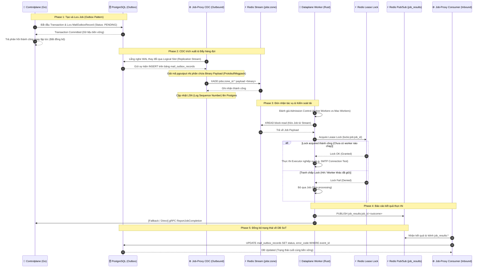

# Job Lifecycle and Processing Workflow Canonical Contract

**Status**: Draft v1  
**Owner**: Platform/Controlplane & Dataplane team  
**Scope**: Distributed Job Scheduling, Outbox Pattern, CDC (Logical Replication), Redis Streams, and Distributed Transaction Safety

---

## 1. Tổng Quan Kiến Trúc (Architectural Overview)

Hệ thống xử lý tác vụ phân tán (Distributed Job Processing) được thiết kế theo nguyên tắc **Cloud-Native**, đảm bảo tính **Sẵn Sàng Cao (HA - High Availability)**, khả năng chịu lỗi (fault-tolerance), và tính bền vững của dữ liệu (data durability).

Mô hình hoạt động dựa trên sự phối hợp giữa 3 thành phần chính:

1. **Controlplane (Go)**: Tiếp nhận yêu cầu nghiệp vụ từ client, lưu trữ trạng thái giao dịch một cách bền vững vào cơ sở dữ liệu qua mẫu thiết kế **Outbox Pattern**.
2. **Job-Proxy (Rust)**: Cầu nối hai chiều trung gian.
   - **Outbound (CDC Streamer)**: Đọc luồng thay đổi nhị phân (WAL) từ Postgres bằng phương pháp Logical Replication (không dùng Polling tránh gánh nặng I/O) và đẩy tác vụ sang Redis Streams.
   - **Inbound (Result Consumer)**: Lắng nghe kết quả xử lý từ Dataplane qua Redis Pub/Sub và cập nhật trạng thái cuối vào Postgres.
3. **Dataplane (Rust)**: Engine thực thi tác vụ thực tế. Kéo công việc từ Redis Streams, quản lý luồng bằng cơ chế kiểm soát admission control & distributed lease lock, thực hiện công việc và báo cáo lại kết quả.

---

## 2. Biểu Đồ Luồng Xử Lý (Workflow Sequence Diagram)

---

## 3. Chi Tiết Từng Giai Đoạn (Detailed Step-by-Step Lifecycle)

### 3.1. Khởi tạo & Lưu trữ (Controlplane)

- **Outbox Write**: Thay vì trực tiếp kết nối tới hệ thống ngoại vi (như gọi SMTP server) hay đẩy trực tiếp lên hàng đợi Redis (gây nguy cơ mất dữ liệu khi Redis sập hoặc transaction của DB rollback), Controlplane chỉ thực hiện ghi bản ghi `MailOutboxRecord` vào PostgreSQL trong cùng một Transaction nghiệp vụ.
- **Tối ưu hóa Binary Payload**: Để triệt tiêu allocation do reflection của `json.Marshal` ở Go, payload được tuần tự hóa sang định dạng nhị phân siêu nhẹ (ví dụ: Protobuf hoặc MessagePack) và lưu vào cột kiểu `BYTEA` thay vì kiểu `JSONB`.
- **Tính Bền Vững (Data Durability)**: Do ghi nhận vào DB trước, bản ghi outbox được bảo vệ bởi log ghi trước (WAL) của Postgres, đảm bảo dữ liệu không bao giờ bị thất lạc.
- **Trở về tức thời (Non-blocking)**: Hàm `TestConnectionRaw` ngay sau khi ghi Outbox thành công sẽ trả về kết quả `nil` ngay cho API Handler để phản hồi `200 Success` về cho client. Luồng kiểm tra thực tế sẽ chuyển hoàn toàn thành bất đồng bộ.

### 3.2. Trích xuất & Định tuyến (Job-Proxy CDC Streamer)

- **Logical Replication**: `CdcStreamer` của Job-Proxy kết nối trực tiếp vào Postgres bằng kết nối replication nhị phân. Dịch vụ tự động tạo Publication (`FOR TABLE mail_outbox_records`) và Logical Slot (`pgoutput` plugin) nếu chưa tồn tại.
- **Truyền dẫn nhị phân thô (Binary Forwarding)**: CDC Streamer trích xuất trường `BYTEA` từ WAL của Postgres và chuyển tiếp trực tiếp (dưới dạng binary thô) lên Redis Stream `jobs:<zone_id>`. Cơ chế này loại bỏ hoàn toàn các bước phân tích (parsing) hay chuyển đổi dữ liệu nặng ở tầng trung gian.
- **Độc lập và Phân tán (HA-ready)**: Nhiều instance của Job-Proxy chạy song song sẽ tranh chấp sử dụng chung một slot replication. Do PostgreSQL chỉ cho phép một kết nối active trên một slot tại một thời điểm, các instance còn lại sẽ ở trạng thái chờ (warm-standby), tự động failover nếu instance chính gặp sự cố.
- **At-Least-Once Delivery**: Job-Proxy chỉ thực hiện cập nhật applied LSN về phía Postgres sau khi lệnh `XADD` gửi tin nhắn lên Redis Stream thành công. Nếu Redis bị sập, Job-Proxy không ACK LSN, Postgres giữ lại WAL và sẽ replay lại luồng sự kiện từ vị trí chưa ACK ngay khi kết nối được tái thiết lập.

### 3.3. Tiêu thụ & Thực thi (Dataplane Job Consumer)

- **Kiểm soát tải động (Admission Control & Backpressure)**: Trước khi thăm dò Redis Stream, mỗi worker trong Dataplane gọi `AdmissionController` đánh giá xem instance hiện tại có bị quá tải không (dựa trên cấu hình `max_workers` từ Policy Engine). Nếu quá tải, luồng sẽ tạm dừng (pacing delay / circuit broken) để tránh hiện tượng sập node do quá tải kết nối hoặc RAM.
- **Distributed Lease Lock (Đảm bảo Idempotency)**:
  - Khi kéo được Job, Dataplane cố gắng giành khóa phân phối `locks:job:<job_id>` trên Redis nội bộ với một thời gian rảnh (idle lease).
  - Bước này ngăn chặn tình trạng hai worker cùng xử lý một job (tránh Race Condition trong môi trường HA khi một node bị chậm nhịp nhưng chưa chết hẳn).
- **Phân phối nghiệp vụ (Workload Dispatching)**: Tác vụ được định tuyến dựa theo định dạng topic `[workload].[action]`. Ví dụ, `mail.test_connection` được gửi trực tiếp tới `executor::mail::test_connection::run`.

### 3.4. Báo cáo kết quả (Dataplane Reporter)

- **Redis Pub/Sub**: Kết quả sau khi thực thi được gửi lên kênh `job_results:<job_id>` để thông báo lập tức.
- **gRPC Fallback**: Dataplane cũng gọi trực tiếp về Controlplane thông qua gRPC `ReportJobCompletion` để tăng tính tin cậy. Đường truyền gRPC được bảo mật bắt buộc qua mTLS (Client CA & Server TLS Certificates).

### 3.5. Đồng bộ trạng thái (Job-Proxy Result Consumer)

- **Result Listener**: Thành phần `ResultConsumer` của Job-Proxy đăng ký mẫu kênh `job_results:*` trên Redis.
- **Cập nhật nguyên tử (Atomic Database Update)**:
  - Khi nhận được kết quả xử lý, nó thực hiện câu lệnh `UPDATE` cập nhật `status`, `attempts`, `error_code`, và `error_message`.
  - Điều kiện WHERE đảm bảo trạng thái trong DB chỉ được cập nhật từ các trạng thái chưa hoàn thành (`PENDING`, `PROCESSING`, `PUBLISHED`), ngăn ngừa ghi đè trạng thái đã hoàn thành (Race Condition khi kết quả trả về bị trễ nhịp hoặc gửi lặp).

---

## 4. Các Vấn Đề Thiết Kế HA & Tối Ưu Hóa (HA & Optimization Guidelines)

| Rủi Ro Hệ Thống (Failure Case) | Giải Pháp Thiết Kế (Mitigation) | Cơ Chế Chi Tiết |
| :--- | :--- | :--- |
| **PostgreSQL hoặc Redis sập kết nối** | Reconnect Loop tự động | Job-Proxy tích hợp vòng lặp vô hạn thử kết nối lại với độ trễ (backoff delay) tránh làm sập DB do spam yêu cầu. |
| **Nhiều Worker Dataplane kéo trùng Job** | Redis Distributed Lease Lock | Dùng lệnh SETNX (SET IF NOT EXISTS) trên Redis để khóa định danh `job_id` trong khoảng thời gian `idle` chỉ định. |
| **Dataplane sập khi đang thực thi** | Lease Lock Expiry | Sau khi khóa hết hạn (`idle` timeout), Job sẽ trở thành trạng thái mồ côi và được cơ chế quét (Orphan Job Reclaimer) thu hồi để thực hiện lại. |
| **Ghi đè kết quả cũ do Network delay** | Atomic State Constraint | Sử dụng điều kiện `status IN ('PENDING', 'PROCESSING', 'PUBLISHED')` trong câu lệnh `UPDATE` kết quả tại Postgres. |
| **Lạm dụng tài nguyên bộ nhớ trace** | Custom Span Boundaries | Tuân thủ Contract tracing: Không tự ý sinh span ở lớp Service nghiệp vụ, chỉ sinh span tự động ở driver Downstream (PG, Redis) hoặc Entrypoint. |
| **Gánh nặng CPU & RAM khi Parse JSON** | Lưu trữ Nhị phân (`BYTEA` + Protobuf) | Sử dụng Protobuf tuần tự hóa ở Go và lưu vào cột `BYTEA`. Cắt giảm 50-70% I/O ghi WAL, zero-allocation ở Go và giải mã nhanh bằng Rust ở Dataplane. Dữ liệu phân tích sẽ được giải mã bởi Analytics Service đứng trước Data Lake ở tương lai (V3). |
