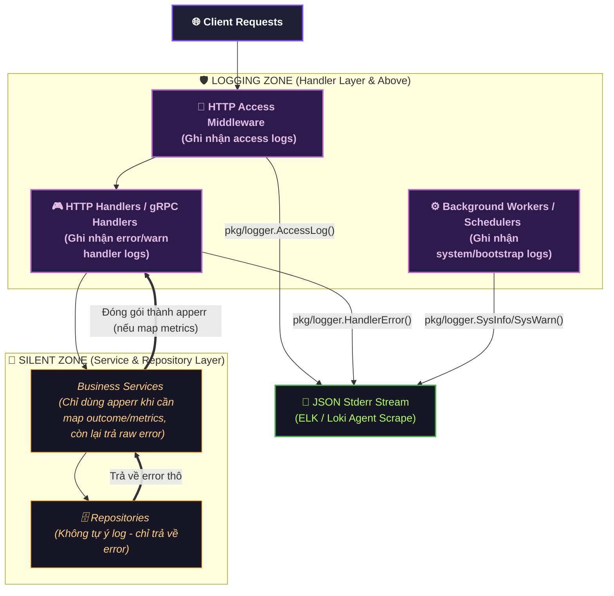

# Log Graph Canonical Contract

Status: Draft v1  
Owner: Platform/Controlplane team  
Scope: Logging Subsystem Boundaries, Context Invariants, and Structured Log Flow  

---

## Overview

Tài liệu này đặc tả **Hợp Đồng Thiết Kế Hệ Thống Log** (Log Graph Contract) áp dụng thống nhất cho toàn bộ hệ thống Controlplane. Mục tiêu là định hình ranh giới ghi log, phân loại loại log, bảo đảm cấu trúc ngữ cảnh (JSON fields), và tránh ô nhiễm log (log pollution).

---

## 1. Log Boundaries & Flow (Phân Phối & Ranh Giới Ghi Log)

Hệ thống Controlplane áp dụng nguyên tắc **chỉ ghi log ở tầng Handler/Transport trở lên** (HTTP Controller, gRPC Handler, Background Service Workers).

### Nguyên tắc ranh giới ghi log (Log Boundary Rules)

1. **Lớp Giao Tiếp & HTTP (Handler Layer):** Ghi nhận lưu lượng HTTP (Access Log), kết quả xử lý requests, lỗi nghiệp vụ trả về cho Client.
2. **Lớp Nghiệp Vụ & Dữ Liệu (Service & Repository Layer):** **Tuyệt đối không** tự ý gọi log.
   - Lớp Service chỉ sử dụng `apperr` để wrap lỗi **khi và chỉ khi** lỗi đó đi kèm với một outcome nghiệp vụ được thiết lập để đo lường metrics (map metrics và logs).
   - Nếu lỗi phát sinh không cần tracking metrics nghiệp vụ, Service phải trả về lỗi tiêu chuẩn (raw/standard error) trực tiếp lên Handler thay vì đóng gói qua `apperr`.
3. **Lớp Tiến Trình Chạy Ngầm (System Worker Layer):** Các background schedulers, task queues, hoặc bootstrap flows được phép ghi nhận log tiến trình trực tiếp qua subsystem `system` do không thuộc vòng đời HTTP Request thông thường.

---

## 2. Log Type Classification (Phân Loại & Cấu Trúc Log)

Tất cả log xuất ra dạng JSON đều được chia làm 3 kiểu loại thông qua trường bắt buộc `"log_type"`:

| Log Type | Source of Truth API (pkg/logger) | Trạng thái / Fields bắt buộc | Ví dụ ứng dụng |
|---|---|---|---|
| `"access"` | `AccessLog(...)` | `"request_id"`, `"method"`, `"route"`, `"status_code"`, `"latency_ms"`, `"client_ip"` | Ghi nhận lưu lượng và hiệu năng HTTP đầu vào của hệ thống. |
| `"handler"` | `HandlerInfo`, `HandlerWarn`, `HandlerError` | `"request_id"`, `"user_id"`, `"op"`, `"error"`, và các fields từ `apperr.LogFields` | Ghi nhận hoạt động nghiệp vụ của client hoặc các lỗi/cảnh báo xảy ra trong API handlers. |
| `"system"` | `SysInfo`, `SysWarn`, `SysError`, `SysFatal` | `"op"`, `"error"`, các trường tự định nghĩa tùy ngữ cảnh (`Fields`) | Ghi nhận quá trình khởi chạy app (bootstrap), dọn dẹp bộ nhớ (eviction), hoặc key rotation scheduler. |

---

## 3. Log Context Invariant (Bảo Đảm Ngữ Cảnh)

Để log có thể truy vết (traceable) hiệu quả trên các hệ thống HA lớn (Elasticsearch, Loki), mọi bản ghi log phải duy trì các trường cấu trúc sau:

### 3.1 Traceability (ID liên kết)

- **`request_id`**: Bắt buộc có trong `"access"` và `"handler"` logs để liên kết toàn bộ chuỗi hành vi của một request duy nhất.
- **`user_id`**: Đính kèm trong `"handler"` log khi request đã vượt qua lớp Authentication để giám sát hành động của người dùng cụ thể.

### 3.2 Operation Naming (`op`)

Trường `op` phải được đặt tên nhất quán theo mẫu phân cấp:
$$\text{format: } \langle\text{layer}\rangle.\langle\text{module}\rangle.\langle\text{action}\rangle$$

- Ví dụ: `handler.iam.login`, `system.iam.rotation.scheduler`, `handler.core.create_zone`.

### 3.3 Structured Error Fields (`error` & `apperr`)

Khi log một lỗi tại lớp Handler, logger sẽ phân giải lỗi qua `apperr.LogFields(err)` để tự động đính kèm thêm các metadata:

- `error_code`: Mã lỗi nghiệp vụ chuẩn hóa (e.g., `invalid_credentials`).
- `error_severity`: Mức độ nghiêm trọng của lỗi.
- `error`: Nội dung lỗi thô kèm callstack (nếu có).

---

## 4. Governance Rules

**Contract ID:** `LOGS-GOV-001`

1. **Single Source of Truth:** Chỉ sử dụng duy nhất các wrapper API trong package `controlplane/pkg/logger/logger.go`. Không tự ý import trực tiếp package `logrus` bên ngoài lớp này.
2. **Fail-Safe Logging:** Logging code phải là **panic-free**. Nếu `gin.Context` hoặc `error` bị `nil`, logger phải xử lý an toàn (silent fallback) thay vì gây crash ứng dụng.
3. **No Dynamic Levels in Production:** Logger mặc định ghi nhận từ mức `InfoLevel` ở môi trường production. Không bật log debug/trace động khi chưa có phê duyệt an toàn thông tin để bảo vệ rò rỉ dữ liệu nhạy cảm (PII).
