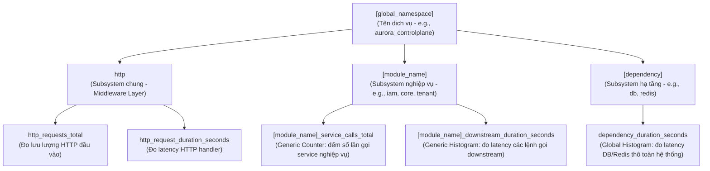
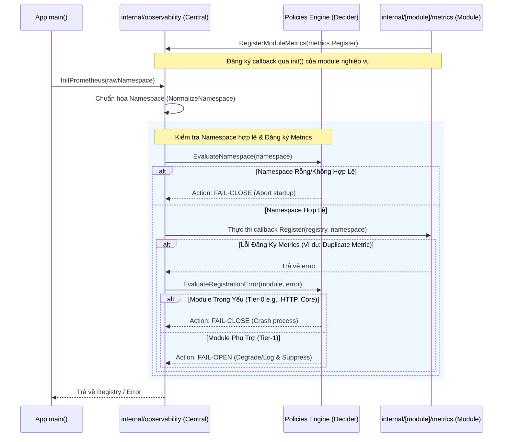

# Metrics Graph Canonical Contract

Status: Draft v1  
Owner: Platform/Controlplane team  
Scope: Subsystem Metrics Topology, Organization Patterns, and Observability Boundaries  

---

## Overview

Tài liệu này đặc tả **Mẫu Tổ Chức Cây Đo Lường** (Metrics Graph Pattern) áp dụng thống nhất cho toàn bộ hệ thống Controlplane. Đây là hợp đồng thiết kế để định hướng cách tổ chức, phân cấp, và phân định trách nhiệm thu thập chỉ số (metrics) giữa các lớp kiến trúc.

---

## 1. Metrics Hierarchy & Ownership Pattern (Phân Cấp Sở Hữu)

Hệ thống Controlplane tổ chức metrics theo mô hình phân cấp dạng cây (Tree Topology) để tránh xung đột tên và phân định rõ ràng trách nhiệm đo lường:

### Nguyên tắc ranh giới (Observability Boundaries)

1. **Lớp Giao Tiếp (HTTP Layer):** Do Middleware tự động đo lường (HTTP status, route, latency). Module nghiệp vụ **tuyệt đối không** đo lường các chỉ số HTTP tại Service layer.
2. **Lớp Nghiệp Vụ (Service Layer):** Mỗi module tự định nghĩa và quản lý chỉ số nghiệp vụ của mình thông qua tối đa 2 metrics generic: 1 CounterVec và 1 HistogramVec.
3. **Lớp Hạ Tầng (Infrastructure Layer):** Các driver (DB pgx tracer, Redis hook) tự động ghi nhận latency thô qua metric dependency toàn cục (`dependency_duration_seconds`).

---

## 2. Module Metrics Design Pattern (Mẫu Thiết Kế Module)

Mỗi module nghiệp vụ khi triển khai observability cần tuân thủ cấu trúc tối giản gồm đúng 2 metrics vector dùng chung:

### 2.1 Service Calls Counter (`[module]_service_calls_total`)

- **Mục tiêu:** Đo đếm tần suất và phân loại kết quả đầu ra của tất cả nghiệp vụ trong module.
- **Labels bắt buộc:** `[]string{"flow", "result", "cache_path"}`
  - `flow`: Tên chức năng/luồng nghiệp vụ cụ thể (e.g. `"register"`, `"login"`, `"create_zone"`).
  - `result`: Outcome code nghiệp vụ (e.g. `"success"`, `"already_exists"`, `"invalid_credentials"`).
  - `cache_path`: Hướng đi của luồng dữ liệu (e.g. `"cache_miss"`, `"cache_hit"`, `"n/a"` nếu không sử dụng).

### 2.2 Downstream Latency Histogram (`[module]_downstream_duration_seconds`)

- **Mục tiêu:** Đo lường latency có chọn lọc của các tác vụ gọi hệ thống ngoài (downstream) để phục vụ cô lập sự cố (isolation).
- **Labels bắt buộc:** `[]string{"kind", "operation", "status"}`
  - `kind`: Loại downstream (e.g. `"db"`, `"redis"`, `"crypto"`).
  - `operation`: Tên thao tác nghiệp vụ cụ thể (e.g. `"presence_check"`, `"hash_password"`, `"insert_user"`).
  - `status`: Kết quả thao tác (`"ok"` hoặc `"error"`).

---

## 3. Namespace Registration & Policies Engine (Đăng Ký & Xử Lý Lỗi)

Để tránh việc các module nghiệp vụ tự ý khởi tạo namespace và registry riêng lẻ dẫn đến phân mảnh, hệ thống áp dụng cơ chế tự đăng ký ngược (Self-Registration) về trung tâm. Toàn bộ lỗi phát sinh trong quá trình này được định tuyến qua **Observability Policies Engine** để đưa ra quyết định hành vi.

### Chính sách xử lý lỗi (Observability Policies Engine Decision Matrix)

| Scenario | Severity | Policy Action | Mô tả chi tiết |
|---|---|---|---|
| Central Namespace Rỗng hoặc Bị Lỗi Định Dạng Nặng | High | **FAIL-CLOSE** | Gây crash/stop tiến trình bootstrap ứng dụng ngay lập tức. Không cho phép cluster HA chạy ở trạng thái thiếu namespace hoặc sai namespace (ảnh hưởng đến hệ thống định tuyến logs/metrics tập trung). |
| Trùng lặp / Lỗi khởi tạo metrics lớp giao tiếp (HTTP/Core) | High | **FAIL-CLOSE** | Lớp HTTP và Core DB/Redis metrics là Tier-0. Lỗi đăng ký metrics này sẽ block deployment để nhà vận hành xử lý cấu hình sai. |
| Lỗi đăng ký metrics ở các module phụ trợ hoặc non-critical (Tier-1) | Low | **FAIL-OPEN** | Ghi log cảnh báo mức độ WARN/ERROR, chặn lỗi không cho lan rộng (suppress), khởi tạo thực thể mock/dummy no-op để luồng chính tiếp tục hoạt động, duy trì tính HA của dịch vụ. |

### Chính sách quản lý Namespace (Namespace Delegation Policy)

- **Chuẩn hóa duy nhất:** Namespace chỉ được chuẩn hóa một lần duy nhất tại hàm `NormalizeNamespace` của tầng observability trung tâm.
- **Quyền quyết định:** Nếu namespace lỗi hoặc trống, chính sách xử lý (ví dụ: dùng fallback mặc định hoặc crash ngay lập tức) sẽ được quyết định bởi policy engine của tầng trung tâm. Các module con nhận namespace đã chuẩn hóa và **không tự động thay đổi hay bổ sung giá trị mặc định**.

---

## 4. Governance & Integration Rules

1. **Rule of Two (Quy tắc hai metric):** Một module nghiệp vụ chỉ được phép đăng ký tối đa 1 CounterVec nghiệp vụ và 1 HistogramVec đo latency. Không tạo các metric đơn lẻ cho từng flow.
2. **Generic API calls:** Callsite tại Service Layer phải gọi qua các hàm Observe generic, tự truyền giá trị label (flow, result, operation) thay vì gọi các hàm hard-code nghiệp vụ.
3. **No-op Staging:** Khi thực hiện refactor metrics theo từng phase, các hàm đo lường chưa chuyển đổi ở phase này phải được dọn dẹp sạch sẽ (bỏ stub rỗng) hoặc chuyển đổi đồng loạt để tránh để lại dead code.
4. **Panic-safe Invariant:** Tất cả các collector/metric pointer tại module nghiệp vụ phải được kiểm tra `nil` trước khi gọi `.Observe()` hoặc `.Inc()`. Nếu Prometheus không được khởi động (ví dụ: trong unit test), luồng đo lường sẽ tự động bỏ qua (fail-open) thay vì gây panic ứng dụng.
