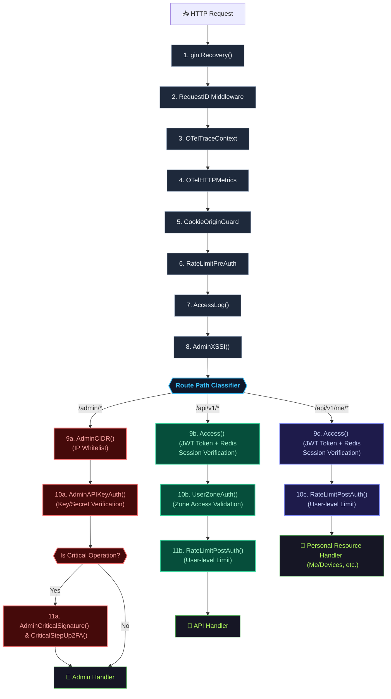

# Middleware Pipeline & Routing Canonical Contract

Status: Draft v1  
Owner: Platform/Controlplane team  
Scope: Global Middleware Ordering, Request Classification, and Route-Specific Security Chains  

---

## 1. Overview

Tài liệu này đặc tả **Hợp đồng Thiết kế Chuỗi Middleware & Định Tuyến** (Middleware Pipeline & Routing Contract) của Controlplane. Hợp đồng này quy định chi tiết luồng đi của request qua các lớp middleware toàn cục (Global Middlewares) và cách phân tách bảo mật cho 3 nhóm route chính: **Admin**, **API (General User)**, và **Me (Personal Resource)**.

---

## 2. Request Routing Topology & Security Pipelines (Định tuyến và Chuỗi bảo mật)

Mọi HTTP request gửi tới Controlplane sau khi đi qua **Global Middleware** toàn cục sẽ được phân nhóm thành 3 loại route chính: **Admin**, **API (General User)**, và **Me (Personal Resource)**. Mỗi nhóm route áp dụng một chuỗi bảo mật (Security Pipeline) đặc thù để bảo vệ tài nguyên hệ thống.

### 2.1 Sơ đồ xử lý Request & Phân nhánh Route (Mermaid Pipeline Graph)

---

## 3. Chi tiết các Phân hạng Route (Route Classification Details)

| Phân hạng | Đường dẫn gốc | Cơ chế Xác thực chính | Middleware đặc thù | Mục đích & Cam kết thiết kế |
| :--- | :--- | :--- | :--- | :--- |
| **Admin** | `/admin/*` | API Key (`AdminAPIKeyAuth`) | `AdminCIDR`, `AdminCriticalSignature`, `AdminCriticalStepUp2FA` | Quản trị hệ thống, vận hành hạ tầng bởi SRE. Yêu cầu CIDR whitelist, ký số và 2FA khi thực hiện hành động nhạy cảm (như xoay key). |
| **API** | `/api/v1/*` | Access Token (`Access`) | `UserZoneAuth`, `RateLimitPostAuth` | Các API nghiệp vụ chung của hệ thống phục vụ client/user. Xác thực token kết hợp kiểm tra trạng thái zone và phân chia rate limit theo user identity. |
| **Me** | `/api/v1/me/*` | Access Token (`Access`) | `RateLimitPostAuth` | Tra cứu/Cập nhật thông tin cá nhân của user đang đăng nhập (như danh sách thiết bị active, thu hồi session). Chỉ tương tác trực tiếp lên tài nguyên thuộc sở hữu của chính User ID lấy từ context. |

---

## 4. Invariants & Security Rules (Các Quy tắc & Ràng buộc Bảo mật)

1. **Context Isolation:** Các API thuộc phân khúc **Me** và **API** sau khi qua `Access()` middleware bắt buộc phải tiêm `UserID` (`constant.ContextKeyUserID`), `Role` (`constant.ContextKeyRole`), và `Level` (`constant.ContextKeyLevel`) vào Gin/Go Context. Handler tuyệt đối KHÔNG được tự ý lấy `actorUserID` từ các tham số query/payload của Client để tránh lỗ hổng privilege escalation (leo thang đặc quyền).
2. **Fail-Closed by Default:** Nếu bất kỳ middleware nào trong chuỗi bảo mật gặp lỗi (như lỗi kết nối Redis session store, JWT signature invalid, token hết hạn, IP CIDR check từ chối), request lập tức bị hủy (`c.Abort()`) kèm mã lỗi tương ứng (401 Unauthorized, 403 Forbidden, hoặc 503 Service Unavailable). Không bao giờ có chế độ fallback silent cho phép bỏ qua xác thực.
3. **Defense in Depth:** Phân khúc **Admin** thực hiện IP CIDR Whitelist ngay từ lớp ngoài cùng trước khi xử lý các bước API Key chuyên sâu, nhằm hạn chế tối đa tài nguyên xử lý vô ích và giảm thiểu nguy cơ bị brute force mật khẩu/key.
