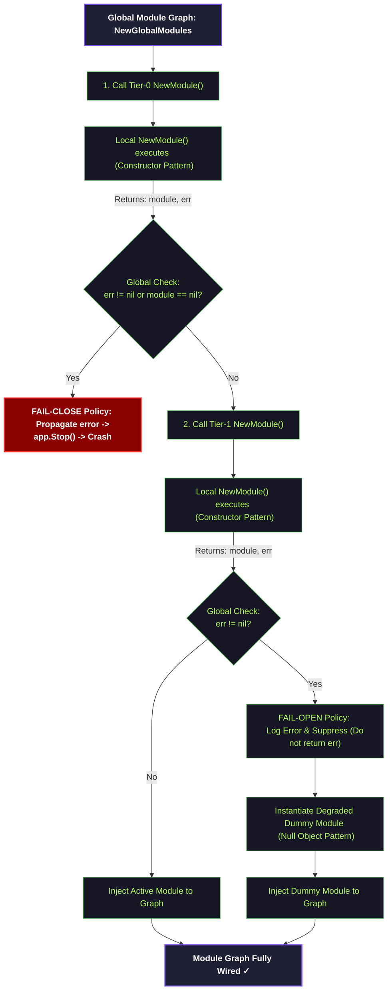

# Module Graph Canonical Contract

Status: Draft v1  
Owner: Platform/Controlplane team  
Scope: Global Module Graph loading, Tier-0 vs Tier-1 dependency segmentation  

---

## 1. Global & Local Module Dependency Flow (Module Graph)

Sơ đồ dưới đây đặc tả luồng tải và thiết lập dependencies của các Module nghiệp vụ trong chuỗi bootstrap toàn cục (`NewGlobalModules` tại `controlplane/internal/app/module.go`):

---

## 2. Tier Classification & Policies (Phân Nhóm Module)

Hệ thống Controlplane phân loại các Module nghiệp vụ thành 2 phân hạng để tối ưu hóa tính HA và độ tin cậy:

### 2.1 Tier-0 (Critical Services - Dịch Vụ Sống Còn)

- **Danh sách Modules:** `Core`, `IAM`, `PolicyEngine`.
- **Chiến lược xử lý lỗi (Fail Strategy):** **Fail-Close**. Bất kỳ lỗi khởi tạo nào (như connection pool bị lỗi, thiếu runtime master key, lỗi Redis client) bắt buộc phải ném lỗi hoặc panic để chấm dứt (crash) tiến trình khởi động ngay lập tức. Điều này giúp bộ điều phối (Kubernetes) chặn đứng việc deploy cấu hình sai và kích hoạt cảnh báo hạ tầng cho SRE.

### 2.2 Tier-1 (Non-Critical Services - Dịch Vụ Phụ Trợ)

- **Danh sách Modules:** `Hypervisor`, `Mail`.
- **Chiến lược xử lý lỗi (Fail Strategy):** **Fail-Open (Graceful Degradation)**. Nếu xảy ra lỗi khởi tạo (như config sai, network timeout tới server mail), hệ thống bắt buộc phải bắt lỗi, ghi log cảnh báo mức độ WARN/ERROR, khử lỗi (suppress error) và khởi tạo một đối tượng thay thế không hoạt động (Null Object Pattern / Dummy Module). Việc này cho phép Controlplane tiếp tục vận hành các chức năng cốt lõi khác mà không bị tê liệt toàn bộ.

---

## 3. Governance Invariants

- **Single Source of Truth:** File `controlplane/internal/app/module.go` là nguồn tin cậy duy nhất định nghĩa cấu trúc Module Graph và liên kết chéo giữa các Module.
- **Health Reporting:** Endpoint kiểm tra sức khỏe `/api/v1/health/readiness` phải báo `unhealthy` nếu bất kỳ Tier-0 Module nào lỗi, nhưng báo `partially degraded` (giảm hiệu năng) nếu Tier-1 Module lỗi.
- **Fail-Fast Enforcement:** Mọi quyết định fail-fast phải xảy ra ngay tại biên khởi chạy (Initialization Boundary), tuyệt đối không để lọt lỗi cấu hình hoặc dependency `nil` vào runtime request.
