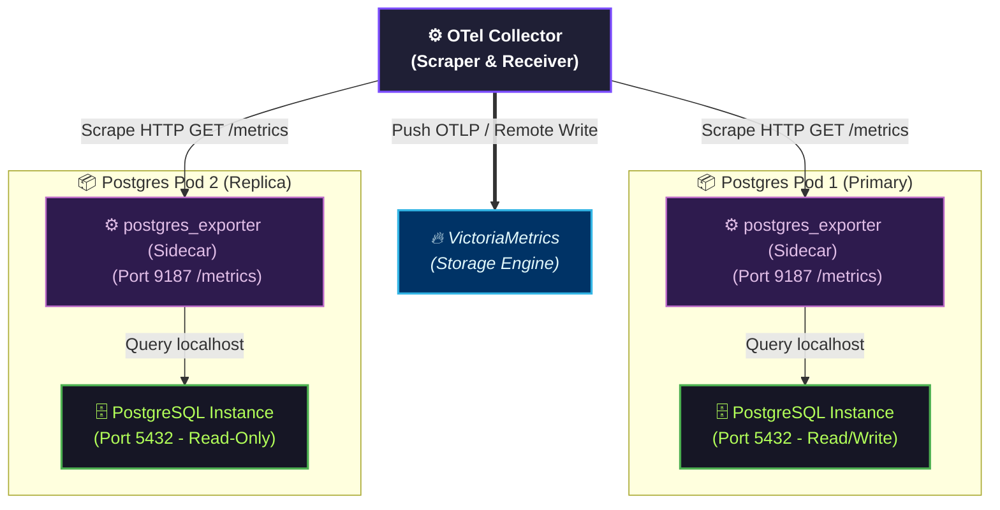

# PostgreSQL Exporter Canonical Contract

**Status**: Draft v1  
**Owner**: Platform/Controlplane & SRE team  
**Scope**: PostgreSQL Infrastructure Monitoring, HA Deployment Architecture, Security Constraints, WAL & Replication Slot Protection, and Grafana Alerting Rules

---

## 1. Overview & Objective (Tổng quan & Mục tiêu)

PostgreSQL là kho lưu trữ dữ liệu trung tâm bền vững (Single Source of Truth) phục vụ cho hệ thống Controlplane và các module nghiệp vụ như Outbox Pattern (CDC Logical Replication). Để bảo đảm tính sẵn sàng cao (HA), hiệu năng tối ưu, và tính bền vững của dữ liệu, hệ thống yêu cầu một giải pháp giám sát PostgreSQL chuyên dụng (`postgres_exporter`).

Tài liệu này đặc tả **Hợp đồng Thiết kế Giám sát PostgreSQL** nhằm:

- Xác định mô hình triển khai Cloud-Native HA của `postgres_exporter`.
- Đặc tả ranh giới bảo mật và phân quyền tối thiểu (Least Privilege).
- Ngăn ngừa các lỗi logic, cạn kiệt tài nguyên (Connection Exhaustion), và rủi ro tràn đĩa do Logical Replication WAL Accumulation (CDC).
- Định nghĩa luồng dữ liệu (Data Pipeline) tích hợp với OpenTelemetry Collector và VictoriaMetrics.

---

## 2. Cloud-Native & HA Deployment Architecture (Kiến trúc Triển khai HA)

Trong môi trường Cloud-Native (Kubernetes) chạy HA, PostgreSQL thường được quản lý dưới dạng cụm Primary-Replica (sử dụng Patroni, Crunchy Data PGO, hoặc CloudNativePG). `postgres_exporter` phải được thiết kế để giám sát toàn diện cả hai trạng thái này mà không làm ảnh hưởng đến hiệu năng hệ thống.



### 2.1 Sidecar Pattern (Mẫu Thiết kế Sidecar - Tiêu chuẩn HA)

Đối với cụm PostgreSQL HA, **Sidecar Pattern** là mô hình triển khai bắt buộc vì các lý do sau:

1. **Cô lập định danh (Identity Isolation)**: Mỗi `postgres_exporter` chỉ kết nối trực tiếp đến PostgreSQL instance chạy cùng Pod thông qua giao tiếp `localhost`. Điều này giúp phân biệt rõ ràng chỉ số của từng Node (ví dụ: đâu là Primary, đâu là Replica, độ trễ replication của từng Replica).
2. **Loại bỏ Single Point of Failure (SPOF)**: Nếu sử dụng một cụm Exporter tập trung kết nối qua PgBouncer hoặc Load Balancer, ta sẽ không giám sát được từng node vật lý riêng lẻ và có nguy cơ Exporter bị sập làm gián đoạn toàn bộ chỉ số giám sát database.
3. **Bảo mật mạng nội bộ**: Không cần mở cổng PostgreSQL (5432) ra ngoài môi trường mạng chung của cụm Kubernetes. Chỉ có `postgres_exporter` truy cập nội bộ trong Pod, và OTel Collector truy cập exporter qua cổng `/metrics` bảo mật.

---

## 3. Metrics Ingestion Flow & Boundary (Luồng Thu Thập & Ranh Giới)

Để đảm bảo tính nhất quán với hợp đồng **Zero-Inbound Observability** của các microservice, luồng thu thập metrics hạ tầng được quy định như sau:

1. **Exporter Endpoint (Pull)**: `postgres_exporter` vận hành theo mô hình Pull, mở cổng HTTP GET `/metrics` (mặc định port `9187`) để cung cấp dữ liệu thô dạng Prometheus.
2. **OTel Collector Bridge**: Thay vì cài đặt một máy chủ Prometheus độc lập để scrape, **OpenTelemetry Collector** (đã được cấu hình HA) sẽ sử dụng `prometheus` receiver để định kỳ pull metrics từ các Sidecar Exporter này.
3. **Unified Egress (Push)**: OTel Collector nhận dữ liệu, thực hiện batching, chuẩn hóa các thẻ nhãn (attributes) như `cluster_role`, `instance_id`, `zone`, rồi đẩy (Push) một chiều về VictoriaMetrics thông qua giao thức `prometheusremotewrite`.

*Điều này đảm bảo kiến trúc giám sát chỉ có một chiều đẩy dữ liệu ra ngoài biên lưu trữ, bảo đảm an toàn thông tin.*

---

## 4. Security & Permissions Contract (Hợp đồng Bảo mật & Phân quyền)

Việc sử dụng tài khoản `postgres` (Superuser) cho việc giám sát là **nghiêm cấm hoàn toàn** trên môi trường sản xuất để tránh nguy cơ rò rỉ dữ liệu hoặc bị tấn công leo thang đặc quyền.

### 4.1 Dedicated Monitoring User (Tài khoản giám sát chuyên dụng)

- **Tên Role**: `postgres_exporter` (hoặc tương đương).
- **Phân quyền hệ thống**: Từ PostgreSQL 10+, hệ thống cung cấp sẵn role `pg_monitor` chứa toàn bộ quyền đọc danh mục hệ thống (system catalogs) phục vụ cho giám sát.
- **Câu lệnh thiết lập**:

  ```sql
  CREATE USER postgres_exporter WITH PASSWORD 'secure_password_here';
  GRANT pg_monitor TO postgres_exporter;
  ```

- **Không cấp quyền**: Role này tuyệt đối không được cấp quyền `SUPERUSER`, `CREATEDB`, `CREATEROLE`, hoặc `REPLICATION`, và không có quyền truy cập dữ liệu trên các bảng nghiệp vụ (user tables).

### 4.2 Credentials Management (Quản lý thông tin xác thực)

- Thông tin kết nối (`DATA_SOURCE_NAME`) phải được cung cấp qua Environment Variable bảo mật (Kubernetes Secrets) dưới dạng:
  `postgresql://postgres_exporter:<password>@127.0.0.1:5432/postgres?sslmode=disable` (hoặc `sslmode=require` trên production).

---

## 5. Performance Optimization & Data Durability (Tối ưu hóa & Bảo vệ Dữ liệu)

Giám sát không được phép làm ảnh hưởng hoặc làm sập dịch vụ chính. Dưới đây là các rủi ro hệ thống và cơ chế giảm thiểu bắt buộc:

### 5.1 Phòng ngừa cạn kiệt kết nối (Connection Exhaustion)

- **Rủi ro**: Khi cơ sở dữ liệu bị quá tải hoặc gặp sự cố, số lượng kết nối tới Postgres tăng đột biến. Nếu Exporter tạo quá nhiều kết nối mới để lấy metrics, nó sẽ chiếm hết slot kết nối còn lại, gây ra hiện tượng từ chối dịch vụ (Denial of Service) đối với Controlplane và Job-Proxy.
- **Biện pháp giảm thiểu**:
  - Giới hạn kích thước pool kết nối của `postgres_exporter` ở mức tối giản: tối đa **1 đến 2 kết nối**.
  - Thiết lập timeout truy vấn giám sát chặt chẽ: `connect_timeout=3` (giây) và timeout thực thi query của exporter là `5` (giây). Nếu truy vấn catalog bị nghẽn quá 5s, exporter phải tự hủy kết nối và báo lỗi để tránh làm nghẽn PostgreSQL backend.

### 5.2 Phòng ngừa tràn đĩa do tích tụ WAL (Replication Slot & CDC Protection)

- **Bối cảnh**: Hệ thống sử dụng `job-proxy` để stream các thay đổi từ bảng `mail_outbox_records` thông qua Logical Replication Slot (`outbox_slot`).
- **Nguy cơ cực kỳ nghiêm trọng**: Nếu `job-proxy` bị crash, kết nối đến replication slot bị ngắt. Lúc này, PostgreSQL bắt buộc phải giữ lại toàn bộ Log ghi trước (WAL - Write Ahead Log) trên đĩa cứng để chờ `job-proxy` kết nối lại và xác nhận (ACK LSN). Nếu không có cảnh báo kịp thời, thư mục `pg_wal` sẽ phình to cho đến khi **đầy 100% dung lượng đĩa cứng**, khiến PostgreSQL tự động sập (panic) và có thể gây hỏng hóc cấu trúc file dữ liệu (data corruption).
- **Cơ chế giám sát bắt buộc**:
  - Exporter bắt buộc phải thu thập trạng thái hoạt động của replication slots (`pg_replication_slots`).
  - Đo lường dung lượng WAL tích tụ chưa được tiêu thụ (Replication Lag bytes/LSN gap).
  - Cảnh báo ngay lập tức nếu replication slot ở trạng thái `active = false` hoặc replication lag vượt quá ngưỡng cho phép (ví dụ: > 500MB).

### 5.3 Tần suất và Độ sâu thu thập (Scrape Interval Tuning)

- **Scrape Interval**: Khuyến nghị đặt tần suất scrape là **15 giây** hoặc **30 giây** để cân bằng giữa độ mịn của biểu đồ và I/O tải của database.
- **Disable Heavy Metrics**: Vô hiệu hóa các bộ thu thập thông tin cấu hình tĩnh hoặc các bảng thống kê truy vấn quá nặng nếu không cần thiết (ví dụ: tắt `pg_stat_statements` trong luồng lấy metrics định kỳ của exporter để tránh quét toàn bộ bộ nhớ cache SQL).

---

## 6. Metrics & Alerts Definition (Đặc tả Metrics & Cảnh báo SRE)

### 6.1 Các Metrics cốt lõi cần thu thập

| Metric Name | Mô tả nghiệp vụ | Tầm quan trọng |
| :--- | :--- | :--- |
| `pg_up` | Trạng thái sống/chết của PostgreSQL instance (1 = Ok, 0 = Down). | **Critical** - Nhận biết sập database. |
| `pg_stat_database_numbackends` | Số lượng kết nối active tới từng database. | **High** - Phòng ngừa nghẽn connection pool. |
| `pg_replication_slots_active` | Trạng thái active của replication slots (CDC). | **Critical** - Phát hiện Job-Proxy CDC mất kết nối. |
| `pg_replication_slots_lag_bytes` | Dung lượng dữ liệu WAL đang chờ được replication tiêu thụ. | **Critical** - Ngăn ngừa tràn đĩa cứng. |
| `pg_stat_database_xact_commit` / `_rollback` | Tỷ lệ commit / rollback giao dịch. | **High** - Phát hiện lỗi logic nghiệp vụ gây rollback hàng loạt. |
| `pg_stat_database_conflicts` | Số lượng xung đột truy vấn trên các Node Replica. | **Medium** - Giám sát tính ổn định của cụm HA Read-Only. |
| `pg_stat_database_blks_hit` / `_read` | Tỷ lệ Cache Hit Ratio của bộ đệm tuần hoàn (Shared Buffers). | **Medium** - Đánh giá hiệu năng và nhu cầu nâng cấp RAM. |

### 6.2 Hợp đồng Cảnh báo SRE (SRE Alerting Matrix)

Khi tích hợp lên Grafana & Alertmanager, các quy tắc cảnh báo sau phải được thiết lập mặc định:

```yaml
groups:
  - name: postgresql_alerts
    rules:
      # 1. Cảnh báo sập nguồn DB
      - alert: PostgreSQLDown
        expr: pg_up == 0
        for: 30s
        labels:
          severity: critical
        annotations:
          summary: "PostgreSQL Instance Down"
          description: "Không thể kết nối đến PostgreSQL instance trên node {{ $labels.instance }}."

      # 2. Cảnh báo mất kết nối Logical Replication Slot (Rủi ro cao nhất cho dữ liệu)
      - alert: PostgreSQLLogicalSlotInactive
        expr: pg_replication_slots_active{slot_type="logical"} == 0
        for: 1m
        labels:
          severity: critical
        annotations:
          summary: "Logical Replication Slot Inactive"
          description: "Slot replication '{{ $labels.slot_name }}' đang không hoạt động. Job-Proxy CDC có thể đã sập. Nguy cơ tràn đĩa pg_wal!"

      # 3. Cảnh báo dung lượng WAL tích tụ quá lớn
      - alert: PostgreSQLReplicationLagHigh
        expr: pg_replication_slots_lag_bytes > 536870912  # 512 MB
        for: 2m
        labels:
          severity: warning
        annotations:
          summary: "PostgreSQL Replication Lag High"
          description: "Dữ liệu WAL tích tụ trên slot '{{ $labels.slot_name }}' vượt quá 512MB (Đang là {{ $value | humanizeBytes }}). Cần kiểm tra kết nối Job-Proxy."

      # 4. Cảnh báo cạn kiệt kết nối
      - alert: PostgreSQLTooManyConnections
        expr: sum(pg_stat_database_numbackends) by (instance) / pg_settings_max_connections * 100 > 85
        for: 1m
        labels:
          severity: warning
        annotations:
          summary: "PostgreSQL Connection Usage High"
          description: "Số lượng kết nối đến PostgreSQL vượt quá 85% giới hạn max_connections trên {{ $labels.instance }}."
```
