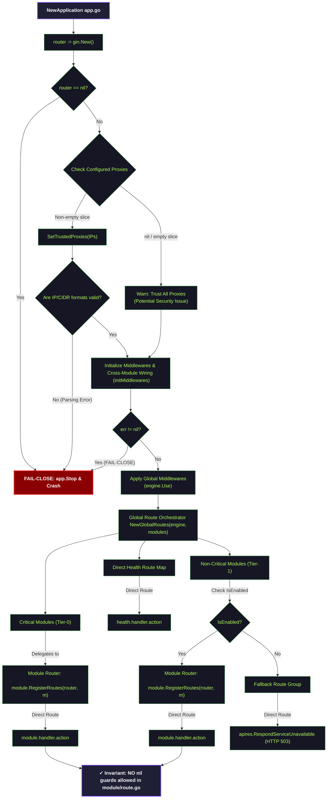

# Router Graph Canonical Contract

Status: Draft v1  
Owner: Platform/Controlplane team  
Scope: HTTP Engine setup, Middleware pipeline, and Route Registration delegation  

---

## 1. HTTP Engine & Route Registration Flow (Router Flow)

Sơ đồ dưới đây đặc tả luồng khởi tạo HTTP Engine (Gin), cấu hình bảo mật, thiết lập middlewares và bàn giao đăng ký route cho các Module:

---

## 2. HTTP Engine Bootstrap & Security Invariants

Hệ thống HTTP Router bắt buộc phải bảo đảm các nguyên tắc cấu hình an toàn sau:

### 2.1 Trusted Proxies Security

- **Không tin tưởng mặc định:** Nếu danh sách proxy trống, Gin Router sẽ phát log cảnh báo nghiêm trọng.
- **Fail-Close trên CIDR/IP sai định dạng:** Bất kỳ lỗi parse cấu hình proxy IP/CIDR nào đều kích hoạt crash tiến trình khởi chạy ngay lập tức (`FAIL-CLOSE`) để bảo đảm lớp CIDR guard không bị bypass.

### 2.2 Route Registration Contract

- **No Nil Guards inside Route files:** Các file đăng ký route của các module nghiệp vụ (e.g. `internal/iam/route.go`, `internal/core/route.go`) **không được chứa code kiểm tra nil** đối với Handler hay Service.
- **Đảm bảo của App:** Lớp `App` cam kết bằng hợp đồng thiết kế rằng khi hàm đăng ký route được gọi, mọi dependency truyền vào (Module, Handler, Service) đều đã được khởi tạo hoàn hảo và non-nil.

---

## 3. Tier-1 Route Fallback (Tuyến fallback khi dịch vụ tắt)

Đối với các module Tier-1 (Non-critical) có thể bị tắt (disabled) hoặc bị hạ cấp (degraded) do lỗi khởi tạo:

- Lớp định tuyến không được ẩn hay xóa route của client.
- Thay vào đó, nếu module bị tắt (`IsEnabled == false`), route của module đó sẽ được định tuyến sang nhóm Fallback Route Group.
- Nhóm fallback này tự động phản hồi mã trạng thái HTTP `503 Service Unavailable` thông qua `apires.RespondServiceUnavailable` để thông báo cho Client biết tính năng tạm thời bị gián đoạn nhưng không phá vỡ cấu trúc routing chung của API Gateway.
