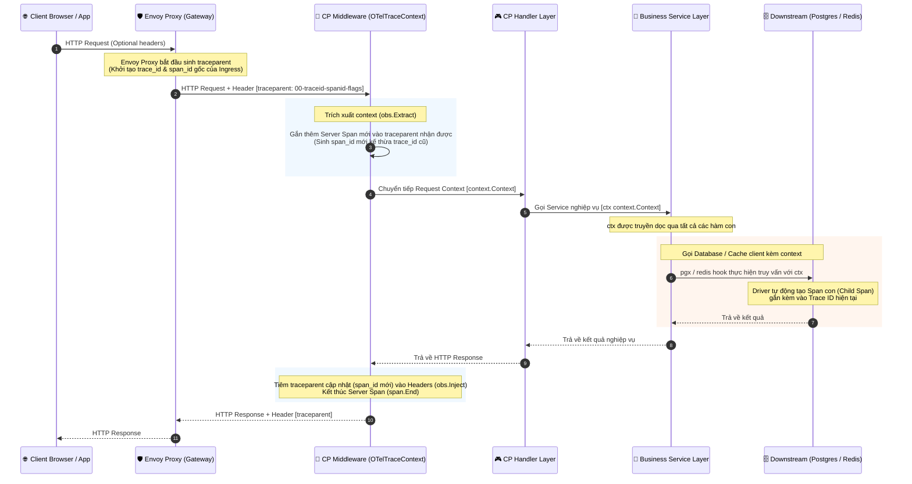
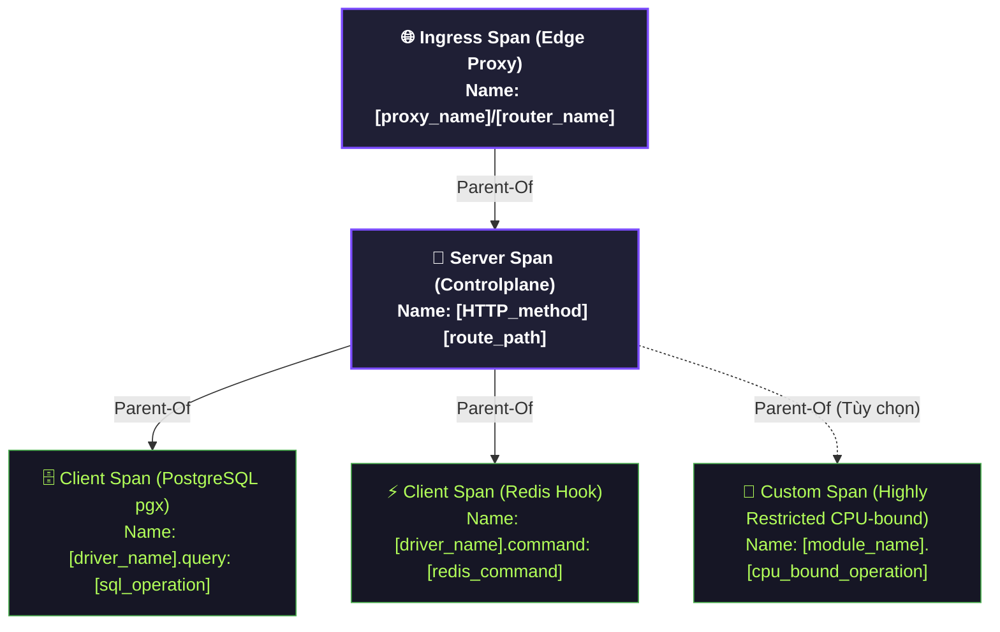

# OpenTelemetry Tracing Flow Canonical Contract

Status: Draft v1  
Owner: Platform/Controlplane team  
Scope: Distributed Tracing, Context Propagation, and Span Hierarchy  

---

## Overview

Tài liệu này đặc tả **Mẫu Lan Truyền Tracing** (Tracing Flow Pattern) tích hợp OpenTelemetry (OTel) áp dụng thống nhất cho hệ thống Controlplane. Đây là hợp đồng thiết kế quy định cách thức sinh, kế thừa, và phân phối định danh trace (Trace Context) giữa cổng Proxy (Envoy) và các lớp bên trong Controlplane.

---

## 1. Trace Propagation & Lifecycle (Quy Trình Lan Truyền Vết)

Vòng đời của một trace bắt đầu từ biên mạng (Edge Proxy) đi sâu vào API Handlers và lan truyền xuống hạ tầng cơ sở dữ liệu:

---

## 2. Context Propagation Rules (Quy Tắc Truyền Context)

Để đảm bảo trace không bị đứt gãy (trace context breakage), tất cả các kỹ sư phát triển phải tuân thủ các quy tắc truyền ngữ cảnh sau:

### 2.1 Go Context Propagation Invariant

- **Không ngắt quãng context:** Đối số đầu tiên của mọi hàm Service, Repository, và Client call bắt buộc phải nhận `ctx context.Context`.
- **Không sử dụng `context.Background()` hoặc `context.TODO()`** ở các tầng nghiệp vụ phía dưới. Việc này sẽ cắt đứt mối liên kết giữa Span hiện tại và Span gốc do Middleware tạo ra.
- **Asynchronous Tasks:** Đối với các tác vụ chạy nền (fire-and-forget) tách biệt hoàn toàn khỏi vòng đời của request gốc, được phép sử dụng một Context rỗng mới (`context.Background()`), nhưng phải chủ động copy hoặc đính kèm Trace ID cũ sang log (nếu muốn liên kết log) và bắt đầu một Trace mới độc lập.

### 2.2 W3C Trace Context Header Format

Header `traceparent` tuân thủ tiêu chuẩn W3C Distributed Tracing với định dạng:
$$\text{format: } \text{version}-\text{trace\_id}-\text{parent\_id}-\text{trace\_flags}$$

- Ví dụ: `00-4bf92f3577b34da6a3ce929d0e0e4736-00f067aa0ba902b7-01`
  - `version` (`00`): Phiên bản đặc tả hiện tại.
  - `trace_id` (`4bf92f3577b34da6a3ce929d0e0e4736`): 16-byte định danh giao dịch duy nhất toàn cục.
  - `parent_id` (`00f067aa0ba902b7`): 8-byte định danh Span cha.
  - `trace_flags` (`01`): Cờ điều khiển thu thập (e.g., `01` tức là đã được lấy mẫu - sampled).

### 2.3 Trace ID Immutability & Span Generation Boundaries (Tính Bất Biến & Biên Sinh Span)

Để tránh lãng phí tài nguyên CPU/Memory và làm nhiễu dữ liệu trace, hệ thống tuân thủ 2 nguyên lý vận hành:

1. **Trace ID là bất biến (Immutable):** `trace_id` được sinh ra một lần duy nhất tại Envoy Proxy và đi kèm xuyên suốt trong Go `context.Context` qua mọi lớp. Các lớp trung gian không được sinh lại hay thay đổi `trace_id` này.
2. **Không tự ý sinh Span ở lớp Service:** Các phương thức nghiệp vụ thông thường trong Service/Repository Layer **không tự sinh Span mới**. Chúng chỉ nhận và truyền tiếp `context.Context` chứa trace ID hiện tại.
3. **Biên sinh Span (Span Boundaries):** Một Span mới chỉ được sinh ra tại:
   - **Tầng Entrypoint (Server Span):** Ghi nhận tổng thời gian xử lý request của Controlplane (do Middleware thực hiện).
   - **Tầng Downstream (Client Span):** Khi gọi ra hệ thống ngoài (truy vấn Database qua pgx, gọi Redis qua redis_hook, hoặc gọi HTTP/gRPC API sang service khác).

---

## 3. Span Hierarchy & Boundaries (Phân Cấp & Ranh Giới Span)

- **Span Cha của Controlplane (Server Span):** Được tạo tự động ở lớp biên của Controlplane (`OTelTraceContext` Middleware) bằng cách gắn thêm (append) một Span mới vào `traceparent` gốc nhận từ Envoy. Span này lưu trữ cùng `trace_id` giao dịch nhưng có `span_id` riêng biệt.
- **Span Con (Child Span):**
  - **Tự động bởi Driver:** Mọi lệnh gọi xuống PostgreSQL và Redis đều tự động sinh Span con qua `pgx_tracer.go` và `redis_hook.go`.
  - **Đo lường thủ công (Manual Span):** Các module nghiệp vụ chỉ tự sinh Span thủ công khi xử lý một tác vụ tính toán CPU-bound rất nặng (ví dụ: băm mật khẩu `Argon2id` nhiều luồng). Các nghiệp vụ I/O thông thường không được phép lạm dụng tự tạo Span nghiệp vụ con để tránh làm phình kích thước trace buffer.

---

## 4. Governance & Integration Rules

1. **Panic-safe propagation:** Toàn bộ API trích xuất và tiêm context (`obs.Extract`, `obs.Inject`) phải được bọc trong các cơ chế kiểm tra `nil`. Nếu OTel chưa được khởi tạo ở bootstrap phase, luồng nghiệp vụ vẫn phải chạy bình thường (fail-open).
2. **PII Masking:** Tuyệt đối không đưa các thông tin nhạy cảm của người dùng (như mật khẩu, số điện thoại, mã token) vào thuộc tính của Span (`Span Attributes`). Chỉ được phép đính kèm các thông tin hạ tầng hoặc nghiệp vụ đã được hash/masking (ví dụ: `user_id`, `client_ip`, `status_code`).
3. **Trace-to-Log Correlation:** Định danh `trace_id` luôn được đồng bộ hóa vào trường `"request_id"` của JSON Log (nếu có context) để nhà vận hành có thể trực tiếp tìm kiếm trace tương ứng khi xem log trên Loki/Elasticsearch.
