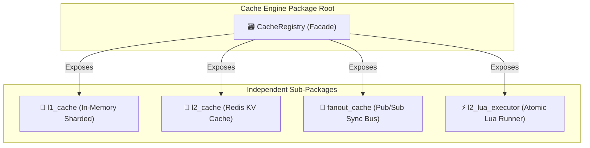
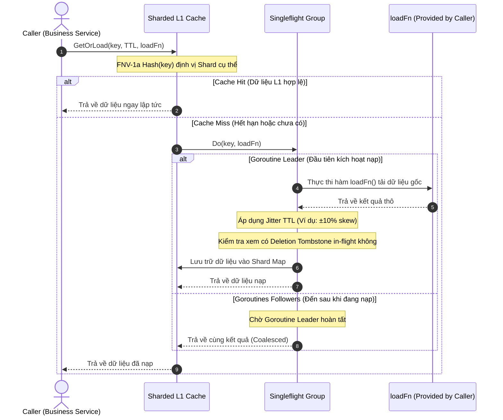
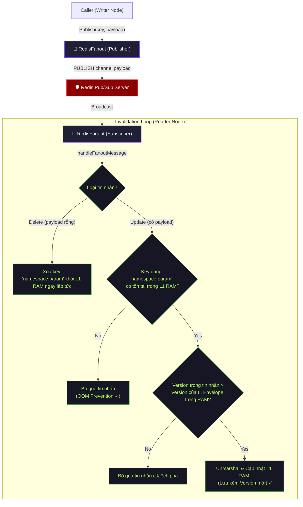
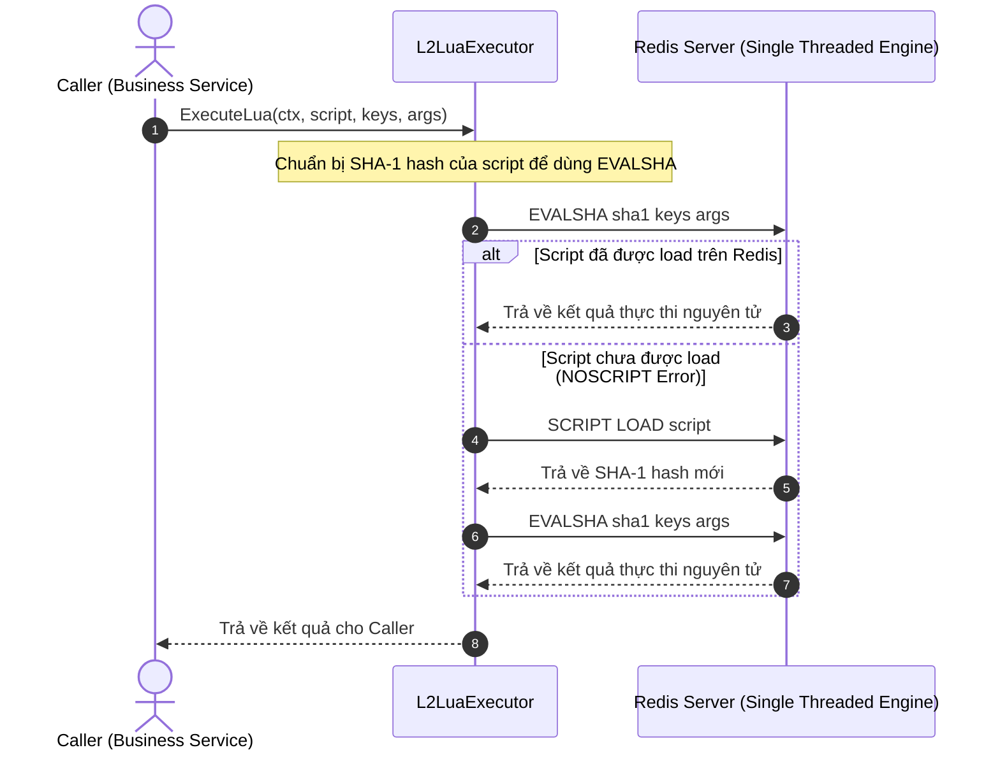

# Cache Engine Infrastructure

Module `cacheengine` đóng vai trò là một **hạ tầng cung cấp (Infrastructure Provisioner)**. Module cung cấp các khối xây dựng cơ bản (Primitives) độc lập và hiệu năng cao phục vụ cho việc lưu trữ đệm, đồng bộ hóa và điều phối trạng thái, không quyết định hay áp đặt luồng nghiệp vụ (Business Workflows) của Caller.

Các module nghiệp vụ của hệ thống (như IAM, Core, Mail...) tự quyết định cách phối hợp các công cụ này để phục vụ nhu cầu cụ thể (ví dụ: Cache-Aside, Write-Through, Read-Through).

---

## 1. Tổng Quan Kiến Trúc (Architecture Overview)

### 1.1 Các Phân Hệ Của Engine (Engine Components)

Hạ tầng Cache Engine được chia thành 4 phân hệ chính hoạt động độc lập dưới sự quản lý của `CacheRegistry` Facade:

---

### 1.2 Quy Tắc Thiết Kế Key Pattern Ở Các Layer

Để duy trì tính nhất quán, dễ quản trị và tránh va chạm (collision) trong shared Redis/Cluster, Cache Engine quy định cấu trúc đặt tên Key Pattern phân lớp rõ ràng:

| Layer | Định Dạng Key | Ví Dụ Minh Họa | Giải Thích Chi Tiết |
| :--- | :--- | :--- | :--- |
| **L1 RAM Cache** | `{module_name}:{namespace}:{params}` | `iam:rbac_role:admin` `core:zone_by_code:us` | Key định danh độc nhất dùng để lưu trữ đối tượng gốc trên RAM (Zero-Serialization). Nếu không có params, định dạng là `{module_name}:{namespace}` (ví dụ: `core:zone_catalog`). |
| **L1 Invalidation Bus (Fanout)** | `{module_name}:{namespace}:{params}` | `iam:rbac_role:admin` | Payload truyền qua Redis Pub/Sub mang chính xác Key của L1 để các node replica xác định vùng cache cần dọn dẹp hoặc cập nhật tức thì. |
| **L2 Redis Cache** | `{module_name}:{namespace}:{params}` | `iam:rbac_role:admin` | Vùng lưu trữ thô đã được serialize (JSON/MsgPack) trực tiếp trên Redis để phục vụ truy xuất phân tán. |
| **L2 Version Control** | `{module_name}:version:{namespace}:{params}` | `iam:version:rbac_role:admin` | Khóa siêu dữ liệu (Metadata Key) trên Redis theo dõi phiên bản đơn điệu (`UnixNano` timestamp), dùng để lọc và chống ghi đè dữ liệu cũ (Stale Writes) trong môi trường HA. |

---

## 2. Thiết Kế Chi Tiết & Cơ Chế Hoạt Động (Internal Use Cases)

Các sơ đồ dưới đây mô tả hành vi nội tại của từng phân hệ khi được caller gọi thực thi.

### 2.1 Cơ chế GetOrLoad của L1 Memory Cache (`l1_cache`)

`l1_cache` hỗ trợ chống Lock Contention bằng Sharding, chống Cache Stampede bằng Jitter TTL và gom cụm yêu cầu bằng `singleflight`:

---

### 2.2 Cơ chế Đồng Bộ Hóa Phiên Bản của Fanout Bus (`fanout_cache`)

`fanout_cache` cung cấp cơ chế phát tán và lắng nghe sự kiện đồng bộ L1 Cache giữa các replica trong Cluster, tích hợp tính năng **OOM Prevention** (chỉ nạp RAM những gì đang active) và chống stale write bằng Version đơn điệu:

---

### 2.3 Cơ chế Thực Thi Lua Script Nguyên Tử (`l2_lua_executor`)

`l2_lua_executor` cung cấp giải pháp chạy các script Lua nguyên tử trên Redis để cập nhật phiên bản hoặc kiểm tra khóa khóa một cách an toàn mà không bị tranh chấp bởi các transaction đồng thời khác:

---

## 3. Các Tính Năng An Toàn Cho Vận Hành HA (HA Protections)

- **Flush-on-Reconnect:** Nếu kết nối tới Redis bị ngắt rồi phục hồi, luồng monitor sẽ tự động dọn sạch L1 RAM cục bộ để đảm bảo không phục vụ dữ liệu cũ/lệch cấu hình.
- **Tombstone Invalidation:** Đảm bảo không ghi đè dữ liệu cũ (stale write) nếu có thao tác xóa dữ liệu xảy ra đồng thời trong khi đang query DB.
- **OOM Prevention:** Tin nhắn Pub/Sub cập nhật key chưa từng được query trên instance hiện tại sẽ bị bỏ qua thay vì cache bừa bãi, giúp tối ưu dung lượng RAM sử dụng.
