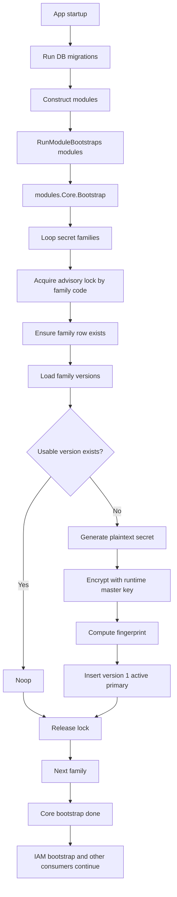

# Core Secret Bootstrap Token Flow

## 0. Purpose

This document describes the bootstrap flow that ensures initial secret versions exist in the database before other modules consume runtime secrets.

This flow belongs to the `core` module.

It is used for these secret families:
- `access_token`
- `refresh_token`
- `admin_api_key`
- `one_time_token`

Goal:
- if a family has no usable version in DB, create exactly one initial active primary version
- if a family already has a usable version, do nothing
- avoid duplicate creation in HA multi-controlplane startup

---

## 1. Entry Point

App startup sequence:

1. PostgreSQL init
2. Redis init
3. DB migrations
4. module construction
5. `RunModuleBootstraps(modules)`
6. HTTP / gRPC startup

`RunModuleBootstraps(modules)` calls:

- `modules.Core.Bootstrap()`
- `modules.IAM.Bootstrap()`

In current design, `core` runs before `iam`.

Reason:
- IAM and other consumers may need secrets that are owned and prepared by `core`

---

## 1.5 Bootstrap Diagram

Diagram intent:
- show where bootstrap begins in app startup
- show HA-safe lock boundary
- show create-if-empty branch
- show that `core` bootstrap completes before consumers depend on runtime secrets

---

## 2. Bootstrap Family List

Current bootstrap family list is defined in `internal/core/module.go`.

For each family, bootstrap provides:
- `code`
- `name`
- `description`

---

## 3. High-Level Flow

For each family:

1. acquire HA-safe advisory lock by family code
2. load family row by code
3. create family row if missing
4. load secret versions for the family
5. validate version cardinality
6. if at least one usable version exists -> noop
7. if no usable version exists -> generate a new initial secret
8. encrypt secret with runtime master key
9. store encrypted secret as version `1`
10. mark it `active` and `primary`
11. release advisory lock

---

## 4. Locking Strategy

Locking is per family code.

The repository acquires PostgreSQL advisory lock using:
- one namespace key for `core secret bootstrap`
- one deterministic key derived from family code

This means:
- two controlplanes booting at the same time will not create duplicate initial versions for the same family
- other families can still bootstrap independently

Lock scope is small and only protects the create-if-empty decision.

---

## 5. Create-If-Empty Rule

Bootstrap only creates a new version when there is no usable version.

Usable means:
- status is `active` or `pending`
- family state still satisfies `1..2 version` invariant

If usable version count is:
- `0` -> create initial version
- `1` -> noop
- `2` -> noop
- `>2` -> fail fast as invalid DB state

Bootstrap never tries to auto-heal a broken state with more than 2 versions.

---

## 6. Initial Secret Material

When initial version is created:

1. generate 32 random bytes using secure random source
2. base64url-encode them as plaintext secret
3. encrypt plaintext secret using `security.EncryptSecret(...)`
4. compute SHA-256 fingerprint of plaintext secret
5. store only:
   - `secret_ciphertext`
   - `secret_fingerprint`

The raw plaintext secret is not stored in DB.

It is only available transiently in the service result during bootstrap create.

---

## 7. Initial Version Shape

The initial version is created with:
- `version = 1`
- `status = active`
- `is_primary = true`
- `activated_at = now`
- `rotation_reason = bootstrap_initial_secret`

This makes the family immediately consumable by runtime secret provider.

---

## 8. DB Invariant

Bootstrap enforces:
- minimum `1` version key
- maximum `2` version keys

Steady state target:
- `1` primary active version

Temporary overlap state:
- `2` versions during rotation window

Bootstrap itself only creates the first version and does not rotate.

---

## 9. Dependencies

Bootstrap requires:
- successful `core` migrations
- runtime master key already set in process
- PostgreSQL advisory lock support

If runtime master key is missing or invalid:
- secret encryption fails
- bootstrap fails fast
- application startup must fail

---

## 10. Failure Behavior

Bootstrap must fail startup when:
- DB connection fails
- advisory lock fails
- family state is invalid (`>2` versions)
- encryption fails
- insert/update fails

Reason:
- serving traffic without valid core secret state is unsafe

---

## 11. Result

After successful bootstrap:
- all required families exist
- each required family has at least one usable primary version
- later runtime reads can load them from DB and cache them in RAM
