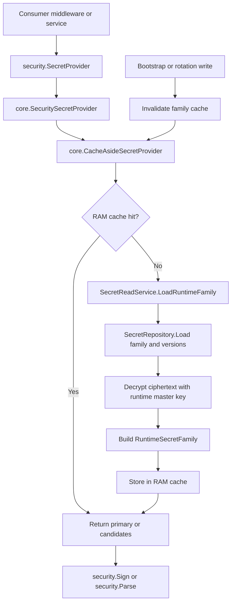

# Core Cache And Secret Usage Flow

## 0. Purpose

This document describes how runtime secrets are loaded from the database, cached in RAM, and exposed to consumers.

This flow belongs to the `core` module.

Design rule:
- consumer must not read repository directly
- consumer reads from provider
- provider reads from service
- service reads from repository

Strict flow:
- consumer -> provider -> service -> repository -> database

---

## 1. Components

### 1.1 Repository

Repository responsibilities:
- read family row by code
- read version rows by family ID
- no decrypt logic
- no primary selection policy
- no cache logic

### 1.2 SecretReadService

Service responsibilities:
- load family from repo
- load versions from repo
- validate family state
- decrypt ciphertext
- build runtime-ready secret objects

### 1.3 CacheAsideSecretProvider

Provider responsibilities:
- check RAM cache first
- on miss, call `SecretReadService`
- cache runtime-ready result in memory
- support invalidate and warm
- use local per-family lock to avoid repeated concurrent DB loads in the same process

### 1.4 SecuritySecretProvider

Security adapter responsibilities:
- convert `core` runtime secret shape to `internal/security` secret candidate shape
- allow auth/middleware/token code to consume a security-level interface instead of `core` internals

---

## 1.5 Cache And Usage Diagram

Diagram intent:
- show strict boundary `consumer -> provider -> service -> repo -> DB`
- show cache-aside read path
- show that decrypt happens in read service, not repository
- show invalidation after bootstrap or rotation writes

---

## 2. Source Of Truth

Source of truth is PostgreSQL.

RAM cache is only a read optimization.

If RAM misses:
- provider falls back to service
- service falls back to DB

If cache is invalidated:
- next read rehydrates from DB again

---

## 3. Runtime Load Flow

For `GetPrimary(familyCode)`:

1. provider checks in-memory cache
2. if cache hit -> return primary secret
3. if cache miss -> provider takes local family mutex
4. provider checks cache again after lock
5. provider calls `SecretReadService.GetRuntimeSecretFamily(...)`
6. service loads family + versions from repo
7. service validates `1..2 version` rule
8. service decrypts ciphertext into plaintext runtime secret values
9. service chooses the single primary version
10. provider stores runtime family in RAM cache
11. provider returns primary secret

For `GetCandidates(familyCode)`:
- same flow as above
- return up to 2 runtime secret candidates

---

## 4. Cache Shape

Cache key:
- `familyCode`

Cache value contains:
- family metadata
- primary runtime secret
- candidate runtime secrets
- `loaded_at`

Runtime cache stores plaintext secret material in RAM.

This is acceptable because:
- DB stores encrypted ciphertext only
- plaintext is needed for runtime sign/verify operations
- cache is process-local and ephemeral

---

## 5. Invariant Validation

`SecretReadService` validates:
- family exists
- version count is between `1` and `2`
- at least one active/pending usable version exists
- exactly one primary usable version exists
- ciphertext decrypt succeeds

If validation fails:
- provider returns error
- consumer must fail closed or fail unavailable depending on use case

---

## 6. Decrypt Behavior

Decryption happens in service layer only.

Repository never returns plaintext secret.

The service uses:
- `security.DecryptSecret(...)`

If decryption fails:
- service returns `core` errorx
- provider does not populate cache

---

## 7. Cache Invalidate Flow

Cache must be invalidated after state-changing operations such as:
- initial bootstrap create
- rotation create/promote
- retire
- revoke
- delete oldest during overlap cleanup

Rule:
- any write affecting a family must invalidate the cache entry for that family

Otherwise RAM cache can serve stale secret candidates.

---

## 8. Local Concurrency Guard

Provider maintains a local mutex per family code.

Purpose:
- if many goroutines request the same family at the same time while cache is empty
- only one goroutine hits DB/decrypt path
- others wait and then read fresh cache

This is process-local optimization only.

Cross-node HA consistency is handled by DB and write-time locks, not provider cache lock.

---

## 9. Consumer Contract

Consumers should depend on `security.SecretProvider`.

They must not depend on:
- `core` repository
- `core` DB model
- `core` SQL

Examples:
- access JWT verify -> `GetCandidates(access_token)`
- access JWT sign -> `GetPrimary(access_token)`
- refresh token sign/verify -> refresh family
- one-time token sign/verify -> one_time_token family

---

## 10. Failure Semantics

If provider cannot load secret family:
- auth-critical consumer should fail closed
- middleware can return unavailable or unauthorized depending on stage

Recommended behavior:
- signing failure -> service unavailable
- verify failure because runtime secret source unavailable -> service unavailable
- token invalid with successful secret load -> unauthorized

