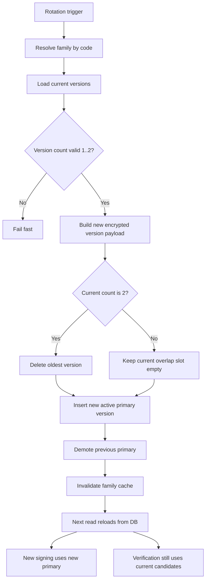

# Core Rotate Token Flow

## 0. Purpose

This document describes the secret rotation flow for token families.

This flow belongs to the `core` module.

It does not describe refresh-token database rows in IAM.
It describes rotation of the underlying secret key material used to sign or validate token families.

Families typically include:
- `access_token`
- `refresh_token`
- `one_time_token`
- optionally `admin_api_key`

---

## 1. Rotation Policy

Current policy is based on token TTL.

Rule:
- if `ttl < 24h` -> `rotation interval = 24h`
- if `ttl >= 24h` -> `rotation interval = ttl * 2`

This interval is the rotation cadence policy.

It is not the same as token expiration itself.

---

## 1.5 Rotation Diagram

Diagram intent:
- show fail-fast branch for invalid states
- show `1 key -> 2 key` and `2 key -> drop oldest -> rotate`
- show cache invalidation boundary after successful write
- show impact on signing versus verification

---

## 2. Cardinality Rule

Per family, allowed version count is:
- minimum `1`
- maximum `2`

Meaning:
- steady state: `1` active primary version
- overlap state: `2` versions during rotation window

Invalid states:
- `0` versions
- `3+` versions

If service sees invalid state:
- fail fast
- do not auto-heal silently

---

## 3. Rotation Input

Rotation requires a new version payload containing:
- version ID
- family ID
- version number
- encrypted secret ciphertext
- secret fingerprint

The caller is responsible for preparing the new version material.

Rotation service is responsible for:
- validating family state
- enforcing cardinality
- promoting the new primary
- retiring or deleting old version according to rule

---

## 4. High-Level Rotation Flow

1. load family by code
2. load current versions
3. validate family state is within `1..2`
4. prepare new version as `active + primary`
5. if current family already has `2` versions:
   - delete oldest version first
6. create new version row
7. replace primary version
8. optionally retire previous primary immediately
9. invalidate provider cache for that family

---

## 5. One-Key To Two-Key Flow

When family currently has `1` usable version:

1. create new version
2. promote new version to primary
3. old primary becomes non-primary
4. family temporarily has `2` versions

This is the standard overlap rotation state.

---

## 6. Two-Key Rotation Flow

When family already has `2` versions:

1. identify oldest version
2. delete oldest version
3. create new version
4. promote new version to primary
5. previous primary becomes non-primary

This preserves the `max 2 version` invariant.

---

## 7. Primary Selection Rule

At any valid runtime state:
- exactly one version must be primary

Primary is used for:
- new token signing
- new issue operations

Non-primary active version is used only for:
- overlap verification of already-issued tokens

---

## 8. Cache Interaction

After any successful rotation write:
- cache entry for the family must be invalidated

Next read will:
- load from DB
- decrypt updated versions
- repopulate RAM cache

Without invalidation, consumers may continue using stale primary/candidate data.

---

## 9. Failure Behavior

Rotation must fail when:
- family does not exist
- TTL is invalid
- version set is outside `1..2`
- new version payload is incomplete
- create version fails
- replace primary fails
- retire/delete fails

The service should not partially hide these failures.

---

## 10. Result

After successful rotation:
- family still has at most `2` versions
- exactly one version is primary
- provider cache can be refreshed from DB
- consumers can sign with new primary and verify with current candidates

---

## 11. Current Scope

Current implementation covers:
- policy calculation
- family state validation
- create new version
- replace primary
- delete oldest when already at two versions
- optional retire previous now

Current implementation does not yet include:
- scheduler / cron-based rotation
- external KMS-backed material generation
- distributed event bus for invalidation
- operator-facing API for manual rotation

