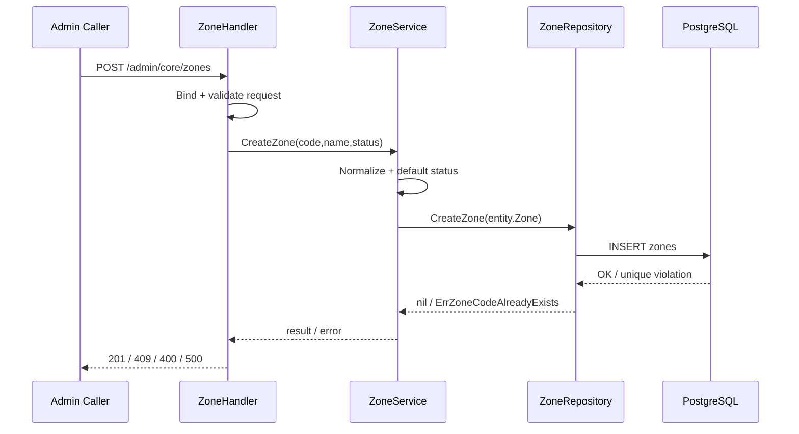
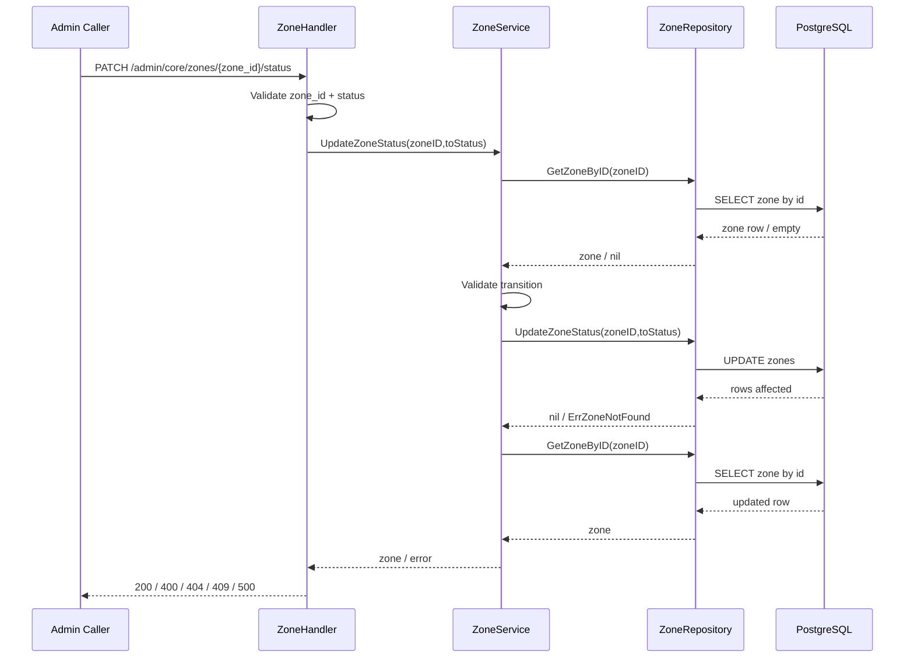
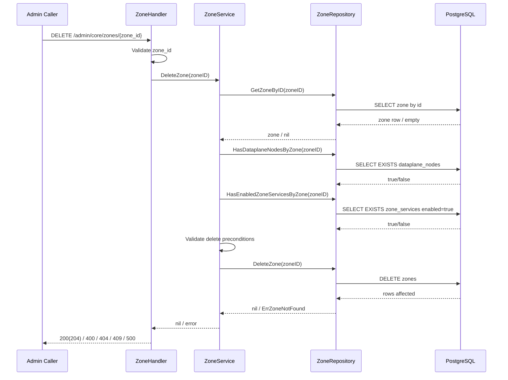
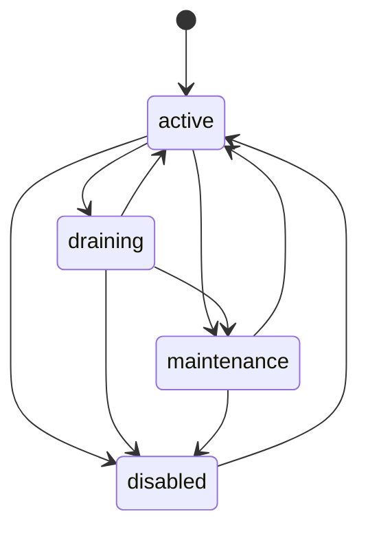

# Zone Flow

## 1) Mục tiêu

Mô tả flow nghiệp vụ zone trong core:
- tạo zone
- đổi trạng thái zone
- xóa zone với pre-condition an toàn

Flow này diễn giải runtime behavior theo thứ tự xử lý, không phải spec API.

---

## 2) Actors

- Admin API caller
- Core Zone Handler
- Core Zone Service
- Core Zone Repository
- PostgreSQL (`zones`, `zone_services`, `dataplane_nodes`)

---

## 3) Flow tạo zone

1. Caller gửi `POST /admin/core/zones`.
2. Handler bind + validate request.
3. Service normalize `code`, validate input, set default status `active` nếu thiếu.
4. Service gọi repo `CreateZone`.
5. Repo insert vào bảng `zones`.
6. Trả response `201`.

Conflict path:
- Nếu `code` đã tồn tại -> repo map conflict -> service/handler map `409`.

---

## 4) Flow update zone status

1. Caller gửi `PATCH /admin/core/zones/{zone_id}/status`.
2. Handler validate `zone_id` + body `status`.
3. Service đọc zone hiện tại bằng `GetZoneByID`.
4. Service validate state transition theo policy.
5. Service gọi repo `UpdateZoneStatus`.
6. Repo update `status`, `updated_at`.
7. Service đọc lại zone và trả `200`.

Reject path:
- `zone_id` invalid -> `400`
- zone không tồn tại -> `404`
- transition không hợp lệ -> `409`

---

## 5) Flow delete zone

1. Caller gửi `DELETE /admin/core/zones/{zone_id}`.
2. Handler validate `zone_id`.
3. Service đọc zone hiện tại.
4. Service enforce pre-condition delete:
   - `zone.status == disabled`
   - không còn `dataplane_nodes` tham chiếu (`HasDataplaneNodesByZone == false`)
   - không còn `zone_services.enabled = true` (`HasEnabledZoneServicesByZone == false`)
5. Service gọi repo `DeleteZone`.
6. Repo delete row zone.
7. Trả `200` (hoặc `204` theo policy).

Reject path:
- thiếu điều kiện pre-delete -> `409`

---

## 6) Invariant chính

- Zone là source-of-truth cho phạm vi hạ tầng theo zone.
- Mỗi dataplane node phải thuộc đúng 1 zone.
- Xóa zone chỉ thực hiện khi không còn dependency runtime.

---

## 7) Liên kết flow

- `zone-service-flow.md`
- `zone-rest-api-v1-temp-spec.md`
- `zone-migration-v1-temp-spec.md`

---

## 8) Sequence Diagram

### 8.1 Create Zone

### 8.2 Update Zone Status

### 8.3 Delete Zone

---

## 9) Zone State Machine

### Delete pre-condition by state

- Chỉ cho phép delete khi `state = disabled`.
- Ngoài state, còn bắt buộc:
  - không có `dataplane_nodes` tham chiếu zone
  - không có `zone_services.enabled = true`
