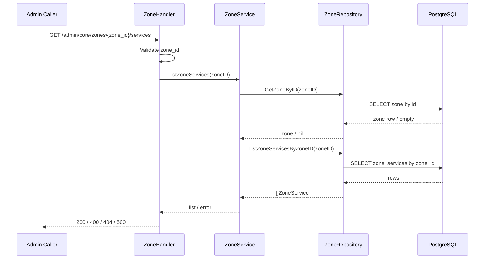
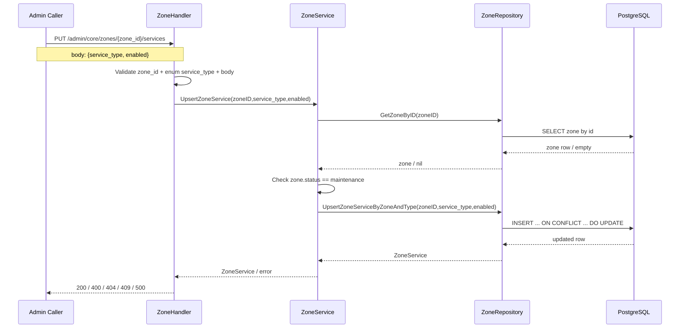
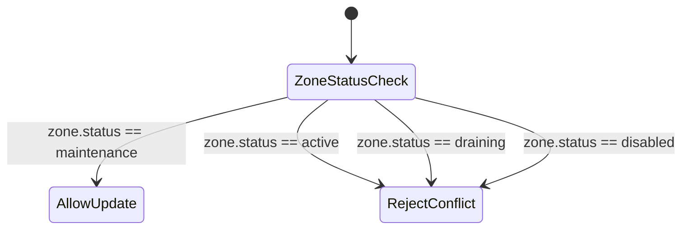

# Zone Service Flow

## 1) Mục tiêu

Mô tả flow quản trị `zone_services` theo zone:
- xem danh sách service trong 1 zone
- bật/tắt service theo zone

Flow này bám rule an toàn đã chốt: chỉ cho phép update khi zone ở `maintenance`.

---

## 2) Actors

- Admin API caller
- Core Zone Handler
- Core Zone Service
- Core Zone Repository
- PostgreSQL (`zones`, `zone_services`)

---

## 3) Flow list zone services

1. Caller gửi `GET /admin/core/zones/{zone_id}/services`.
2. Handler validate `zone_id` format.
3. Service check zone tồn tại (`GetZoneByID`).
4. Service gọi repo `ListZoneServicesByZoneID`.
5. Repo query `zone_services` theo `zone_id`, order theo `service_type`.
6. Trả `200` với danh sách service.

Reject path:
- `zone_id` invalid -> `400`
- zone không tồn tại -> `404`

---

## 4) Flow upsert zone service state

1. Caller gửi `PUT /admin/core/zones/{zone_id}/services` với body:
   - `service_type`
   - `enabled`
2. Handler bind body + validate:
   - `zone_id` UUID
   - `service_type` thuộc enum cho phép
   - `enabled` bool hợp lệ
3. Service đọc zone (`GetZoneByID`).
4. Service enforce rule trạng thái zone:
   - chỉ `maintenance` mới được update
   - `active/draining/disabled` reject `409`
5. Service gọi repo `UpsertZoneServiceByZoneAndType`.
6. Repo thực hiện:
   - insert nếu chưa có
   - update nếu đã có (`ON CONFLICT (zone_id, service_type)`)
7. Trả `200` với trạng thái service mới nhất.

Reject path:
- invalid input/enum -> `400`
- zone không tồn tại -> `404`
- zone không ở maintenance -> `409`

---

## 5) Invariant chính

- Không có bulk update trong V1.
- `service_type` luôn đi qua DTO body, không đi qua path.
- Update zone service là operation maintenance-window only.

---

## 6) Quan hệ với delete zone flow

Flow zone service ảnh hưởng trực tiếp delete zone:
- zone chỉ xóa được khi toàn bộ `zone_services.enabled = false`.

Vì vậy, zone service state phải phản ánh đúng trạng thái vận hành thực tế trước khi thao tác delete.

---

## 7) Liên kết flow

- `zone-flow.md`
- `zone-service-rest-api-v1-temp-spec.md`
- `zone-rest-api-v1-temp-spec.md`

---

## 8) Sequence Diagram

### 8.1 List Zone Services

### 8.2 Upsert Zone Service

---

## 9) Zone-Service Update Guard State Machine

### Guard result

- `AllowUpdate` -> chạy upsert `zone_services`.
- `RejectConflict` -> trả `409 state conflict`.
