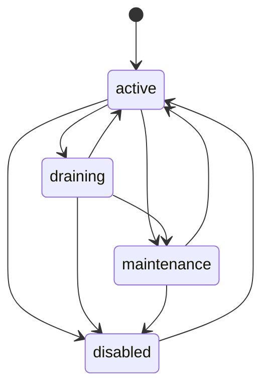

# Zone REST API V1 (Temp Spec)

## 1) Mục tiêu

Đặc tả API RESTful cho quản trị zone trong core:
- thêm zone
- sửa trạng thái zone
- xóa zone

Tài liệu này chỉ mô tả contract và hành vi nghiệp vụ API, không mô tả thay đổi file/code.

---

## 2) Phạm vi V1

Trong scope:
- API CRUD tối thiểu cho zone:
  - Create zone
  - Update zone status
  - Delete zone
- Validation và business rule liên quan lifecycle zone
- Error mapping ở mức API contract

Ngoài scope:
- Không mô tả implementation layering/repo/service
- Không mô tả migration changelist
- Không mô tả authN/authZ chi tiết (chỉ ghi yêu cầu chung)

---

## 3) Resource model

Resource chính:
- `Zone`
  - `id` (uuid v7)
  - `code` (unique)
  - `name`
  - `status` (`active | draining | maintenance | disabled`)
  - `created_at`
  - `updated_at`

---

## 4) Endpoint contract

## 4.1 Create Zone

- **Method:** `POST`
- **Path:** `/admin/core/zones`
- **Body:**
```json
{
  "code": "edge-hcm-1",
  "name": "HCM Edge DC-1",
  "status": "active"
}
```

### Rules
- `code` bắt buộc, unique, normalized lowercase/trim.
- `name` bắt buộc.
- `status` optional, default `active` nếu không gửi.
- Không cho tạo trùng `code`.

### Success
- `201 Created`
```json
{
  "message": "zone created",
  "data": {
    "id": "0196f3b3-3f6f-7a0d-8f74-f7933b6a0e9b",
    "code": "edge-hcm-1",
    "name": "HCM Edge DC-1",
    "status": "active",
    "created_at": "2026-05-13T10:40:12Z",
    "updated_at": "2026-05-13T10:40:12Z"
  }
}
```

### Errors
- `400` invalid input
- `409` zone code already exists
- `500` internal error

---

## 4.2 Update Zone Status

- **Method:** `PATCH`
- **Path:** `/admin/core/zones/{zone_id}/status`
- **Body:**
```json
{
  "status": "draining"
}
```

### Rules
- `zone_id` phải là UUID hợp lệ.
- `status` bắt buộc thuộc enum cho phép.
- State transition phải hợp lệ theo policy V1.

### Transition policy V1
- `active -> draining | maintenance | disabled`
- `draining -> active | maintenance | disabled`
- `maintenance -> active | disabled`
- `disabled -> active` (nếu cho phép re-enable, tùy policy vận hành)

### Success
- `200 OK`
```json
{
  "message": "zone status updated",
  "data": {
    "id": "0196f3b3-3f6f-7a0d-8f74-f7933b6a0e9b",
    "status": "draining",
    "updated_at": "2026-05-13T11:00:00Z"
  }
}
```

### Errors
- `400` invalid request / invalid transition
- `404` zone not found
- `409` zone state conflict
- `500` internal error

---

## 4.3 Delete Zone

- **Method:** `DELETE`
- **Path:** `/admin/core/zones/{zone_id}`

### Rules
- Chỉ cho xóa zone khi không còn `dataplane_nodes` đang tham chiếu zone đó.
- Tất cả bản ghi `zone_services` của zone phải ở trạng thái `enabled = false`.
- Nếu còn node active/reference hoặc còn service đang bật thì reject để tránh orphan runtime state / service exposure sai.

### Success
- `200 OK` (hoặc `204 No Content`)
```json
{
  "message": "zone deleted"
}
```

### Errors
- `404` zone not found
- `409` zone is in use by dataplane nodes or has enabled services
- `500` internal error


### Delete pre-condition theo state (bắt buộc)

`DELETE /admin/core/zones/{zone_id}` chỉ hợp lệ khi đồng thời thỏa cả 3 điều kiện:
1. `zone.status = disabled`
2. không còn `dataplane_nodes` tham chiếu zone
3. toàn bộ `zone_services.enabled = false`

Nếu vi phạm bất kỳ điều kiện nào:
- trả `409 conflict` với message nghiệp vụ phù hợp.

Gợi ý message conflict:
- `zone must be disabled before delete`
- `zone still has dataplane nodes`
- `zone still has enabled services`


---


## 4.4 Zone State Machine

Các trạng thái:
- `active`
- `draining`
- `maintenance`
- `disabled`

Transition hợp lệ V1:
- `active -> draining | maintenance | disabled`
- `draining -> active | maintenance | disabled`
- `maintenance -> active | disabled`
- `disabled -> active`

Transition không hợp lệ (ví dụ):
- `disabled -> draining`
- `maintenance -> draining`



Business note:
- `draining`: zone không nhận assignment mới nhưng vẫn có thể hoàn tất workload đang chạy.
- `maintenance`: zone tạm ngưng phục vụ theo kế hoạch vận hành.
- `disabled`: zone tắt hoàn toàn, chỉ có thể quay lại `active` qua thao tác quản trị rõ ràng.

---

## 5) RESTfulness và consistency

- Base path admin-only: `/admin` (không public `/api/v1`).
- Resource naming dùng danh từ số nhiều: `/zones`.
- Method semantics:
  - `POST` create
  - `PATCH` partial update status
  - `DELETE` remove resource
- Response format thống nhất theo envelope API hiện hành (`message`, `data`, `error`).

---

## 6) Business safeguards

- `code` immutable sau khi tạo (V1).
- Status update là action được kiểm soát, không update tràn fields.
- Delete phải check dependency với dataplane trước khi xóa.
- Tất cả operation phải idempotent theo semantics HTTP tương ứng khi retry client:
  - `PATCH` retry không làm sai state
  - `DELETE` retry trả `404` hoặc success idempotent tùy policy

---

## 7) Security và governance

- API này là admin/control API, yêu cầu authN/authZ admin scope.
- Không trả lỗi làm lộ internals DB.
- Có audit event cho create/update/delete zone (phase implement).

---

## 8) Acceptance criteria

- Có đủ 3 API: create, update status, delete zone.
- Rule unique `code` được enforce.
- Rule delete pre-condition được enforce: chỉ xóa khi `status=disabled` + không còn dataplane node + mọi zone service đều `enabled=false`.
- Status transition được validate theo policy V1.
- API response thống nhất format controlplane hiện tại.


## 9) Test coverage yêu cầu (chuẩn bị implement)

### 9.1 Service tests
- Create zone:
  - valid input -> created
  - duplicate code -> conflict
  - invalid input -> bad request contract
- Update status:
  - valid transitions pass
  - invalid transitions reject
  - zone not found
- Delete zone:
  - pass khi `disabled` + không node + service đều off
  - reject khi status != disabled
  - reject khi còn dataplane node
  - reject khi còn zone_services enabled

### 9.2 Repository tests
- `CreateZone` unique code violation mapping.
- `GetZoneByID` found/not found path.
- `UpdateZoneStatus` rows affected = 0 mapping not found.
- `DeleteZone` rows affected = 0 mapping not found.
- `HasDataplaneNodesByZone` true/false path.
- `HasEnabledZoneServicesByZone` true/false path.

### 9.3 Handler/transport tests
- `POST /admin/core/zones`: 201 / 400 / 409 / 500 mapping.
- `PATCH /admin/core/zones/{zone_id}/status`: 200 / 400 / 404 / 409 / 500 mapping.
- `DELETE /admin/core/zones/{zone_id}`: 200(or 204) / 400 / 404 / 409 / 500 mapping.

### 9.4 Non-functional checks
- Không log dữ liệu nhạy cảm.
- Error response đúng envelope hiện hành.
- Idempotency semantics của HTTP method đúng khi retry.
