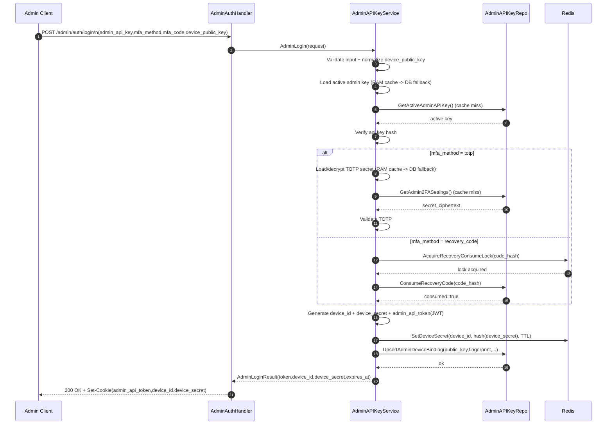
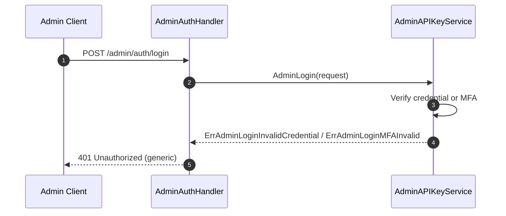
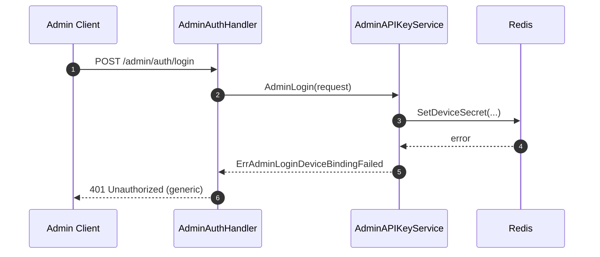
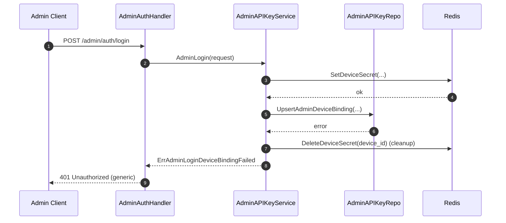
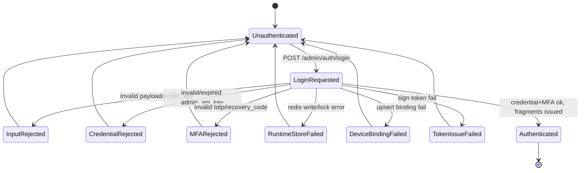

# Admin Login Flow

## 1) Mục tiêu

Mô tả luồng hoạt động đăng nhập admin qua `/admin/auth/login` theo mô hình:
- `admin_api_key` + MFA (`totp|recovery_code`),
- issue runtime fragments (`admin_api_token`, `device_id`, `device_secret`),
- hỗ trợ các nhánh ngoại lệ và hành vi fail-safe.

Tài liệu này chỉ mô tả **flow runtime** và **state transitions**.

---

## 2) Actors & Systems

- **Admin Client**: gửi login request.
- **Admin Auth Handler**: transport boundary, map HTTP + set cookie.
- **Admin Auth Service**: business verify + issue runtime fragments.
- **PostgreSQL**: source-of-truth cho admin key/2FA/recovery/device binding.
- **Redis**: runtime store cho `device_secret(hash)` và lock recovery consume.

---

## 3) Main sequence (success path)

---

## 4) Exception sequences

### 4.1 Invalid credential / MFA fail

### 4.2 Redis runtime write fail

### 4.3 Device binding DB fail after Redis set

---

## 5) State machine

---

## 6) Error handling matrix

| Condition | HTTP | Side effect |
|---|---:|---|
| Invalid payload / invalid device public key | 400 | Không tạo session |
| Invalid/expired admin_api_key | 401 | Không tạo session |
| Invalid MFA | 401 | Không tạo session |
| Redis lock/runtime write fail | 401/503 theo mapping hiện hành | Không tạo session |
| DB upsert device binding fail | 401 | Cleanup runtime secret nếu đã set |
| JWT sign/auth infra fail | 500 | Cleanup runtime secret nếu đã set |

---

## 7) Security invariants

- Không log plaintext `admin_api_key`, `mfa_code`, token, `device_secret`.
- Response lỗi phải generic, không leak lý do nội bộ.
- Session admin chỉ hợp lệ khi đủ 3 fragments (`admin_api_token`, `device_id`, `device_secret`).
- Recovery code phải one-time và có lock chống race consume.
- Cache policy của admin flow: TTL-only by design (replica-local RAM cache + DB fallback).
