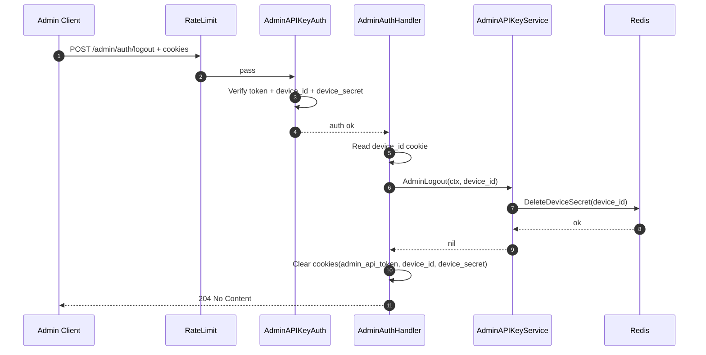
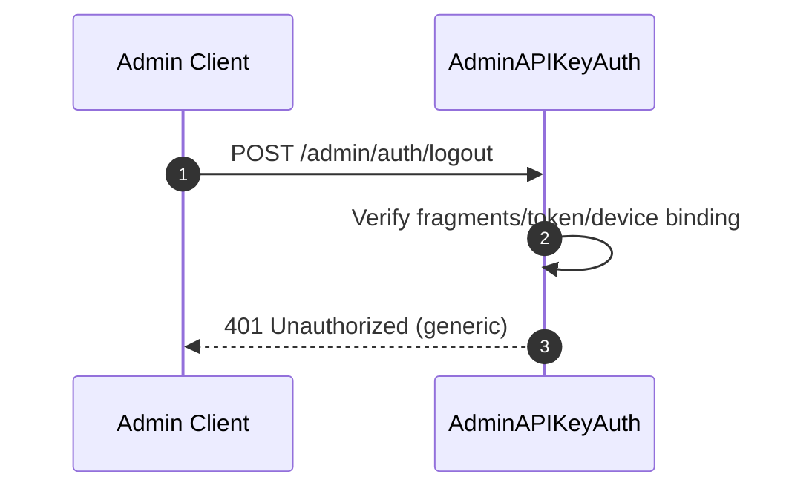
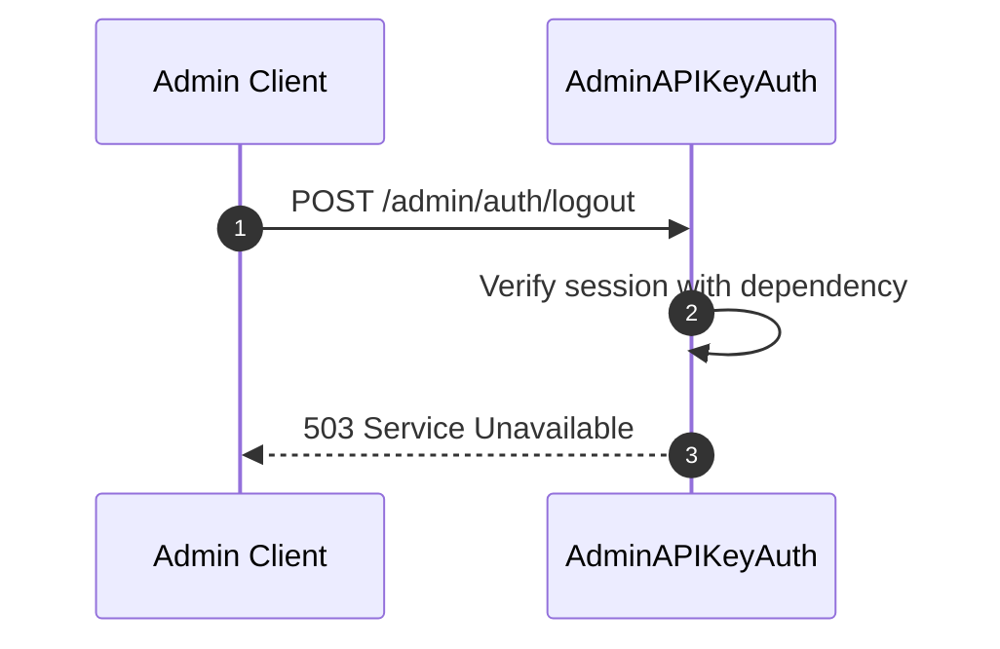
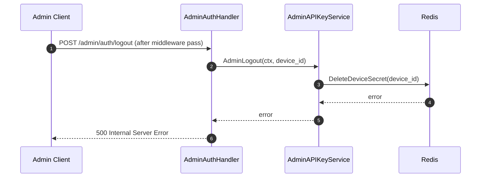
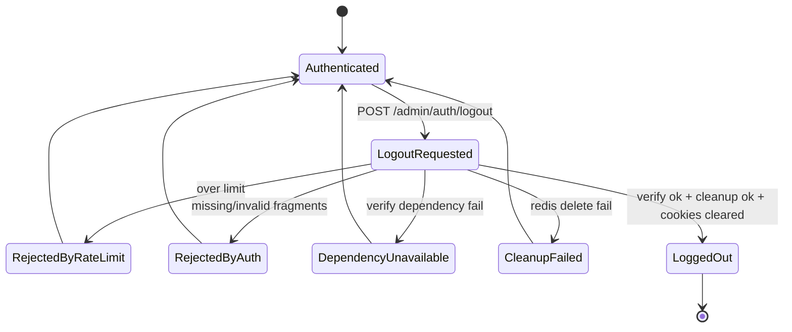

# Admin Logout Flow

## 1) Mục tiêu

Mô tả luồng runtime cho `POST /admin/auth/logout` trong kênh `/admin`:
- xác thực session hiện tại qua `AdminAPIKeyAuth`,
- cleanup runtime secret theo `device_id`,
- clear đầy đủ session fragments phía client.

Tài liệu này chỉ mô tả flow vận hành, ngoại lệ, state machine, error handling và security invariants.

---

## 2) Actors & Systems

- **Admin Client**: gọi logout endpoint.
- **RateLimit middleware**: giới hạn tần suất gọi logout theo bucket route.
- **AdminAPIKeyAuth middleware**: verify runtime fragments (`admin_api_token`, `device_id`, `device_secret`).
- **AdminAuthHandler**: transport boundary, gọi service và clear cookies.
- **AdminAPIKeyService**: business cleanup runtime secret.
- **Redis**: runtime store cho `device_secret(hash)` theo `device_id`.

---

## 3) Main sequence

---

## 4) Exception sequences

### 4.1 Session fragments thiếu hoặc invalid

### 4.2 Dependency verify path lỗi (secret provider/Redis verify)

### 4.3 Runtime cleanup fail trong service

---

## 5) State machine

---

## 6) Error handling matrix

| Condition | HTTP/result | Side effects |
|---|---:|---|
| Rate limit reject | 429 | Không vào auth middleware/handler |
| Missing cookie fragments | 401 | Không gọi service, không cleanup |
| Invalid token/device binding | 401 | Không gọi service, không cleanup |
| Verify dependency fail (middleware) | 503 | Fail-closed, không vào handler |
| `device_id` rỗng nhưng đã vào service | 204 | Service no-op cleanup, handler vẫn clear cookies |
| Redis `DeleteDeviceSecret` fail | 500 | Không xác nhận logout thành công |
| Success path | 204 | Xóa runtime secret theo `device_id` + clear 3 cookies |

---

## 7) Security invariants

- `POST /admin/auth/logout` luôn đi qua `AdminAPIKeyAuth` (không bypass).
- Session admin chỉ hợp lệ khi đủ 3 fragments (`admin_api_token`, `device_id`, `device_secret`).
- Dependency verify path lỗi thì fail-closed (`503`), không cho pass tạm.
- Không log plaintext token hoặc `device_secret`.
- Logout success phải đồng thời:
  - cleanup runtime secret server-side theo `device_id`,
  - clear đầy đủ cookie fragments phía client.
