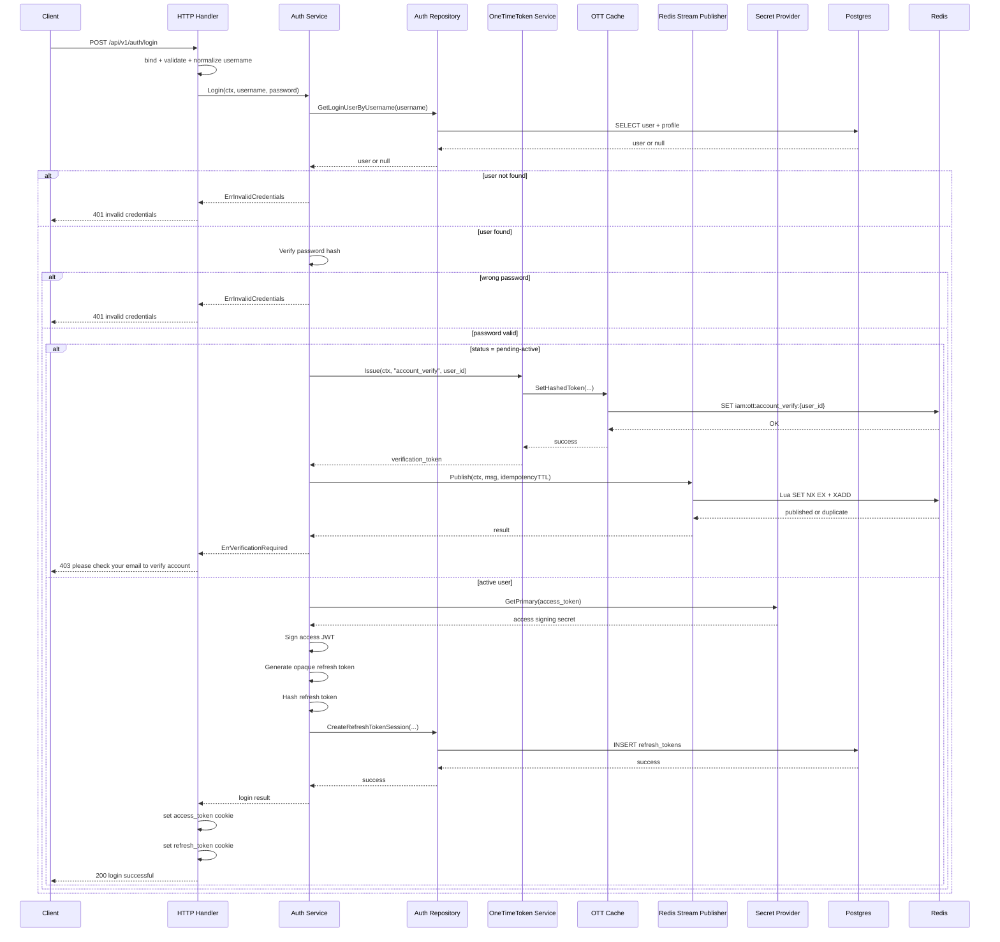

# IAM Login Flow

## 1. Purpose

Tài liệu này mô tả **flow login hiện tại** của IAM module theo implementation thực tế.

Scope của flow này:
- endpoint `POST /api/v1/auth/login`
- login bằng `username + password`
- access token là JWT
- refresh token là opaque random token
- set `access_token` và `refresh_token` bằng HttpOnly cookies khi login success
- persist refresh session vào bảng `refresh_tokens`
- với account `pending-active`: issue one-time token + publish mail verify job vào Redis stream
- không trả OTT token ra login response

---

## 2. Source Of Truth

Flow này bám theo các file sau:
- `internal/iam/transport/http/handler/auth_handler.go`
- `internal/iam/service/auth_service.go`
- `internal/iam/repository/auth_repo.go`
- `internal/iam/cache/one_time_token_cache.go`
- `infra/redis/stream.go`
- `internal/security/jwt.go`
- `internal/security/password.go`
- `internal/iam/test/svc_test/auth_service_test.go`
- `internal/iam/test/transport_test/auth_handler_test.go`
- `internal/iam/test/integration_test/register_integration_test.go`

---

## 3. Endpoint Contract

### 3.1 Route
- `POST /api/v1/auth/login`

### 3.2 Request JSON
```json
{
  "username": "alice.nguyen",
  "password": "secret123"
}
```

### 3.3 Validation Boundary
Validation nằm ở handler:
- `username` bắt buộc
- `password` bắt buộc
- normalize `username` bằng lowercase + trim

### 3.4 Success Response
HTTP `200 OK`

```json
{
  "message": "login successful"
}
```

### 3.5 Pending Active Response
HTTP `403 Forbidden`

```json
{
  "error": "forbidden",
  "message": "please check your email to verify account"
}
```

### 3.6 Failure Response
- `400 bad request`
- `401 unauthorized` -> `invalid credentials`
- `403 forbidden` -> `please check your email to verify account`
- `500 internal server error`
- `503 service unavailable`

---

## 4. Token Design

### 4.1 Access token
- dùng JWT
- ký bằng secret family `access_token`
- claims hiện tại:
  - `sub = user.id`
  - `jti = uuid v7`
  - `lvl = user_level`
  - `role = ""`
  - `device_id = ""`
  - `token_use = access`
  - `iat`
  - `exp`
- **không chứa `status` claim**

### 4.2 Refresh token
- không dùng JWT
- là opaque random token
- raw token chỉ dùng để set cookie/return internal result
- DB chỉ lưu `token_hash`

### 4.3 One-time token cho pending-active
- purpose cố định: `account_verify`
- key cache: `iam:ott:{purpose}:{user_id}`
- value cache: `token_hash`
- TTL: `config.IAM.OneTimeTokenTTL`
- mỗi `(purpose,user_id)` chỉ có 1 token active tại 1 thời điểm (issue mới overwrite token cũ)

---

## 5. Cookie Policy

Login success set 2 cookies:
- `access_token`
- `refresh_token`

Thuộc tính hiện tại:
- `HttpOnly = true`
- `Path = /`
- `SameSite = Lax`
- `Secure = true` nếu request đang dùng TLS
- `Domain = cfg.App.PublicDomain` nếu có, ngược lại host-only

Expiry:
- access theo `Security.AccessSecretTTL`
- refresh theo `Security.RefreshTokenTTL`

Với case `pending-active`:
- **không set** `access_token`
- **không set** `refresh_token`

---

## 6. Login Flow Diagram



---

## 7. Step By Step Flow

### 7.1 Handler phase
Handler làm các việc sau:
1. bind request JSON
2. validate DTO
3. normalize `username`
4. gọi `AuthService.Login`
5. map service result sang response
6. set cookies (chỉ khi login success)
7. trả response thành công hoặc lỗi generic

### 7.2 Service phase
Service làm các việc sau:
1. load user theo `username`
2. verify password hash
3. block `suspended` và `disabled` bằng generic invalid credentials
4. nếu `pending-active`:
   - issue OTT `account_verify`
   - publish mail verify job vào Redis stream generic với idempotency
   - trả `ErrVerificationRequired`
5. nếu `active`:
   - lấy access signing secret
   - ký access JWT
   - generate refresh token
   - hash refresh token
   - persist refresh session
   - trả login result

### 7.3 Repository phase
Repository làm các việc sau:
1. select user theo username (kèm email/fullname phục vụ mail payload)
2. insert refresh session row
3. wrap DB errors

### 7.4 Mail verify job payload example

Ví dụ payload map được build inline trong `auth_service.go` và publish qua `infra/redis/stream.go`:

```json
{
  "event_type": "mail.verify_account.requested",
  "purpose": "account_verify",
  "user_id": "0196f3b3-3f6f-7a0d-8f74-f7933b6a0e9b",
  "email": "alice.nguyen@example.com",
  "fullname": "Alice Nguyen",
  "verify_token": "OTT_PLAINTEXT_TOKEN",
  "requested_at": "2026-05-13T10:40:12.123456789Z",
  "request_id": "6b16e0a7-24db-45ef-a66a-8f7aa19a1b91",
  "idempotency_key": "account_verify:0196f3b3-3f6f-7a0d-8f74-f7933b6a0e9b:6b16e0a7-24db-45ef-a66a-8f7aa19a1b91"
}
```

Boundary:
- Đây là payload queue job mail, không phải state của OTT cache.
- OTT cache vẫn lưu riêng `token_hash` tại key `iam:ott:{purpose}:{user_id}`.

---

## 8. Error Flow

### 8.1 External behavior
- user không tồn tại -> `invalid credentials`
- password sai -> `invalid credentials`
- user `pending-active` -> `please check your email to verify account`
- internal auth/session failure -> generic internal/service unavailable

### 8.2 Internal behavior
- `GetLoginUserByUsername` fail -> `load_user_error`
- issue OTT fail -> `verification_issue_error`
- publish verify mail job fail -> `verification_publish_error`
- access secret/sign fail -> `issue_access_error`
- refresh generate fail -> `generate_refresh_error`
- persist refresh fail -> `persist_refresh_error`

---

## 9. Observability

### 9.1 Metrics
Login flow có metric riêng:
- `iam_login_total{result}`

Result labels tiêu biểu:
- `success`
- `invalid_credentials`
- `verification_required`
- `verification_issue_error`
- `verification_publish_error`
- `verify_mail_publish_attempt`
- `verify_mail_publish_success`
- `verify_mail_publish_duplicate`
- `verify_mail_publish_error`
- `load_user_error`
- `issue_access_error`
- `generate_refresh_error`
- `persist_refresh_error`

Và dependency metrics Redis cho publish step:
- `dependency_duration_seconds{kind="redis", operation="iam.login.publish_verify_mail_job", status}`

### 9.2 Tracing
Publish verify mail job có span:
- name: `iam.login.publish_verify_mail_job`
- attributes:
  - `stream`
  - `event_type`
  - `purpose`
  - `user_id`
  - `idempotency_key`
  - `published`
  - `stream_id` (nếu có)

### 9.3 Security for observability
- Không log plaintext password.
- Không log/trace `verify_token` plaintext.
