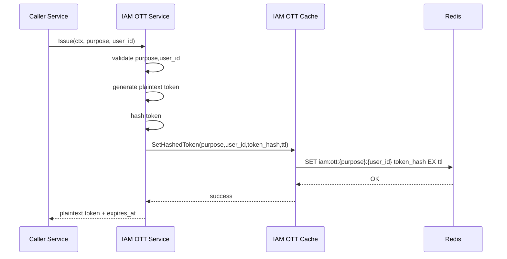
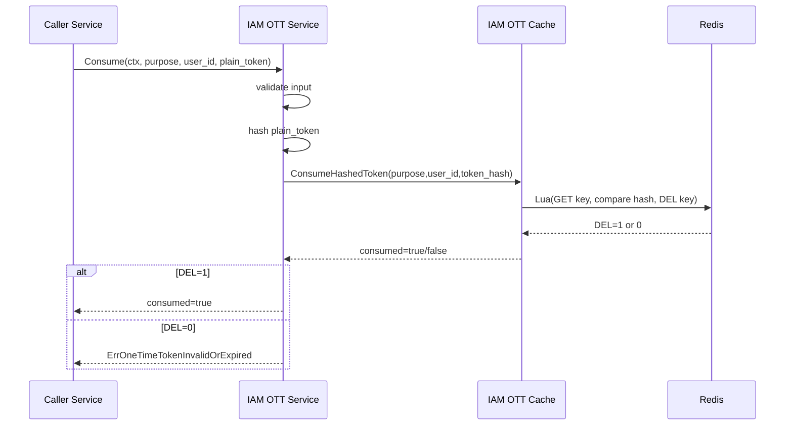

# One-Time Token Flow

## 1) Mục tiêu

Mô tả luồng runtime của one-time token trong IAM:
- Service phát hành OTT (issue) cho một `purpose + user_id`.
- Chỉ lưu `token_hash` vào Redis với TTL cố định từ config.
- Service consume OTT theo semantics one-time (dùng 1 lần).

Tài liệu này mô tả flow vận hành; contract chi tiết xem ở spec.

---

## 2) Thành phần

- `IAM Service`
  - Validate input.
  - Generate token plaintext.
  - Hash token.
  - Call cache layer.

- `IAM Cache`
  - Chứa Redis statements (`SET`, Lua `GET+compare+DEL`).

- `Redis`
  - Lưu key theo `purpose + user_id`.
  - TTL từ `config.IAM.OneTimeTokenTTL`.

---

## 3) Key/Value contract

- Key format:
  - `iam:ott:{purpose}:{user_id}`

- Value:
  - `token_hash` (không lưu plaintext token)

- TTL:
  - Chỉ dùng `config.IAM.OneTimeTokenTTL`
  - Không fallback, không per-purpose.

---

## 4) Flow Issue

Ghi chú:
- `SET` overwrite token cũ cùng key, đảm bảo 1 active token tại 1 thời điểm cho mỗi `purpose+user_id`.

---

## 5) Flow Consume

---

## 6) Error mapping

- Input invalid (`purpose` hoặc `user_id` rỗng):
  - `ErrOneTimeTokenInvalidPurposeOrUser`

- Issue thất bại:
  - `ErrOneTimeTokenIssueFailed`

- Consume lỗi hạ tầng/cache:
  - `ErrOneTimeTokenConsumeFailed`

- Token sai/hết hạn/đã dùng:
  - `ErrOneTimeTokenInvalidOrExpired`

---

## 7) Security rules

- Không log plaintext token.
- Không log raw token hash.
- Không trả token hash cho caller.
- Token plaintext chỉ xuất hiện lúc trả từ `Issue` để caller dùng nội bộ.

---

## 8) Invariants

- Mỗi OTT consume thành công tối đa 1 lần.
- `1 active token / (purpose, user_id)` tại mọi thời điểm.
- Nếu issue mới cùng key thì token cũ bị override.

---

## 9) Tài liệu liên quan

- `controlplane/internal/iam/docs/spec/one-time-token-flow-v1-temp-spec.md`
- `controlplane/internal/iam/docs/spec/login-v2-pending-active-verify-ott-temp-spec.md`
