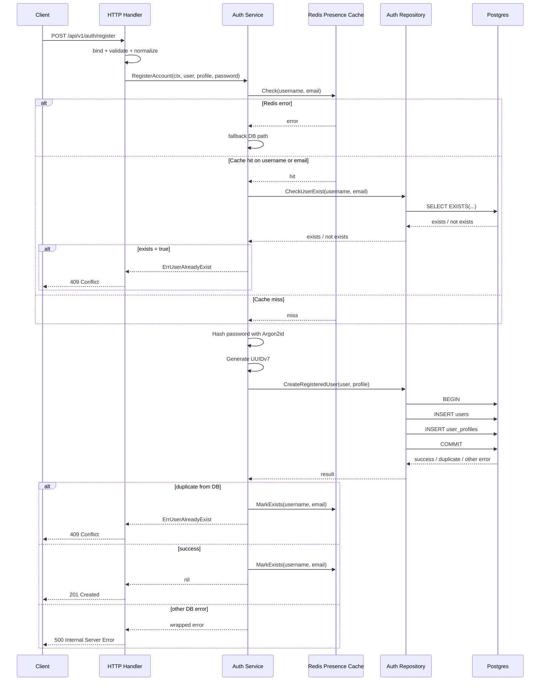

# IAM Register Flow

## 1. Purpose

Tài liệu này mô tả **flow register hiện tại** của IAM module theo code và migration đang chạy thực tế.

Scope của flow này:
- endpoint `POST /api/v1/auth/register`
- tạo `users`
- tạo `user_profiles`
- dùng Redis presence bitmap như pre-check tối ưu
- duplicate cuối cùng vẫn chốt ở **Postgres unique constraint**
- **chưa** auto-login
- **chưa** issue JWT
- **chưa** verify email thật
- **chưa** gán role mặc định
- **chưa** tạo tenant/workspace mặc định

---

## 2. Source Of Truth

Flow này đang bám theo các file sau:
- `internal/iam/transport/http/handler/auth_handler.go`
- `internal/iam/service/auth_service.go`
- `internal/iam/repository/auth_repo.go`
- `internal/iam/cache/register_presence.go`
- `internal/iam/migrations/000001_iam_enums.up.sql`
- `internal/iam/migrations/000002_iam_tables.up.sql`
- `internal/iam/migrations/000003_iam_indexes.up.sql`
- `internal/iam/test/integration_test/register_integration_test.go`

---

## 3. Endpoint Contract

## 3.1 Route
- `POST /api/v1/auth/register`

## 3.2 Request JSON
```json
{
  "username": "alice.nguyen",
  "email": "user@example.com",
  "password": "secret123",
  "re_password": "secret123",
  "fullname": "Alice Nguyen"
}
```

## 3.3 Validation Boundary
Validation nằm ở **handler**, không đẩy xuống service.

Các rule hiện tại:
- `username` bắt buộc
- `username` tối thiểu `6` ký tự
- `email` đúng format email
- `password` bắt buộc
- `password` tối thiểu `8` ký tự
- `re_password` bắt buộc
- `fullname` bắt buộc
- `password == re_password`

Handler cũng normalize input request trước khi gọi service:
- trim spaces
- lowercase `username`
- lowercase `email`

## 3.4 Response
### Success
- HTTP `201 Created`

### Failure
- HTTP `400 Bad Request`
- HTTP `409 Conflict`
- HTTP `500 Internal Server Error`

---

## 4. Data Model Mapping

## 4.1 users
Các cột được dùng trong register flow:
- `id`
- `username`
- `email`
- `phone`
- `password_hash`
- `status`
- `user_level`
- `created_at`
- `updated_at`

Mapping hiện tại:
- `id = uuid v7`
- `username = normalized username`
- `email = normalized email`
- `phone = NULL`
- `password_hash = Argon2id encoded hash`
- `status = pending-active`
- `user_level = 4`
- `created_at = now UTC`
- `updated_at = now UTC`

Uniqueness:
- `users_username_lower_uidx` trên `lower(username)`
- `users_email_lower_uidx` trên `lower(email)`

## 4.2 user_profiles
Các cột được dùng:
- `user_id`
- `fullname`
- `avatar_url`
- `bio`
- `locale`
- `timezone`
- `created_at`
- `updated_at`

Mapping hiện tại:
- `fullname = request.fullname`
- `avatar_url = NULL`
- `bio = NULL`
- `locale = vi-VN` nếu request/service chưa set
- `timezone = Asia/Ho_Chi_Minh` nếu request/service chưa set
- `created_at = now UTC`
- `updated_at = now UTC`

## 4.3 Không làm trong register v1 hiện tại
- không insert `password_history`
- không insert `audit_events`
- không tạo `refresh_tokens`
- không tạo `devices`
- không tạo `mfa_settings`

---

## 5. Register Flow Diagram



---

## 6. Step By Step Flow

## 6.1 Handler phase
Handler làm các việc sau:
1. bind JSON request
2. validate DTO
3. compare `password` và `re_password`
4. normalize request fields
5. map request sang domain entity `User` và `UserProfile`
6. gọi service `RegisterAccount`
7. map error sang HTTP response

Nguyên tắc:
- request validation ở handler
- business logic ở service
- SQL ở repo

## 6.2 Service phase
Service làm các việc sau:
1. reject nếu thiếu dữ liệu cần thiết
2. gọi Redis presence cache để pre-check
3. nếu cache hit thì exact-check DB bằng `CheckUserExist`
4. hash password
5. generate `uuid v7`
6. build `User` entity hoàn chỉnh
7. build `UserProfile` entity hoàn chỉnh
8. gọi repo insert trong transaction
9. nếu duplicate từ DB thì mark bitmap lại
10. nếu success thì mark bitmap lại
11. nếu Redis lỗi ở check/mark thì chỉ log warning, không fail request

## 6.3 Repository phase
Repository làm các việc sau:
1. mở transaction
2. insert `users`
3. insert `user_profiles`
4. commit transaction
5. map unique violation về `ErrUserAlreadyExist`
6. wrap các DB error khác để service/log biết root cause

---

## 7. Duplicate Strategy

Flow duplicate hiện tại là **cache-aside optimization**, không dùng cache làm source of truth.

## 7.1 Redis pre-check
Dùng hai bitmap key:
- `iam:register:bitmap:username`
- `iam:register:bitmap:email`

Input không lưu raw vào Redis key. Thay vào đó:
- HMAC-SHA256 của `username`
- HMAC-SHA256 của `email`
- digest được map sang bitmap index

## 7.2 Decision rule
- nếu Redis miss cả 2 -> đi thẳng create path
- nếu Redis hit 1 trong 2 -> check exact ở DB bằng `username` + `email`
- nếu Redis lỗi -> fallback DB create path
- nếu DB duplicate -> trả `ErrUserAlreadyExist`

## 7.3 Vì sao vẫn cần DB unique
Bitmap chỉ là optimization:
- có thể false positive
- không được dùng làm quyết định đúng/sai cuối cùng

DB unique constraint mới là hàng rào correctness cuối cùng.

---

## 8. Error Flow

## 8.1 Handler level
- DTO invalid -> `400`
- password mismatch -> `400`
- duplicate -> `409`
- internal error -> `500`

## 8.2 Service level
### Redis check lỗi
- không fail request
- log warning
- fallback DB path

### Redis mark lỗi
- không fail request
- log warning
- request vẫn success hoặc vẫn duplicate bình thường

### DB duplicate
- return `ErrUserAlreadyExist`
- service mark bitmap lại nếu có thể

### DB/internal error khác
- giữ wrapped error
- log raw/root cause ở flow register
- handler map về `500`

---

## 9. Observability

## 9.1 Metrics
Register flow hiện có metrics outcome riêng:
- `iam_register_total{result,cache_path}`

Các label quan trọng:
- `result`
  - `success`
  - `invalid_argument`
  - `already_exists`
  - `exist_check_error`
  - `hash_password_error`
  - `id_generate_error`
  - `insert_error`
- `cache_path`
  - `not_checked`
  - `cache_miss`
  - `cache_hit_db_check`
  - `cache_fallback`

Ngoài ra còn có dependency metrics từ global observability:
- DB latency
- Redis latency

## 9.2 Logs
Register flow log semantic fields như:
- `flow=register`
- `stage`
- `result`
- `cache_path`
- `cache_checked`
- `cache_username_hit`
- `cache_email_hit`

Khi có error, flow register log thêm:
- `error_raw`
- `error_type`
- `error_root`
- `error_root_type`

Mục tiêu là debug được root cause thật, ví dụ:
- lỗi Redis dial
- lỗi unique violation từ DB
- lỗi hash password

## 9.3 Trace
Flow này **không trace nội bộ layer**.
Hiện chỉ giữ:
- root HTTP span
- Redis client spans
- Postgres client spans

---

## 10. Integration Test Coverage

Bộ integration test thật hiện tại đang cover:
- apply IAM migrations trên Postgres thật
- register success với Postgres + Redis thật
- duplicate register với Postgres + Redis thật
- bitmap false positive vẫn create được user
- Redis down vẫn fallback DB và create được user
- duplicate từ DB vẫn mark bitmap lại

Test file:
- `internal/iam/test/integration_test/register_integration_test.go`

Test helper:
- `internal/iam/test/testutil/integration.go`

---

## 11. Current Limitations

Flow register hiện tại vẫn còn các giới hạn sau:
- chưa verify email thật
- status `pending-active` chưa nối sang activation flow
- chưa auto-login
- chưa issue JWT
- chưa có HTTP E2E integration qua app full stack
- anti-bot mới chủ yếu ở rate limit, chưa có challenge/captcha layer
- bitmap Redis là optimization đơn giản, chưa có advanced abuse/risk scoring

---

## 12. Production Notes

Đánh giá phase hiện tại:
- correctness core: ổn
- Redis failure tolerance: ổn
- duplicate safety: ổn
- migration trên DB thật: đã verify
- production hardening: còn cần làm thêm

Nếu chạy production phase đầu, nên ưu tiên tiếp:
1. verify/activation flow cho `pending-active`
2. anti-bot layer ngoài rate limit
3. HTTP E2E verification
4. alert rules cho register metrics
5. concurrency test ở mức HTTP/request race
