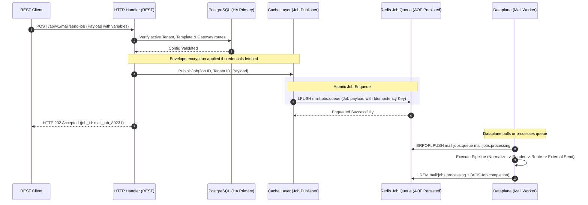

# 📬 Mail Module Architecture & Directory Specification
>
> **Cloud-Native, Secure, Asynchronous, and Highly Optimized Blueprint**

This document defines the refined directory structure and design architecture for the **Mail Module** of the control plane. It integrates the four core independent components (**Consumer**, **Template**, **Gateway**, and **Endpoint**) using asynchronous Redis-based job dispatch, aligned with the design patterns found in the `iam` and `core` packages.

---

## 1. 📂 Refined Directory Tree Architecture

To keep the codebase modular, clean, and perfectly aligned with your design requirements, the directory tree has been structured as follows:

```text
controlplane/internal/mail/
├── docs/                                  # Architectural docs (Existing & New)
│   ├── mail-consumer-phase1-idea.md       # Consumer phase 1 concepts
│   ├── mail-pipeline-b2b-idea.md          # B2B pipeline concepts
│   └── mail_module_architecture.md        # This refined architecture blueprint
├── module.go                              # Fx Module definition & bootstrap lifecycle management
├── route.go                               # HTTP REST routing definitions (Gin)
├── migration.go                           # Schema migrations registry
├── migrations/                            # PostgreSQL migrations (durability source of truth, aligned with iam)
│   ├── 000001_mail_enums.up.sql
│   ├── 000001_mail_enums.down.sql
│   ├── 000002_mail_tables.up.sql          # Defines separate tables for consumer, template, gateway, endpoint
│   ├── 000002_mail_tables.down.sql
│   ├── 000003_mail_indexes.up.sql
│   ├── 000003_mail_indexes.down.sql
│   └── embed.go                           # Embeds SQL migrations for direct startup check
├── domain/                                # Core Business Domain Entities & Abstractions
│   ├── entity/                            # Pure domain models (Stateless Go structs)
│   │   ├── consumer.go                    # Consumer configuration entities
│   │   ├── template.go                    # Dynamic mail template configurations
│   │   ├── gateway.go                     # Gateway policies & route strategies
│   │   └── endpoint.go                    # External connection parameters
│   ├── repo/                              # Data access interface boundaries (explicitly split into 4)
│   │   ├── consumer_repo.go
│   │   ├── template_repo.go
│   │   ├── gateway_repo.go
│   │   └── endpoint_repo.go
│   └── service/                           # Business logic service interfaces (explicitly split into 4)
│       ├── consumer_service.go
│       ├── template_service.go
│       ├── gateway_service.go
│       └── endpoint_service.go
├── taxonomy/                              # Static classifications, errors & outcomes (aligned with iam)
│   ├── error.go                           # Standard semantic errors for mail operations
│   └── outcome.go                         # Business event outcomes, delivery states, stage outcomes
├── model/                                 # DB Models matching migrations (aligned with iam)
│   ├── consumer.go                        # Consumer table model & converters (Entity <-> Model)
│   ├── template.go                        # Template table model & converters (Entity <-> Model)
│   ├── gateway.go                         # Gateway table model & converters (Entity <-> Model)
│   ├── endpoint.go                        # Endpoint table model & converters (Entity <-> Model)
│   └── job.go                             # Redis job cache/stream DB schema
├── repository/                            # Concrete Repository Implementations
│       ├── consumer_repo_postgres.go
│       ├── template_repo_postgres.go
│       ├── gateway_repo_postgres.go
│       └── endpoint_repo_postgres.go
├── service/                               # Concrete Business Logic Implementations (split into 4)
│   ├── consumer_service_impl.go           # CRUD, connectivity test, enable/pause consumers
│   ├── template_service_impl.go           # CRUD, syntax checking, variable validation
│   ├── gateway_service_impl.go            # CRUD, routing rules, failover path calculations
│   └── endpoint_service_impl.go           # CRUD, secure credentials handling
├── cache/                                 # Cache & Redis Queue/Stream Adapter (consolidated)
│   ├── mail_cache.go                      # Low-latency Redis cache for templates & configurations
│   └── job_publisher.go                   # Redis Stream/Queue publisher for dispatching mail jobs
├── metrics/                               # Observability Instrumentation
│   └── metrics.go                         # Prometheus gauge/counter registry
├── transport/                             # Interface Adapters (HTTP REST)
│   └── http/
│       ├── dto/                           # Data Transfer Objects
│       │   └── req/                       # API Request DTO payloads matching iam style
│       │       ├── consumer_request.go
│       │       ├── template_request.go
│       │       ├── gateway_request.go
│       │       ├── endpoint_request.go
│       │       └── job_request.go
│       └── handler/                       # Handlers split explicitly to isolate API domains
│           ├── consumer_handler.go        # Handles /api/v1/mail/consumers
│           ├── template_handler.go        # Handles /api/v1/mail/templates
│           ├── gateway_handler.go         # Handles /api/v1/mail/gateways
│           └── endpoint_handler.go        # Handles /api/v1/mail/endpoints
└── test/                                  # Robust Automated Testing Suite
    ├── svc_test/                          # Service layer unit & integration tests
    └── repo_test/                         # Database repository integration tests
```

---

## 2. 🧱 Detailed Component Specification

Here is the concrete role description for each of the four decoupled functional components:

### 2.1 Consumer (`consumer/`)

- **Role**: Ingests, claims, and parses inbound messages from external queues (Kafka, Redis Stream, RabbitMQ, NATS) and normalizes them into internal structural messages.
- **REST Endpoints**: CRUD management APIs, and dynamic state-switching (`PATCH /status` to pause or resume a consumer in runtime).
- **Security & Reliability**: Uses strict idempotency keys to ensure that even if a message source replays, it is only processed once.

### 2.2 Template (`template/`)

- **Role**: Declares dynamic email layouts, structural schemas, and placeholders.
- **Dynamic Render**: Renders HTML/Text content from incoming payloads (e.g., `{{payload.user.name}}`).
- **Security & Protection**: Enforces sandboxed parsing inside the rendering engine to prevent **Server-Side Template Injection (SSTI)** or arbitrary execution.

### 2.3 Gateway (`gateway/`)

- **Role**: Receives dynamic rendered content and selects the optimal path of dispatch based on business policies and dynamic tenant route matrices.
- **High Availability**: Decoupled from physical adapters, implementing intelligent fallback routes when target delivery endpoints fail.

### 2.4 Endpoint (`endpoint/`)

- **Role**: Stores, validates, and manages physical connection criteria to SMTP servers or SaaS providers (e.g., SendGrid, Mailgun).
- **Security & Protection**: Enforces **Envelope Encryption** (AES-256-GCM) on all SMTP passwords and private API keys before database insertion.

---

## 3. ☁️ Asynchronous Redis-based Job Dispatch Flow

Because mail delivery runs asynchronously through Redis jobs rather than direct RPC/Scheduling, the flow is simplified, robust, and highly scalable:



---

## 4. 🔒 Data Durability, Race Conditions, & Security Analysis

### 4.1 Race Conditions & Resolutions

- **Idempotency checks**: Duplicate job pushes are caught by keeping an idempotency lease key in Redis (`mail:idempotency:<job_id>`) using `SETNX` with a configurable lease TTL. If a job is re-submitted within the window, the request is rejected as a duplicate.
- **Concurrent updates to pipelines**: Pessimistic row-locking (`SELECT FOR UPDATE`) is applied in Postgres when templates or gateway configurations are modified to prevent inconsistent states.

### 4.2 Durability

- **Tier-0 (Configs)**: Stored strictly in PostgreSQL with replication enabled.
- **Tier-1 (Jobs)**: Handled by Redis with Append-Only File (AOF) configured to synchronize frequently (`appendfsync everysec`) so that jobs are never lost upon Redis restarts.

### 4.3 Security & Protection

- **Secrets Management**: SMTP/API credentials stored in the `mail_endpoints` table are encrypted using **Envelope Encryption** (AES-256-GCM) prior to insertion and decrypted only at the edge.
- **Tenant Isolation**: Multi-tenant separation is maintained via the `tenant_id` column, which is explicitly queried in all PostgreSQL operations.
