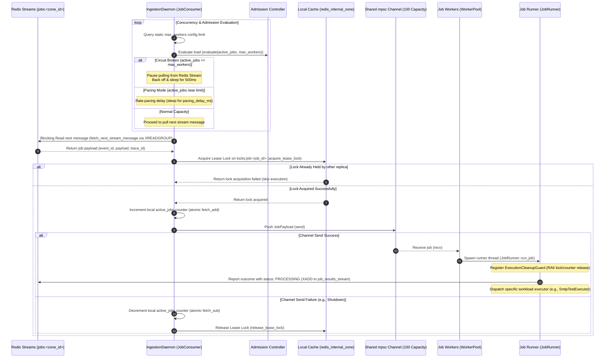

# Dataplane Runtime - Job Consumer & Admission Control Specification

This document specifies the generic Dataplane execution runtime. It details the worker loop, concurrency limits (admission control), distributed lease locks, and task scheduling mechanisms.

---

## 🔄 Ingestion & Concurrency Lifecycle Sequence

All incoming jobs pushed to the Redis stream `jobs:<zone_id>` are fetched, locked, and scheduled through a decoupled **Producer-Consumer** architecture using a local memory channel:

---

## 📥 How Jobs are Received (Job Ingestion Loop)

- **Entrypoint File**: `dataplane/src/job_lifecycle/consumer.rs`
- **Caller/Function**: `JobConsumer::start_ingestion` (Starts at Line 34)
- **Redis Query Callsite**: `dataplane/src/infra/redis/query.rs` -> `fetch_next_stream_message` (Starts at Line 18)

### Description

The ingestion loop runs vĩnh viễn (persistently) as a single **`IngestionDaemon`** Tokio task spawned during system bootstrap in `app.rs`.

- **Decoupled Architecture (Producer)**: The daemon is the single producer fetching jobs from the Redis Stream `jobs:<zone_id>`. It is not scaled and matches the application lifecycle. Once it fetches a job, it acquires a lease lock and pushes it to an in-memory `tokio::sync::mpsc::channel`.
- **Dynamic Scaling (Consumers)**: The job workers in the worker pool act as consumers reading from this in-memory channel. To facilitate auto-scaling, the `AutoScaleEngine` evaluates queue metrics (lag/latency) and instructs `WorkerLifecycleManager` to dynamically scale the consumer tasks (Job Workers) up (to `max_workers`) or down (to `min_workers`, default `1`).

---

## 🛡️ How Admission Control Limits Overloads

- **Entrypoint File**: `dataplane/src/job_lifecycle/admission.rs`
- **Caller/Function**: `AdmissionController::evaluate` (Starts at Line 35)

### Description

Before pulling new messages from the Redis Stream, the ingestion loop evaluates the node's capacity ratio. The `evaluate` method computes the resource index `r = max(active_ratio, cpu_usage, ram_usage)` where `active_ratio = current_active / max_workers`:

- **Circuit Broken Mode**: If `r >= 80%` (`0.8`), the circuit breaker trips (OPEN), pausing stream ingestion and sleeping for `500ms`. It remains OPEN until load recovers and drops below `50%` (`0.5`) (hysteresis threshold).
- **Pacing Mode**: If `0.0 < r < 0.8`, a dynamic, linear pacing delay is applied: `pacing_delay_ms = 1000 * (r / 0.8)` ms. This delays the fetch operation to naturally pace the ingestion rate before the node hits limits, preventing thundering herds.

---

## 🔒 How Distributed Lease Locks & Watchdog are Managed

- **Lock Acquisition Callsite**: `dataplane/src/infra/redis/query.rs` -> `acquire_lease_lock` (Starts at Line 142)
- **Lock Release Callsite**: `dataplane/src/infra/redis/query.rs` -> `release_lease_lock` (Starts at Line 163)
- **Registry**: `dataplane/src/workerpool/watchdog.rs` -> `ActiveLockRegistry` (Starts at Line 31)
- **Watchdog Background Loop**: `dataplane/src/workerpool/watchdog.rs` -> `start_watchdog_loop` (Starts at Line 111)

### 1. Distributed Lease Lock Concept

To achieve reliable multi-replica execution in a High Availability (HA) cluster and guarantee exactly-once processing, a distributed lease lock is acquired on Redis before processing a job:

- **Key Pattern**: `locks:job:<job_id>`
- **Acquisition**: Done via `SETNX` with a TTL of 30 seconds.
- **Fail-Safe**: If lock acquisition fails (meaning another Dataplane node is already processing the job), the current node immediately skips the job message to avoid double execution.

### 2. Active Lock Registry

Once the lock is successfully acquired and the job is picked up by a worker thread, its metadata is registered in a thread-safe registry:

- **Structure**: `ActiveLockRegistry` wrapping a `RwLock<HashMap<String, ActiveLockInfo>>`.
- **Metadata stored**:
  - `started_at` (timestamp when the execution started).
  - `max_execution_limit` (the `idle` timeout option specified in the job payload, or a fallback default).
  - `abort_handle` (the Tokio `AbortHandle` of the running task).
  - `job_id`, `job_version`, `attempt`.

### 3. Background Watchdog Loop (Auto-Renewal via Pipelining)

The Watchdog runs as a background task executing every 10 seconds. In each tick, it scans all active registered locks:

- **Renewal (Time elapsed < limit)**:
  - If the job is still running and the elapsed time has not hit `max_execution_limit`, the Watchdog includes the lock key in a batch list.
  - To optimize performance and prevent network blocking under high-concurrency, the Watchdog performs **Redis Pipelining** to batch-extend the expiration TTL of all running locks (`EXPIRE key 30`) in a single network request.
- **Forced Timeout Abort (Time elapsed >= limit)**:
  - If a job hangs or exceeds its maximum execution limit, the Watchdog triggers proactive cancellation:
    1. Calls `abort_handle.abort()` to terminate the Tokio green task executing the job.
    2. Deregisters the lock from the registry.
    3. Spawns a background task to report a `FAILED` result with error code `EXECUTION_TIMEOUT` to the Redis Result Stream (`job_results_stream`).

### 4. RAII Cleanup Guard (`ExecutionCleanupGuard`)

To prevent lock leaks and resource leaks when a task finishes, is aborted, or panics, the execution is wrapped using an RAII pattern:

- **Drop Lifecycle**:
  - The runner registers `ExecutionCleanupGuard` which is bound to the task context.
  - When the task completes (successfully or via failure/abort/panic), the guard's `drop()` method is automatically called.
  - On drop, the guard:
    1. **Instantly deregisters** the lock from the `ActiveLockRegistry` to stop the Watchdog from sending lease renewals.
    2. Spawns a detached tokio task to call `release_lease_lock` (deleting the Redis lock key) and atomically decrements the global `active_jobs` counter.

---

## 🚀 How Jobs are Executed & Cleaned Up

- **Task Spawner Callsite**: `dataplane/src/job_lifecycle/runner.rs` -> `JobRunner::run_job` (Starts at Line 44)
- **RAII Cleanup Guard**: `dataplane/src/job_lifecycle/runner.rs` -> `ExecutionCleanupGuard::drop` (Starts at Line 22)

### Description

Once the worker retrieves a job from the channel, it spawns a non-blocking async Tokio task using `run_job`:

- **Early Processing Notification**: Before executing the workload, the runner immediately publishes a `PROCESSING` status update via the Redis Stream `job_results_stream` (XADD). This allows the Job-Proxy to receive the update, modify the Controlplane DB status to `PROCESSING` in a transaction, and trigger real-time progress notifications to the UI.
- **Execution Guard**: The runner registers an `ExecutionCleanupGuard` (RAII pattern).
- **Execution Timeout**: Workload execution is regulated by the Watchdog loop. The watchdog monitors the execution time against the specific task's `idle` limit (default 10 minutes). If a task exceeds its limit, the Watchdog triggers proactive cancellation via `AbortHandle::abort()`.
- **Auto Release**: When the executor finishes (or is aborted/panics), the `ExecutionCleanupGuard` drops. This drops the active job count and releases the Redis lock asynchronously, ensuring complete resource cleanup and preventing leakage.

---

## 📐 Architectural Design Patterns

The Dataplane's high-performance, resilient runtime is built using several core design patterns:

### 1. Job Ingestion & Decoupling: Producer-Consumer Pattern

- **Implementation**: `dataplane/src/job_lifecycle/consumer.rs`
- **Pattern**: Implements a **Producer-Consumer Pattern** where the single `IngestionDaemon` serves as the producer pushing payloads to a memory channel, and dynamic worker threads act as consumers. This decouples the network-level Redis stream fetch logic from task execution logic, allowing scaling to happen entirely in-memory without group rebalancing/recreation overhead on Redis.

### 2. Admission Control: Circuit Breaker with Hysteresis & Rate Pacing

- **Implementation**: `dataplane/src/job_lifecycle/admission.rs`
- **Pattern**: Implements a **Circuit Breaker** with hysteresis bounds to shield the node from cascading resource failures. If local CPU, RAM, or worker thread usage exceeds `80%`, the loop cuts ingestion (OPEN state). It stays open until usage drops below `50%` (CLOSED state). Additionally, near-capacity workloads trigger a linear **Rate Pacing Delay** to prevent thundering herd spikes.

### 3. Worker Pool & Auto Scale: Decoupled Multi-Consumer Worker Strategy

- **Implementation**: `dataplane/src/workerpool/lifecycle.rs` & `dataplane/src/workerpool/auto_scale.rs`
- **Pattern**: Instead of managing custom operating system threads or multiple direct Redis Stream consumer loops, logical workers are lightweight Tokio green tasks consuming from the local `mpsc` channel. The `AutoScaleEngine` scales the number of these channel-consumer workers up or down based on lag, ensuring we always have at least `min_workers` (baseline `1`) active.

### 4. Distributed Lock and Lease: Watchdog-driven Lease & Execution Timeout Control Pattern

- **Implementation**: `dataplane/src/infra/redis/query.rs`, `dataplane/src/workerpool/watchdog.rs` & `dataplane/src/job_lifecycle/runner.rs`
- **Pattern**: Implements a **Lease Lock Pattern** using Redis key-value isolation (`SETNX` with TTL) to guarantee exactly-once processing in HA clusters. To prevent ghost-job duplicates and hung worker execution, the node maintains a thread-safe `ActiveLockRegistry` containing active task start times, abort handles, and execution limits, monitored by a background **Watchdog loop**. Every 10 seconds, the watchdog checks all active locks. If the elapsed execution time is below the task-specific `idle` timeout, the watchdog uses **Redis Pipelining** to batch-extend the lease TTL on Redis by 30 seconds. If a task exceeds its timeout limit, the watchdog triggers proactive task cancellation via its `AbortHandle`, stops extending the lease, and reports an `EXECUTION_TIMEOUT` failure to the Controlplane.

### 5. Job Dispatch Workload: Command / Strategy Pattern

- **Implementation**: `dataplane/src/job_lifecycle/consumer.rs`
- **Pattern**: Utilizes a dynamic **Command Dispatcher** pattern. The ingestion loop parses incoming jobs by their dot-separated namespace/topic prefix (e.g., routing `mail.test_connection` to `SmtpTestExecutor`). The runner resolves these namespaces to individual execution strategies, decoupling the ingestion loop framework from concrete job business logic.
