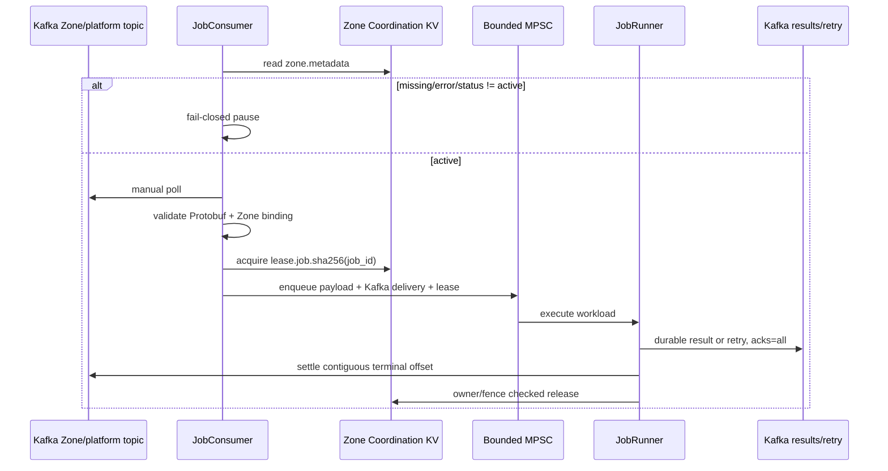

# Dataplane Runtime — Kafka, NATS Core, Zone KV và Admission

Dataplane thực thi workload của đúng một Zone. Kafka là durable Central↔Zone transport; NATS Core là
ephemeral realtime transport; NATS JetStream KV riêng Zone giữ desired runtime projection,
health và coordination. Dataplane không có credential Redis trung tâm.

God View chính:

- [`leader_worker_god_view.md`](../god_view/dataplane/leader_worker_god_view.md)
- [`observability_logging_god_view.md`](../god_view/dataplane/observability_logging_god_view.md)
- [`kafka_platform_transport_god_view.md`](../god_view/platform/kafka_platform_transport_god_view.md)
- [`zone_metadata_sync_and_state_machine_god_view.md`](../god_view/hierarchy/zone_metadata_sync_and_state_machine_god_view.md)
- [`mail_configuration_projection_god_view.md`](../god_view/mail/mail_configuration_projection_god_view.md)

## 1. Boundary

| Thành phần | Vai trò |
|---|---|
| Kafka transport | Zone/platform command, result, metadata, report, storage snapshot |
| NATS Core | Runtime watch và consumer snapshot best-effort |
| Zone NATS `AURORA_ZONE_CONFIG` | Zone metadata và mail immutable projection |
| Zone NATS `AURORA_ZONE_HEALTH` | Rebuildable current health |
| Zone NATS `AURORA_ZONE_COORDINATION` | CAS lease và fencing |
| Pod memory | Worker registry, admission counters, mail L1 và dynamic lag |

Dataplane không kết nối CP/Billing PostgreSQL, Shared/Auth Redis hoặc Vault. `NATS_URL` là NATS Core
transport còn `NATS_ZONE_URL` là Zone-local JetStream; hai endpoint phải khác nhau. Production Zone KV
dùng file storage và replica `3/5`.

## 2. Job lifecycle

- Poison/cross-Zone command được DLQ trước settle.
- Retry publish command `attempt+1` trước settle original.
- Assignment epoch tăng khi rebalance; completion cũ không commit owner mới.
- Lease giảm concurrent duplicate nhưng external executor vẫn phải idempotent.
- Watchdog renew lease bounded-concurrent; timeout publish terminal result rồi settle.

## 3. Leader, admission và autoscaling

- Stable Zone leader giữ `lease.zone.leader`, TTL 15 giây và renew mỗi 5 giây.
- Chỉ leader chạy recurring infrastructure probes, metadata repair, Zone report và scale decision.
- Hysteresis mở circuit từ `80%`, đóng dưới `50%`.
- Pacing tăng theo active workers/CPU/RAM.
- Bounded MPSC truyền backpressure.
- Mỗi node xuất cached lag của partition local; leader aggregate rồi phát fenced scale directive TTL 15 giây.
- Worker chỉ apply directive đúng Zone/chưa hết hạn; lag stale giữ target trước.

## 4. Mail runtime

Mail configuration hydrate từ Zone KV; customer broker connection chỉ được mở tại Dataplane:

- source suites: Kafka, Redis Stream, NATS JetStream, RabbitMQ;
- connection envelope encrypted, chỉ đúng Zone adapter giải mã;
- one consumer binds one immutable template version;
- template lazy-load vào Moka L1 theo byte weight/TTL/singleflight;
- render escaped parameters rồi batch JMAP;
- customer broker settlement giữ native semantics;
- slot ownership dùng Zone KV lease/fencing.

Customer payload mặc định là `{to, parameter}` JSON. Internal verification topic dùng
`MailDispatchEnvelopeV1` Protobuf nhưng vẫn map thành cùng logical render request.

Dynamic consumer lag/state nằm trong app memory. CP ghi watch request vào Shared Redis Stream, JO bridge
sang NATS Core và mỗi pod giữ lease trong memory. Chỉ pod có watch hợp lệ mới publish bounded Protobuf
snapshot qua NATS Core; không lưu dynamic runtime trong Kafka, PostgreSQL hoặc Zone KV.

## 5. Recovery

| Failure | Behavior |
|---|---|
| Kafka poll/publish outage | Không settle source; replay sau recovery |
| Kafka poison data | Durable DLQ rồi settle |
| Zone KV unavailable | Ingestion fail-closed |
| Pod chết in-flight | Kafka replay sau offset + lease expiry |
| Rebalance | Epoch fence chặn stale completion |
| Result chưa durable | Không commit command |
| NATS Core unavailable | Runtime watch/sample có thể mất; Kafka job không mất và heartbeat sau phục hồi |
| Metadata missing | Durable query/snapshot repair qua Kafka |

## 6. Code map

- `src/infra/kafka.rs`: producer, consumer, rebalance fence, contiguous settlement.
- `src/infra/nats_core.rs`: watch registry memory và runtime report soft-state.
- `src/infra/zone_kv.rs`: buckets, CAS metadata và fenced lease.
- `src/job_lifecycle/consumer.rs`: command validation, DLQ, lease, dispatch.
- `src/job_lifecycle/runner.rs`: execution, retry/result durability.
- `src/workerpool/watchdog.rs`: timeout/lease renewal.
- `src/leader/`: election, metadata, health probe, report, storage scan và scale decision.
- `src/workerpool/scale_follower.rs`: apply fenced worker target.
- `src/executor/mail/runtime/`: customer broker suites.
- `src/executor/mail/processor/`: render/JMAP/batching.
- `src/executor/mail/supervisor/`: pod-local runtime reporting; không probe hạ tầng.

## 7. Structured log controls

| Environment | Default | Boundary |
|---|---:|---|
| `APP_LOG_LEVEL` | `info` | `debug`, `info`, `warn`, `error` |
| `APP_LOG_BUFFERED_LINES` | `16384` | Clamped `1024..262144`; queue đầy drop có metric, không block Tokio |
| `APP_LOG_MAX_FIELD_BYTES` | `16384` | Clamped `1024..262144`; áp dụng trước JSON serialization |
| `APP_LOG_RATE_LIMIT_MS` | `5000` | Clamped `100..60000`; chỉ suppress warning/error trùng |
| `OTEL_TRACE_SAMPLE_RATIO` | `1.0` | Clamped `0..1`; ParentBased ratio chỉ áp dụng cho root trace mới |

Dataplane emit một NDJSON record trên stdout cho mỗi event. Không cấu hình thêm direct OTLP Logs
song song với filelog collector vì cùng record sẽ bị ingest hai lần.
