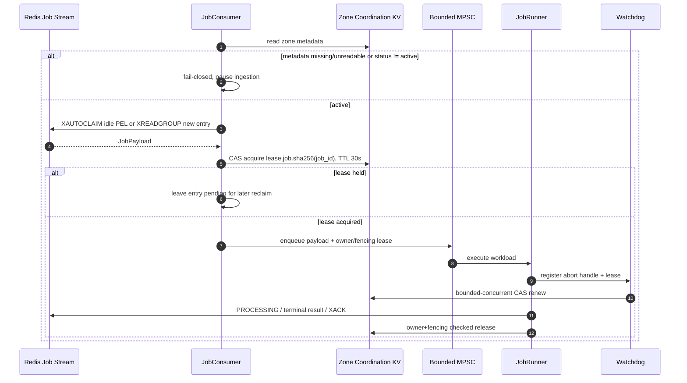

# Dataplane Runtime — Job Transport, Zone KV và Admission Control

Tài liệu này mô tả runtime generic của Dataplane. Redis chỉ còn là Job transport. Toàn bộ shared state nội bộ Zone, health snapshot và distributed lease nằm trên NATS JetStream KV; không còn Redis riêng cho Zone runtime.

## 1. Hạ tầng và ranh giới dữ liệu

| Thành phần | Vai trò | Durability |
|---|---|---|
| NATS Core trung tâm | Request/reply và event bus của CP/JO/IAM/Notification; Dataplane Zone KV không kết nối vào đây | Core messaging, không phải Zone database |
| NATS JetStream của từng Zone | Host ba KV bucket phía dưới; chỉ workload trong đúng Zone được cấp credential | File-backed JetStream riêng của Zone |
| Redis Job | `jobs:<zone_id>`, `jobs:platform`, result/report streams và metadata PubSub transport | Redis Stream/AOF theo deployment |
| `AURORA_ZONE_CONFIG` | Zone metadata, mail consumer/template heads và immutable snapshots | JetStream file storage, history `1`, không TTL |
| `AURORA_ZONE_HEALTH` | Current node/service snapshots có thể tái tạo | JetStream file storage, history `1`, max age 24 giờ |
| `AURORA_ZONE_COORDINATION` | Owner-aware CAS lease và fencing token | JetStream file storage, history `1`, max age 24 giờ |
| Pod memory | Worker registry, admission counters và mail L1 | Không durable, rebuild từ KV |

`NATS_ZONE_URL` là bắt buộc và không fallback sang `NATS_URL`/`NATS_ADDR` của NATS Core. Production dùng `NATS_ZONE_KV_REPLICAS=3` hoặc `5`. Dev compose dùng service `nats-zone-z1` replica `1`, tách vật lý khỏi service Core `nats`. Bootstrap fail-fast nếu endpoint thiếu hoặc bucket sai storage/history/replica/retention contract.

## 2. Luồng nhận và chạy job



Job key dùng SHA-256 của `job_id`, không ghép raw external ID vào NATS key. Stream delivery vẫn là at-least-once; lease giảm thực thi song song nhưng không biến side effect bên ngoài thành exactly-once. Executor phải idempotent hoặc có idempotency key riêng.

## 3. Admission và worker pool

Trước mỗi lần fetch, `AdmissionController` lấy giá trị lớn nhất giữa active-job ratio, CPU và RAM:

- Từ `80%`: circuit mở, ingestion nghỉ `500ms`.
- Chỉ đóng lại khi tải xuống dưới `50%` để tránh dao động.
- Dưới ngưỡng mở: pacing delay tăng tuyến tính theo tải.
- MPSC capacity `100` tạo backpressure giữa ingestion và worker.
- Autoscaler giữ `min_workers..max_workers`, dựa trên Redis Stream lag/latency.

Hai ingestion daemon đọc `jobs:<zone_id>` và `jobs:platform`, nhưng dùng chung admission counter, worker channel và Zone coordination KV.

## 4. Lease, watchdog và cleanup

`ZoneKvStore` cấp lease bằng optimistic CAS trên revision gần nhất. Value lưu:

```text
owner_id
fencing_token
expires_at_unix_ms
last_owner_id
released_at_unix_ms
```

- Acquire chỉ thành công khi key chưa có, đã release hoặc đã hết hạn.
- Renew/release phải khớp cả `owner_id` và `fencing_token`; owner cũ không thể release lease mới.
- Watchdog chạy mỗi 10 giây, renew lease 30 giây với concurrency giới hạn `32`; mất lease thì abort task.
- Quá execution limit thì abort và ghi `EXECUTION_TIMEOUT` vào result stream.
- `ExecutionCleanupGuard` deregister và giảm local `active_jobs` ngay khi drop; network release KV chạy bất đồng bộ nên sự cố NATS không làm admission counter bị kẹt.

Health monitor dùng rotating lease với stable pod ID và same-owner cooldown. Sau một cycle, replica khác được ưu tiên; deployment một replica vẫn tự chạy lại sau cooldown. Snapshot luôn chứa fencing/cycle token và probe node để điều tra split-brain.

## 5. Mail stream runtime Phase 6–8

Mail configuration vẫn hydrate từ `AURORA_ZONE_CONFIG`, nhưng broker runtime dùng lease riêng
`mail.consumer.slot.{consumer_id}.{slot}` trong `AURORA_ZONE_COORDINATION`. Một central supervisor có
initial/per-slot jitter, hard cap `MAIL_STREAM_MAX_SLOTS_PER_POD` và chỉ reconcile khi COW generation đổi,
slot kết thúc hoặc đến retry window.

- Outbox/KV snapshot decode `MailStreamSourceV1`: `stream_type`, adapter schema version, broker resource ID và opaque adapter bytes.
- Dispatcher match `stream_type` đúng một lần; Kafka, Redis Stream, NATS JetStream và RabbitMQ đều có suite connect/consume/retry/settlement riêng.
- `MAIL_STREAM_ENVELOPE_KEY_HEX` là Zone-local AES-256 key dạng 64 hex characters. Thiếu/sai key không làm pod crash; chỉ consumer cần key không được start.
- `MAIL_STREAM_CA_CERT_PATH` tùy chọn pin thêm private Kafka CA từ trusted pod deployment; customer payload không chứa filesystem path.
- Kafka chỉ chấp nhận TLS, Redis Stream dùng `rediss://`, customer JetStream dùng `tls://`, RabbitMQ dùng `amqps://`.
- `MAIL_STREAM_MAX_INFLIGHT_PER_SLOT` tạo broker-native backpressure: Kafka bounded poll, Redis bounded read/claim,
  JetStream bounded local tasks và RabbitMQ QoS/prefetch.
- Phase 7 processor chỉ chấp nhận JSON cố định `{ "to": "...", "parameter": {...} }`, compile/cache placeholder
  theo immutable template snapshot, escape HTML rồi trả typed status cho suite settlement.
- `MAIL_STREAM_PROCESSOR_CONCURRENCY` giới hạn render/JMAP inflight toàn pod, độc lập với số broker slot.
- Kafka commit highest contiguous terminal offset; Redis dùng PEL/XAUTOCLAIM/XACK; JetStream dùng
  Progress/double-ACK/Term; RabbitMQ dùng ACK/reject và bắt buộc stable AMQP `message_id`.
- `MAIL_STREAM_DELIVERY_ENABLED` vẫn mặc định `false` cho tới khi bốn suite vượt staging TLS/failure/rebalance E2E gates.
- Slot health nằm tại `AURORA_ZONE_HEALTH/mail.runtime.{consumer_id}.{slot}` và dùng fencing token để writer cũ không overwrite generation mới.
- `consumer_reporter` gom customer-safe delta vào `mail:consumer:reports`; `health_observer` luân phiên probe JMAP/Stalwart, ghi fenced `zone.service.mail` và OTel metrics cho Grafana.
- `STALWART_REPORTER_BEARER_TOKEN` là read-only management identity riêng; thiếu token chỉ làm inventory unavailable, không tái sử dụng submission credential.

## 6. Recovery và failure semantics

| Failure | Hành vi |
|---|---|
| Zone KV không đọc được | Ingestion fail-closed; không kéo job mới |
| Redis Job tạm lỗi | Entry chưa XACK, được `XAUTOCLAIM` sau idle threshold |
| Pod chết khi chạy | Lease hết hạn; PEL được replica khác claim |
| Watchdog mất lease | Abort owner cũ và deregister |
| Terminal result chưa durable | Không XACK để replay |
| Release KV lỗi | Local counter vẫn đã cleanup; lease tự hết hạn |
| PubSub metadata bị mất | Cold-start/hourly reconciler sửa `zone.metadata` từ PostgreSQL SoT qua JO |

## 7. Code map

- `src/infra/zone_kv.rs`: bucket bootstrap, CAS metadata và fenced/rotating lease.
- `src/job_lifecycle/consumer.rs`: fail-closed ingestion và lease acquisition.
- `src/executor/mail/runtime/consumer_supervisor.rs`: desired slot scheduling, jitter và Zone lease/fencing.
- `src/executor/mail/runtime/dispatcher.rs`: match stream type đúng một lần.
- `src/executor/mail/runtime/`: common encrypted-envelope/fence/health và bốn broker suites độc lập.
- `src/executor/mail/processor/stream.rs`: fixed envelope, lazy template render và typed JMAP result.
- `src/executor/mail/supervisor/consumer_reporter.rs`: bounded logical-slot delta relay.
- `src/executor/mail/supervisor/health_observer.rs`: rotating JMAP/Stalwart health, Zone KV và low-cardinality OTel metrics.
- `src/executor/mail/test/`: toàn bộ unit test của mail; source module chỉ giữ test path declaration.
- `src/job_lifecycle/runner.rs`: execution, result/XACK và RAII cleanup.
- `src/workerpool/watchdog.rs`: timeout và bounded-concurrent lease renewal.
- `src/observability/resource.rs`: per-node health snapshot.
- `src/zone_gateway/`: metadata event/reconciliation và Zone report aggregation.
