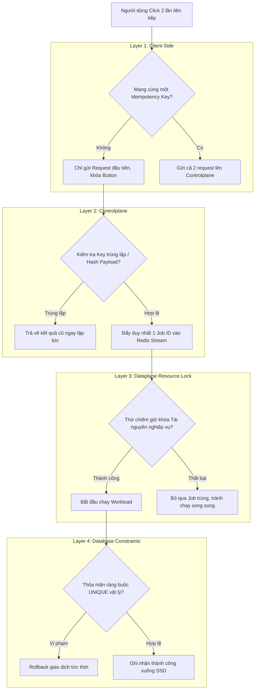

# 🛡️ ĐẶC TẢ KIẾN TRÚC: CHỐNG TRÙNG LẶP ĐA TẦNG (MULTI-LAYERED IDEMPOTENCY SPECIFICATION)

Tài liệu này đặc tả cơ chế chống trùng lặp xử lý (Idempotency) toàn diện của hệ thống Aurora từ phía Client qua Controlplane tới Dataplane, giải quyết triệt để kịch bản "người dùng double-click" dẫn đến các Job trùng lặp bị đẩy vào hệ thống.

---

## 1. 🌐 Bức Tranh Tổng Quan: Phòng Thủ Đa Tầng (Defense-in-Depth)

Chống trùng lặp trong một hệ thống phân tán hiệu năng cao **không bao giờ là trách nhiệm của riêng một phân hệ đơn lẻ**, mà phải được thiết kế dưới dạng **phòng thủ nhiều lớp**:

---

## 2. ⚡ Đặc Tả Chi Tiết 4 Lớp Bảo Vệ

### LỚP 1: Chốt Chặn Phía Client (Client-Side Idempotency Key)

* **Nguyên lý:** Mỗi khi người dùng thực hiện một hành động tạo/sửa đổi (ví dụ: nhấn nút "Tạo VPS"), ứng dụng Client bắt buộc phải tạo ra một **Idempotency Key** độc bản dạng `UUIDv4` gắn liền với hành động đó và lưu tạm vào bộ nhớ.
* **Cơ chế:** Kể cả khi có sự cố mạng chậm khiến người dùng double-click liên tục, tất cả các request gửi đi trong cửa sổ đó đều mang **cùng một Idempotency Key** trong HTTP Header (`X-Idempotency-Key`).
* **Hành vi bổ trợ:** Khóa cứng (Disable) nút bấm ngay sau click đầu tiên để ngăn chặn click vật lý thừa.

### LỚP 2: Hội Tụ Định Danh Tại Controlplane (Deterministic Job ID)

* **Tình huống:** Nếu người dùng bypass lớp Client bằng API Client thô không có Idempotency Key.
* **Giải pháp:** Controlplane thực hiện thuật toán **Content-based Hashing** để tự động sinh ra Job ID có tính chất hội tụ:
  $$\text{Job ID} = \text{SHA256}(\text{user\_id} + \text{action} + \text{resource\_identifier\_or\_checksum})$$
* **Kết quả:** Hai request trùng lặp hoàn toàn về mặt nghiệp vụ sẽ luôn được Controlplane ánh xạ sang **cùng một Job ID duy nhất**. Khi đẩy vào Redis Stream, chúng sẽ tự động ghi đè hoặc bị loại bỏ, ngăn ngừa việc sinh thêm Job ID rác.

### LỚP 3: Khóa Tài Nguyên Nghiệp Vụ Tại Dataplane (Domain/Resource-Level Lock)

* **Tình huống:** Nếu do lỗi cấu hình hoặc trễ xử lý, Controlplane sinh ra 2 Job có ID khác nhau nhưng cùng tác động lên một tài nguyên vật lý thực tế (ví dụ: `Job A` để tạo VPS và `Job B` gửi yêu cầu dừng/xóa VPS đó ngay sau khi nhấn tạo nhầm).
* **Giải pháp: Khóa động dựa trên Workload (Workload-Specific Lock)**
  * Cơ chế khóa này **không được áp dụng cào bằng** ở bộ thu nhận tin trung tâm mà **được quyết định và quản lý chủ động bởi chính Workload/Executor cụ thể** thực thi tác vụ đó:
    * **Stateful Workloads (Hypervisor VM Actions):** Bắt buộc phải thực hiện khóa tài nguyên theo ID của thực thể vật lý (ví dụ: `locks:resource:vps:<vps_id>`).
    * **Stateless Workloads (Mail Delivery / Webhook Telemetry):** Tuyệt đối không sử dụng khóa tài nguyên để đảm bảo thông lượng gửi tin cực lớn và khả năng mở rộng tối đa (Mail thì không thể và không cần khóa).
* **Cơ chế chống Race Condition vòng đời (Lifecycle Race Mitigation):**
  * Giả sử người dùng nhấn "Tạo VPS" (`vps.create`), ngay sau đó nhận ra mình nhầm và nhấn "Dừng VPS" (`vps.stop`).
  * `vps.create` đang chạy sẽ chiếm khóa `locks:resource:vps:123`.
  * `vps.stop` đến sau ở một Worker khác sẽ thử chiếm khóa `locks:resource:vps:123` ➔ **Thất bại** (do tiến trình tạo đang giữ khóa) ➔ Tác vụ `vps.stop` được xếp hàng chờ hoặc trả về retry an toàn.
  * **Kết quả:** Ngăn chặn triệt để thảm họa chạy tranh chấp (Race Condition) làm Hypervisor bị crash hoặc rơi vào trạng thái lỗi không xác định (chưa tạo xong đĩa ảo và card mạng đã bị yêu cầu đóng/hủy). Khi `vps.create` chạy xong giải phóng khóa, `vps.stop` sẽ chiếm khóa thành công và dừng VM cực kỳ an toàn.

### LỚP 4: Chốt Chặn Vật Lý Database (Database Unique Constraints)

* **Tình huống:** Lớp phòng thủ cuối cùng (The Last Line of Defense) khi cả 3 lớp trên bằng cách nào đó đều bị vượt qua do lỗi hệ thống cực kỳ hy hữu.
* **Giải pháp:** Thiết lập chỉ mục duy nhất (Unique Index/Constraint) cứng rắn ở mức lưu trữ cơ sở dữ liệu vật lý (cả SQLite cục bộ và DB tập trung của Controlplane).
  * Chỉ mục duy nhất nghiệp vụ: `UNIQUE(user_id, resource_identifier)`
* **Kết quả:** Khi 2 tiến trình đồng thời cố gắng chạy lệnh `INSERT` xuống đĩa cứng, hệ quản trị cơ sở dữ liệu sẽ lập tức chặn lại và trả về lỗi `Unique Constraint Violation`. Tiến trình trùng lặp lập tức bị hủy bỏ (Rollback), bảo toàn tính nhất quán tuyệt đối của dữ liệu.

---

## 3. 📝 Hướng Dẫn Dành Cho Lập Trình Viên (Design Contracts)

1. **Khi viết API mới**: Luôn yêu cầu Client truyền `X-Idempotency-Key` hoặc tự động áp dụng Content Hashing ở Controlplane trước khi ghi nhận Job vào Redis Stream.
2. **Khi viết Workload ở Dataplane**:
   * Tránh sử dụng các biến tự tăng ngẫu nhiên (non-deterministic parameters) trong payload.
   * Trước khi gọi API hạ tầng (tạo VPS, cấu hình mạng), bắt buộc phải chiếm giữ **Resource Lock** trên Redis Internal Zone tương ứng với tài nguyên đó.
3. **Thiết kế Database**: Luôn khai báo chỉ mục `UNIQUE` cho các trường định danh nghiệp vụ. Tuyệt đối không lưu trữ dữ liệu thiếu ràng buộc vật lý.
