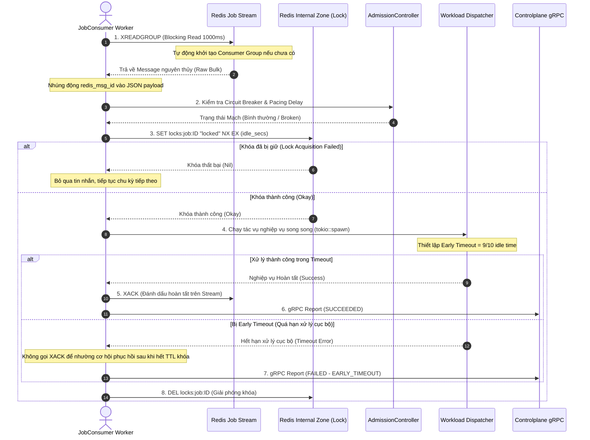

# 📑 SPEC: ĐỘNG CƠ THU NHẬN & CO GIÃN LUỒNG TỰ ĐỘNG (JOB RECEIVER & AUTOSCALING)

Tài liệu đặc tả chi tiết (Technical Specification) về kiến trúc, luồng đi của dữ liệu, cơ chế Circuit Breaker, khóa phân phối Lease Lock và giải pháp tự động co giãn luồng xử lý (Dynamic Thread-Level Autoscaling) của phân hệ **Job Receiver** thuộc Aurora Dataplane.

---

## 1. 🌐 Tổng Quan Kiến Trúc (Architecture Overview)

Phân hệ **Job Receiver** chịu trách nhiệm thu nhận các Job nghiệp vụ từ hàng đợi tập trung (Redis Stream) phân vùng theo vùng địa lý (`ZONE_ID`), kiểm soát dòng chảy thông qua cơ chế phản lực (Admission Control), thực thi phân phối nghiệp vụ song song trên nhóm Worker co giãn động và bảo đảm tính nhất quán giao dịch thông qua cơ chế khóa phân tán Lease Lock.

```mermaid
graph TD
    subgraph Redis Ingestion Zone
        Stream[Redis Stream: jobs:ZONE_ID]
        InternalLock[Internal Lock: locks:job:ID]
    end

    subgraph Dataplane App Container
        Watcher[AutoScaleWatcher Loop]
        Lifecycle[WorkerLifecycleManager]
        
        subgraph Worker Ingestion Pool
            W1[JobConsumer Worker 1]
            W2[JobConsumer Worker 2]
            W3[JobConsumer Worker N]
        end
        
        Admission[AdmissionController]
        Dispatch[Dynamic Workload Dispatcher]
    end

    subgraph Controlplane
        gRPC[gRPC JobResultReporter]
    end

    %% Flow Relationships
    Stream -->|XREADGROUP| W1 & W2 & W3
    W1 & W2 & W3 -->|Validate Circuit & Pacing| Admission
    W1 & W2 & W3 -->|SET NX EX| InternalLock
    W1 & W2 & W3 -->|Dispatch Task| Dispatch
    W1 & W2 & W3 -->|XACK| Stream
    W1 & W2 & W3 -->|DEL| InternalLock
    W1 & W2 & W3 -->|gRPC Result| gRPC

    Watcher -->|Monitor Lag & Latency| Stream
    Watcher -->|Evaluate Scale| Lifecycle
    Lifecycle -->|Spawn/Cancel Workers| Worker Ingestion Pool
```

---

## 2. ⚡ Vòng Đời Giao Dịch "Claim-Process-Commit" An Toàn

Nhằm đảm bảo **không bao giờ mất mát hoặc thất thoát Job** kể cả khi tiến trình Dataplane bị crash đột ngột trong lúc đang xử lý tác vụ, động cơ áp dụng quy trình giao dịch 4 bước nghiêm ngặt:

### Luồng Chi Tiết Thao Tác (Detailed Sequence)



### Quy tắc an toàn đặc biệt

* **Lease Lock TTL (`payload.idle`)**: Thời gian khóa tối đa dựa trên tải của Job.
* **Early Timeout (`9/10 idle`)**: Dataplane luôn chủ động ngắt tiến trình xử lý cục bộ sớm hơn TTL của khóa ít nhất `1/10` thời gian để thực hiện việc báo cáo lỗi kịp thời trước khi khóa bị hệ thống khác chiếm quyền hoặc nhả khóa không an toàn.
* **Crash-Recovery**: Nếu Dataplane crash giữa chừng, khóa `SET NX EX` sẽ tự động hết hạn (TTL expired). Các instance Dataplane khác thông qua cơ chế phục hồi (Pending recovery) có thể kéo lại Job này để xử lý lại mà không làm mất mát tin nhắn nghiệp vụ.

---

## 3. 📈 Động Cơ Tự Động Co Giãn Luồng (Dynamic Autoscaling)

Thay vì co giãn pod (Pod-level scaling) có độ trễ lớn, Dataplane thực hiện **co giãn số luồng xử lý song song trong vùng bộ nhớ tiến trình (Task-Level Autoscaling)** mang lại tốc độ phản hồi cực kỳ nhanh (mili giây).

### A. Quản Lý Vòng Đời Worker (`WorkerLifecycleManager`)

* Duy trì bản đồ ánh xạ `active_workers: Mutex<HashMap<usize, CancellationToken>>`.
* **Scale Up**: Tăng số lượng Worker nghiệp vụ:

  ```rust
  let cancel_token = CancellationToken::new();
  tokio::spawn(JobConsumer::start_ingestion(worker_id, cancel_token, ...));
  ```

* **Scale Down**: Giảm số lượng Worker một cách an toàn (Graceful Drainage):
  * Lấy `CancellationToken` của Worker ID tương ứng ra khỏi bản đồ.
  * Kích hoạt `.cancel()`.
  * Worker tương ứng kiểm tra tín hiệu hủy tại nhịp đầu của chu kỳ lặp mới (`tokio::select!`), hoàn tất nốt Job đang kéo dở rồi thoát vòng lặp sạch sẽ.

### B. Vòng Lặp Giám Sát `AutoScaleWatcher`

Chạy định kỳ mỗi **5 giây**, thực hiện các hành động:

1. **Đo đạc Lag thực tế**: Gọi `query::query_stream_lag` đo đạc tổng số lượng Job đang chờ xử lý trên Stream thông qua lệnh nguyên thủy `XLEN`.
2. **Đo đạc Latency thực tế**: Gọi `query::query_stream_latency_ms` thông qua lệnh nguyên thủy `XPENDING` đo đếm thời gian rảnh rỗi (`idle_time_ms`) của tin nhắn bị kẹt lâu nhất.
3. **Đánh giá quy mô (`AutoScaleEngine`)**:
   * Áp dụng chính sách dựa trên cấu hình ngưỡng động lấy từ Controlplane (Ví dụ: `max_workers`).
   * Thực hiện `scale_up` hoặc `scale_down` số luồng Worker xử lý phù hợp nhằm bảo đảm cân bằng tài nguyên tối ưu.

---

## 4. 🗃️ Đặc Tả API Giao Tiếp Thấp (Lower-Level Communication API)

Phân hệ sử dụng trực tiếp các chỉ thị nguyên thủy của Redis thông qua kết nối dồn kênh siêu tốc (`get_multiplexed_async_connection`) để đảm bảo không bị thắt cổ chai hiệu năng mạng:

| API Nghiệp Vụ | Lệnh Redis Bản Thô | Mục Tiêu & Nhất Quán |
| :--- | :--- | :--- |
| **Kéo Job Mới** | `XREADGROUP GROUP dataplane-group consumer-ID BLOCK 1000 COUNT 1 STREAMS jobs:ZONE_ID >` | Nhận tin nhắn an toàn theo nhóm tiêu dùng (Consumer Group). |
| **Xác Nhận Xong** | `XACK jobs:ZONE_ID dataplane-group MSG_ID` | Gỡ hoàn toàn Job khỏi danh sách xử lý dở dang (Pending List). |
| **Chiếm Khóa** | `SET locks:job:ID locked NX EX TTL` | Khóa phân phối chống trùng lặp xử lý giữa các cụm. |
| **Nhả Khóa** | `DEL locks:job:ID` | Giải phóng khóa sau khi giao dịch hoàn tất hoặc thất bại. |
| **Đo Lag** | `XLEN jobs:ZONE_ID` | Thống kê số lượng Job còn tồn đọng trong Stream. |
| **Đo Latency** | `XPENDING jobs:ZONE_ID dataplane-group - + 1` | Tìm tin nhắn chưa ACK có thời gian nằm chờ lâu nhất. |

---

## 5. 🔍 Lưu Ý Quan Trọng Cho Kỹ Sư Vận Hành (Contracts & Runbook)

1. **Zone Isolation**: Mọi thao tác kéo tin luôn được phân vùng qua `ZONE_ID` được cấu hình từ môi trường. Tuyệt đối không đọc chéo luồng Stream giữa các vùng địa lý khác nhau để bảo toàn ranh giới bảo mật.
2. **Connection Leak Prevention**: Luôn sử dụng Connection Multiplexing của Client thay vì mở/đóng kết nối liên tục nhằm loại bỏ hoàn toàn các lỗi `Too many open files` khi worker pool co giãn mạnh.
3. **sqlite_db Sync**: Khi Job được kéo về thành công, trạng thái ban đầu của Job phải được ghi nhận vào SQLite nội bộ để lưu trữ vết lịch sử xử lý trước khi phân phối tác vụ sang các Worker nghiệp vụ.
