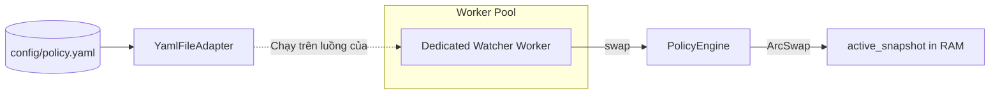

# 📖 Đặc Tả Kỹ Thuật: Dynamic Policy Engine Hot-Reload (Phiên Bản v1)

Tài liệu đặc tả kỹ thuật chi tiết cấu trúc, ranh giới thiết kế, cách hoạt động và hướng dẫn vận hành của phân hệ **Policy Engine Hot-Reload** trong hệ thống **Rust Dataplane (aurora-dataplane)**.

---

## 🧭 1. Tổng Quan Kiến Trúc & Mục Tiêu

Hệ thống Dataplane yêu cầu khả năng hoạt động liên tục **24/7 (Zero-Downtime)**. Các thay đổi về cấu hình giới hạn (Rate Limits, Thread Pool Size, Timeout, Sampling Rates) bắt buộc phải được áp dụng ngay lập tức mà không được phép khởi động lại ứng dụng.

### 🎯 Mục tiêu cốt lõi

1. **Lock-Free Hot-path**: Luồng xử lý công việc (hot-path) của worker đọc cấu hình với độ trễ tối thiểu (p99 < 0.1ms), hoàn toàn không bị chặn (non-blocking).
2. **Safety First (Last-Known-Good)**: Tuyệt đối không để một tệp YAML cấu hình sai cú pháp làm hỏng trạng thái hoạt động của hệ thống. Luôn tự động giữ lại phiên bản tốt gần nhất (LKG).
3. **Thread Supervision**: Mọi tác vụ quét đĩa cứng (File Watcher) được ủy thác cho **Worker Pool** quản lý nhằm kiểm soát tài nguyên chặt chẽ và hưởng lợi từ cơ chế tự phục hồi (Auto-restart on crash).

---

## 🔒 2. Ranh Giới Bảo Mật Nghiêm Ngặt (Privacy Boundary)

Để tuân thủ tuyệt đối chuẩn bảo mật ISO/IEC 27001 và GDPR khi chạy Dataplane trên môi trường Production:

> [!WARNING]
> **ĐIỀU KHOẢN BẤT BIẾN**:
>
> - **CẤM** lưu trữ, vận chuyển, hoặc xử lý thông tin cá nhân hoặc định danh khách hàng (`tenant_id`, `email`, `username`) trong tệp cấu hình của Policy Engine.
> - Policy Engine **chỉ** lưu trữ các tham số vận hành hạ tầng thuần túy như:
>   - `max_workers` (Số lượng luồng tối đa được phép co giãn).
>   - `rate_limit_rps` (Ngưỡng chặn tần suất yêu cầu trên giây).
>   - `log_level` (Cấu hình ghi nhận vết nhật ký).
>   - `bypass_patterns` (Mẫu đường dẫn bỏ qua kiểm soát).

---

## 🛠️ 3. Chi Tiết Thiết Kế Kỹ Thuật (Technical Design)

Kiến trúc Policy Engine của Rust Dataplane bao gồm 4 thành phần phối hợp chặt chẽ:



### 🦀 3.1. Phân Hệ Đọc Lock-Free với `ArcSwap`

- **Thành phần**: `src/policyengine/engine.rs`

- **Cơ chế**: Sử dụng `ArcSwap<PolicySet>` thay cho khóa đọc ghi truyền thống `RwLock`.
- **Hiệu năng**: Các worker gọi hàm `engine.current()` để nhận về một `Arc<PolicySet>`. Tác vụ này chỉ tiêu tốn chi phí của một phép giải tham chiếu con trỏ nguyên tử (atomic pointer dereference), loại bỏ 100% tình trạng tranh chấp tài nguyên (lock contention).

### 🛡️ 3.2. Bộ Ba Bộ Lọc Phòng Vệ (Swap Guard Filters)

Hàm `engine.swap(new_policy)` thực thi chuỗi kiểm soát nghiêm ngặt trước khi ghi đè vào bộ nhớ:

1. **Validate Gate**: Gọi `new_policy.validate()` để kiểm tra phiên bản (bắt buộc `"v1"`) và kiểm tra rỗng (policies cấm rỗng).
2. **Deduplication Gate**: Tính toán nhanh SHA-256 Checksum từ chuỗi YAML thô. Nếu trùng khớp với checksum hiện hành, bỏ qua swap để tránh ghi đè dư thừa.
3. **Cooldown Gate (5 giây)**: Sử dụng mốc thời gian `Instant::now()` trong Mutex bảo vệ để lọc bỏ các sự kiện thay đổi xảy ra dồn dập (reload storm) do các tác vụ ghi nháp trên đĩa gây ra.

### 🧵 3.3. Ủy Thác Luồng Qua Worker Pool

- **Thành phần**: `src/policyengine/adapter.rs` & `src/workerpool/lifecycle.rs`

- **Cơ chế**:
  - `YamlFileAdapter` cung cấp hàm `start_watch(token, on_change)`.
  - Hàm `main.rs` gọi `worker_pool.spawn_dedicated_policy_watcher(0, ...)` để khởi tạo và chạy vòng lặp watch.
  - Nếu luồng gặp lỗi vật lý (như đĩa cứng bị ngắt kết nối tạm thời), Worker Pool sẽ bắt được tín hiệu lỗi từ kênh `mpsc` và tự động kích hoạt tiến trình hồi sinh luồng mới mà không gây gián đoạn hệ thống.

---

## 📝 4. Cú Pháp Cấu Hình YAML Mẫu (`config/policy.yaml`)

Tệp chính sách mẫu tuân thủ nghiêm ngặt schema kiểm định:

```yaml
version: "v1"
updated_at: "2026-05-26T17:30:00Z"
source: "config/policy.yaml"
checksum_sha: "a68731ff55b7964d4b245e14bcf0879c536553df9059f0f9c2d1b80db18c21a9"
policies:
  max_workers: 100
  rate_limit_rps: 500
```

---

## 🚀 5. Hướng Dẫn Vận Hành & Khởi Chạy

### 📥 A. Quy Trình Khởi Động Hệ Thống (Bootstrapping)

Khi khởi động hệ thống tại `main.rs`, luồng kiểm soát sẽ thực hiện nạp tệp chính sách ban đầu:

1. Đọc tệp `config/policy.yaml`.
2. Nếu file thiếu hoặc lỗi cú pháp YAML, Dataplane sẽ kích hoạt `Logger::sys_error` ghi nhận log lỗi hệ thống thô và lập tức **hủy thô tiến trình (`std::process::abort()`)** để hệ thống quản trị container (như Kubernetes) báo động đỏ.
3. Nếu thành công, nạp cấu hình in-memory và bàn giao luồng chạy ngầm cho **Worker Pool** giám sát.

### 🔄 B. Kích Hoạt Cập Nhật Động (Hot-Reload)

- **Tác vụ**: Sửa đổi tham số trong `config/policy.yaml` (ví dụ: tăng `max_workers` từ 100 lên 200).

- **Hành vi tự động**:
    1. Trong vòng tối đa 3 giây, Dedicated Watcher Worker phát hiện thay đổi qua polling loop.
    2. Đọc file cấu hình mới và đối chiếu SHA-256.
    3. Thực hiện `swap()` nguyên tử lock-free.
    4. Hệ thống xuất log dạng:
        `{"time":"2026-05-26T10:37:34.908234123Z","log_type":"system","op":"policyengine.reload","level":"info","message":"Policy Engine: Lock-free atomic swap completed successfully. Checksum: e431f..."}`
