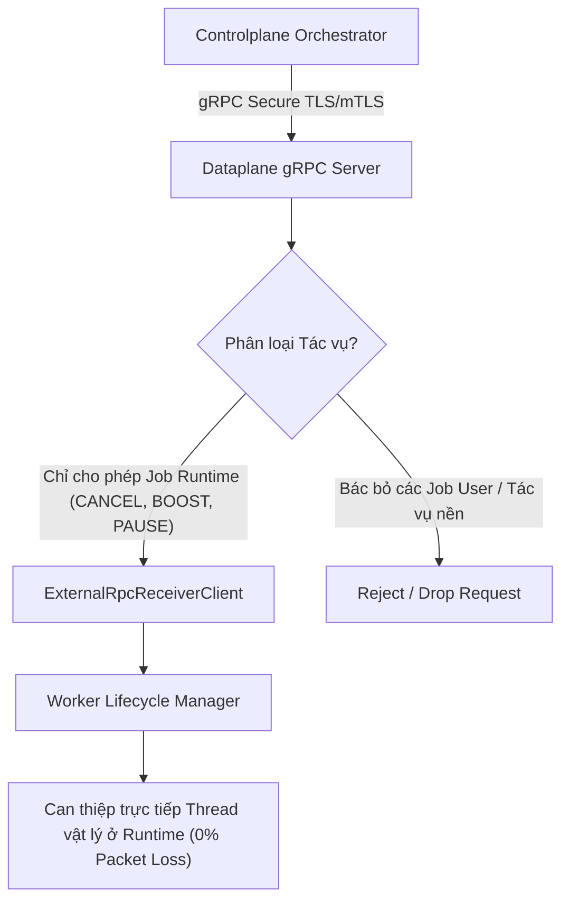

# Tài Liệu Đặc Tả Kỹ Thuật (Technical Spec)

## Hệ Thống Tín Hiệu Điều Phối Khẩn Cấp Job Runtime qua gRPC (V1)

---

### 1. Phân Loại Tác Vụ Trong Hệ Thống (Job Classifications)

Để tối ưu hóa kiến trúc phi trạng thái (stateless) và nâng cao độ tin cậy vận hành, hệ thống phân tách toàn bộ các tác vụ thành hai nhóm độc lập:

1. **Job User (Tác vụ Nghiệp vụ):**
   * **Đặc tính:** Các yêu cầu thông thường do người dùng cuối khởi tạo (ví dụ: tạo máy ảo, thay đổi cấu hình đĩa cứng, gửi email hàng loạt).
   * **Cơ chế xử lý:** Được đóng gói và đẩy vào hàng đợi Redis Job Queue, xử lý bất đồng bộ thông qua `JobConsumer`. Các tác vụ này được phép trễ tùy thuộc vào tải của hệ thống.
2. **Job Runtime (Tác vụ Hệ thống Khẩn cấp):**
   * **Đặc tính:** Các chỉ thị điều khiển trực tiếp mức hạ tầng ảo hóa/máy chủ (ví dụ: yêu cầu ngắt Thread vật lý khẩn cấp, tăng độ ưu tiên lập lịch, đồng bộ trạng thái heartbeat, reload cấu hình nóng).
   * **Yêu cầu khắt khe:** Đòi hỏi xử lý tức thời ở mức **thời gian thực (real-time)** và **cam kết tuyệt đối không được phép thất lạc (100% no-miss guarantee)**. Nếu bị mất mát hoặc chậm trễ, toàn cụm cluster sẽ mất đồng bộ ngay lập tức.

---

### 2. Kiến Trúc gRPC Ưu Tiên Tuyệt Đối (Dedicated gRPC Prioritization)

Nhằm đáp ứng yêu cầu **100% no-miss**, gRPC server của Dataplane được thiết kế kênh truyền dẫn trực tiếp, bypass hoàn toàn Redis Job Queue và hàng đợi thông thường.



---

### 3. Định Nghĩa Cấu Trúc Dữ Liệu (Data Structures)

Tín hiệu điều khiển Job Runtime truyền xuống qua gRPC được chuẩn hóa bằng cấu trúc dữ liệu `ControlplaneSignal` dưới dạng JSON/Protobuf:

```rust
#[derive(serde::Serialize, serde::Deserialize, Clone, Debug)]
pub struct ControlplaneSignal {
    /// Định danh Job runtime đích đang được thực thi trên Dataplane
    pub runtime_job_id: String,
    
    /// Loại tín hiệu điều khiển can thiệp (CANCEL | BOOST | PAUSE)
    pub signal_type: String,
    
    /// Tham số cấu hình hoặc metadata bổ sung
    pub payload: String,
}
```

---

### 4. Phân Phối và Xử Lý Tín Hiệu (Signal Routing & Ingestion)

Khi có kết nối RPC inbound, `ExternalRpcReceiverClient` sẽ giải mã và thực thi so khớp (`match`) loại tín hiệu của Job Runtime:

| Loại Tín Hiệu (`signal_type`) | Hành Vi Runtime (Expected Runtime Behavior) | Độ Ưu Tiên (Priority) |
| :--- | :--- | :--- |
| **`CANCEL`** | Ngắt khẩn cấp luồng Thread/Process đang xử lý Job tương ứng; thu hồi tài nguyên RAM/CPU lập tức. | **CRITICAL (Khẩn cấp)** |
| **`BOOST`** | Nâng độ ưu tiên lập lịch của Worker Pool đối với Job đích lên cao nhất. | **HIGH (Cao)** |
| **`PAUSE`** | Tạm dừng luồng Executor của Job runtime, bảo lưu trạng thái để chờ phục hồi. | **MEDIUM (Trung bình)** |

---

### 5. Ranh Giới Bảo Mật & Ràng Buộc (Security & Policy Boundaries)

1. **Mã hóa Toàn vẹn (mTLS):** Toàn bộ kênh truyền dẫn gRPC phát tín hiệu phải được bảo vệ bằng mTLS được xác thực CA hai chiều thông qua `GrpcSecurityConfig`.
2. **Không Mang Dữ Liệu Nhạy Cảm (Privacy Guard):** Payload của tín hiệu điều khiển tuyệt đối cấm mang theo thông tin cá nhân khách hàng, thông tin định danh Tenant, hay thông tin bảo mật môi trường.
3. **Phòng vệ Chống Từ Chối Dịch Vụ (DDoS Protection):** Cổng gRPC Server áp dụng cơ chế Rate-limiting dựa trên IP nguồn của Controlplane để bảo vệ tài nguyên tính toán của Dataplane node khỏi thảm họa quá tải (Thundering Herd).
