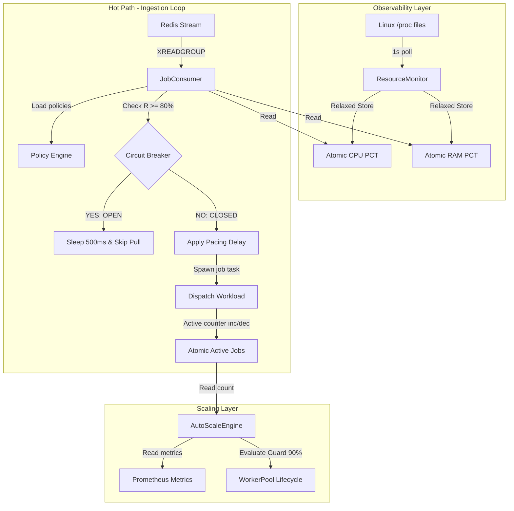

# 📑 ARCHITECTURAL SPECIFICATION: RESOURCE-AWARE WORKER POOL & ADMISSION CONTROL (v1)

## 📌 1. BỐI CẢNH & THỬ THÁCH (BACKGROUND & OBJECTIVES)

Trong hệ thống xử lý công việc phân tán hiệu năng cao (High-Performance Distributed Job Processing), các Dataplane instance hoạt động theo cơ chế **Pull-based (Competing Consumers)** kéo công việc từ hàng đợi Redis Stream.

Tuy nhiên, việc kéo tin liên tục không kiểm soát tài nguyên cục bộ mang lại các nguy cơ vận hành nghiêm trọng:

1. **CPU Thrashing / OOM (Out of Memory)**: Kéo lượng Job quá lớn vượt qua khả năng chịu tải vật lý của instance dẫn đến hiện tượng tráo luồng liên tục (CPU thrashing) hoặc sập tiến trình đột ngột do hết RAM.
2. **Mất cân bằng điều phối (Inefficient Balancing)**: Các Pod đang chịu tải cực cao vẫn tiếp tục giành giật giật Job từ Redis Stream, bỏ phí năng lượng tính toán nhàn rỗi của các Pod khác trong cùng Zone.
3. **Co giãn giật cục (Thrashing local scaling)**: Việc co giãn số lượng luồng xử lý bên trong Pod (Intra-pod Thread Scaling) nếu không có bộ tự vệ cứng (Safety Guard) sẽ làm trầm trọng hơn tình trạng cạn kiệt tài nguyên.

### 🎯 Mục tiêu của Đặc tả này

* Định nghĩa cơ chế toán học kiểm soát nhịp kéo tin dựa trên áp lực ngược (**Linear Decay Pull Pacing**).
* Định nghĩa hệ thống ngắt mạch tự phục hồi bảo vệ tài nguyên ở mức trần an toàn (**Hysteresis Circuit Breaker** tại 80% tải và tự khôi phục tại 50% tải).
* Thiết lập ranh giới bảo vệ cứng (**90% Hard Resource Safeguard**) chống quá tải co giãn luồng cục bộ.

---

## 📐 2. MÔ HÌNH TOÁN HỌC & THUẬT TOÁN (MATHEMATICAL MODEL & ALGORITHMS)

Bộ kiểm soát nhập lượng (Admission Control Engine) hoạt động dựa trên mô hình toán học tuyến tính suy hao kết hợp bộ ngắt mạch Hysteresis:

```
[R = 0%]                                [R = 80%]                     [R = 100%]
   |----------------------------------------|-----------------------------|
   |           VÙNG ĐIỀU TỐC TUYẾN TÍNH       |     VÙNG NGẮT MẠCH TUYỆT ĐỐI  |
   |     Weight W: 1.0 ---> Giảm dần ---> 0.0  |      Weight W: 0.0 (OPEN)   |
   |   Pacing Delay: 0ms ---> Tăng ---> 1000ms |    Ngưng kéo Job hoàn toàn   |
```

### 🧮 2.1. Tỷ lệ Tải Tổng Hợp (Unified Load Ratio - $R$)

Hệ thống đo đạc tải thực tế của Container bằng cách lấy giá trị cực đại trong 3 chiều tài nguyên cốt lõi:
$$R = \max \left( \frac{\text{Active Jobs}}{\text{Max Workers}}, \text{CPU Utilization}, \text{RAM Utilization} \right)$$
*Trong đó:*

* $\text{Active Jobs}$: Số Job đang chạy đồng thời trên luồng xử lý của Container.
* $\text{Max Workers}$: Giới hạn cấu hình luồng tối đa lấy từ Policy Engine động.
* $\text{CPU / RAM Utilization}$: Chỉ số sử dụng thực tế từ nhân Linux.

### 🧮 2.2. Trọng số Kéo Tin (Pull Weight - $W(R)$)

Hàm suy hao tuyến tính (Linear Decay Function) xác định mức độ ưu tiên kéo tin của instance:
$$W(R) = \begin{cases}
  1.0 - \frac{R}{0.8} & \text{nếu } 0.0 \le R < 0.8 \\
  0.0 & \text{nếu } R \ge 0.8
\end{cases}$$

### 🧮 2.3. Nhịp Trễ Kéo Giãn (Pacing Delay)
Thời gian trễ cưỡng chế chèn vào trước mỗi chu kỳ gọi Redis `XREADGROUP`:
$$\text{Pacing Delay} = \text{Base Delay} \times (1.0 - W(R))$$
*Với $\text{Base Delay} = 1000\text{ms}$.*

---

## 🏗️ 3. KIẾN TRÚC THÀNH PHẦN (ARCHITECTURAL COMPONENTS)



### 3.1. Bộ Thu Thập Tài Nguyên Thô (`ResourceMonitor`)
* **Nhiệm vụ**: Đọc định kỳ `/proc/stat` và `/proc/meminfo` của hệ điều hành Linux.
* **Non-blocking Guarantee**: Việc đọc file được thực thi cô lập ở background thread. Chỉ số được lưu dưới dạng `AtomicUsize`. Luồng Hot Path chỉ đọc biến nguyên tử thông qua cơ chế `Relaxed Memory Ordering` ($\approx 0\text{ns}$ overhead), cam kết không gây nghẽn luồng xử lý.

### 3.2. Cơ chế Hysteresis Circuit Breaker (`JobConsumer`)
Bộ ngắt mạch hoạt động dưới dạng bộ đảo trạng thái có độ trễ (Schmidt Trigger style) để tránh dao động bật tắt liên tục (oscillation/thrashing):
* **Trạng thái Mạch ĐÓNG (Ingestion ACTIVE)**:
  * Hoạt động kéo tin bình thường.
  * Nhịp độ kéo tin giãn cách động bằng `Pacing Delay`.
  * Nếu $R \ge 80\% \implies$ Chuyển sang mạch **MỞ** (Circuit `OPEN`).
* **Trạng thái Mạch MỞ (Ingestion PAUSED)**:
  * Ngưng hoàn toàn việc gọi kéo tin từ Redis Stream.
  * Chỉ tập trung xử lý giải phóng các Job đang chạy dở dang.
  * Nếu tải giảm xuống $R \le 50\% \implies$ Reset mạch về **ĐÓNG** (Circuit `CLOSED`).

### 3.3. Trình Co Giãn Tự Vệ Cứng (`AutoScaleEngine`)
* **Cơ chế**: Khi hàng đợi phát sinh lag hoặc latency cao, bộ máy sẽ tính toán đề xuất tăng số lượng luồng xử lý nội bộ.
* **Bộ tự vệ cứng (90% Hard Guard)**:
  ```rust
  if active_connections >= (self.max_workers as f64 * 0.9) as usize {
      // Đóng băng tăng luồng để bảo vệ CPU/RAM không bị cạn kiệt dứt điểm
      return current_workers;
  }
  ```

---

## 🚀 4. QUY TẮC PHỐI HỢP CLOUD-NATIVE VỚI KUBERNETES

Sự kết hợp giữa cơ chế bảo vệ nội bộ của Dataplane và cơ cấu co giãn cụm của Kubernetes tạo nên mô hình tự hồi phục 3 lớp (3-tier Self-Healing Model) hoàn hảo:

1. **Lớp 1 (Intra-pod Thread Scaling - Siêu tốc)**:
   * Khi tải tăng đột biến, `WorkerPool` tự động nâng quy mô luồng cục bộ từ `5` lên tối đa `max_workers` (ví dụ `100`) chỉ trong **microsecond** để đáp ứng tức thì.
2. **Lớp 2 (Local Backpressure & Circuit Breaking - Tự vệ)**:
   * Khi tài nguyên chạm ngưỡng quá tải ($R \ge 80\%$), Pod tự phanh nhịp độ kéo Job. Lúc này, Pod tự bảo vệ mình khỏi nguy cơ sập OOM và không tranh giành thêm Job, nhường tải cho các Pod khác trong Cluster gánh vác.
3. **Lớp 3 (Global Pod Auto-scaling - K8s HPA - Diện rộng)**:
   * Do Pod tự phanh kéo và CPU/RAM duy trì ở mức cao an toàn, K8s Metrics Server ghi nhận chỉ số CPU/Memory của cụm vượt ngưỡng (ví dụ > 80%).
   * K8s HPA (Horizontal Pod Autoscaler) lập tức ra lệnh spawn thêm các **Pod mới** để phân phối lại tải diện rộng một cách trơn tru.

---

## 🧪 5. QUY TRÌNH KIỂM THỬ & XÁC MINH (VERIFICATION PROTOCAL)

Mọi thay đổi liên quan đến thuật toán co giãn và Admission Control bắt buộc phải vượt qua các bài kiểm thử nghiêm ngặt sau:

### 5.1. Biên dịch hệ thống (Compilation Verification)
```bash
cargo check --bin "aurora-dataplane"
```
*Yêu cầu*: Hoàn thành biên dịch với 0 lỗi biên dịch.

### 5.2. Chạy giả lập giải thuật (Simulator Exec)
Thực thi tệp mô phỏng tải để xác minh tính chính xác toán học của chu trình Hysteresis:
```bash
# Chạy tệp mô phỏng kiểm thử độc lập
cargo run --bin admission_simulator
```
*Tiêu chí đạt*:
* Khi Unified Load $R < 80\%$: Nhịp Pacing Delay phải tăng dần tương ứng.
* Khi Unified Load $R \ge 80\%$: Mạch phải báo `OPEN` và tạm dừng nhận job.
* Khi Unified Load giảm từ $75\% \to 55\%$: Mạch vẫn phải giữ trạng thái `OPEN` (Hysteresis working).
* Khi Unified Load giảm hẳn xuống $\le 50\%$: Mạch chuyển sang `CLOSED` và khôi phục nhịp độ kéo tin bình thường.
