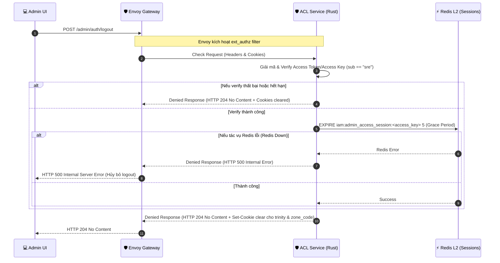

# SRE Admin Logout & Session Revocation - Workflow God View

> [!NOTE]
> Tài liệu này đóng vai trò là **Source of Truth (SoT) / God View** cho luồng Đăng xuất (Logout) và Thu hồi phiên hoạt động (Session Revocation) của SRE Admin.
> Mọi thay đổi về code liên quan đến việc thu hồi session của Admin tại Redis L2 và phản hồi cookies qua Envoy ext_authz phải tuân thủ nghiêm ngặt đặc tả này.

---

## 🗺️ 1. Giới Thiệu

### ❓ Phân hệ SRE Admin Logout là gì?

Phân hệ này đảm nhận vai trò kết thúc phiên làm việc khẩn cấp của SRE Admin một cách an toàn và nhanh chóng. Do SRE Admin sử dụng phiên làm việc tĩnh không gắn với thiết bị cụ thể (không có index) và không có cơ chế `refresh_token` dưới PostgreSQL, luồng logout của SRE Admin diễn ra hoàn toàn tại tầng biên (Edge Gatekeeper) thông qua **Rust ACL (ext_authz)**.

Hành động này thực hiện:

1. **Runtime Session Revocation**: Giảm TTL của session `iam:admin_access_session:<access_key>` xuống còn 5 giây (Grace Period) trên Redis L2 để vô hiệu hóa tức thời nhưng vẫn tránh gây lỗi 401 cho các request song song đang xử lý.
2. **Clear Cookies**: Trả về chỉ thị xóa sạch bộ ba Trinity Cookies cùng cookie vùng hoạt động `zone_code` về phía trình duyệt/client.

### 🌐 Sơ đồ Kiến trúc Tổng quan (System Architecture)

```mermaid
graph TD
    classDef client fill:#332244,stroke:#8844ff,stroke-width:2px;
    classDef gateway fill:#112233,stroke:#3388ff,stroke-width:2px;
    classDef edgeService fill:#113322,stroke:#33cc88,stroke-width:2px;
    classDef storage fill:#333311,stroke:#cccc33,stroke-width:2px;

    UI["💻 Admin UI / CLI"]:::client
    Envoy["🛡️ Envoy Gateway (Edge Proxy)"]:::gateway
    ACL["🛡️ ACL Service (Rust - Edge Authz)"]:::edgeService
    Redis["⚡ Redis L2 (Runtime Sessions)"]:::storage

    UI -- "1. POST /admin/auth/logout" --> Envoy
    Envoy -- "2. ext_authz Check" --> ACL
    ACL -- "3. EXPIRE session 5s (Sync)" --> Redis
    ACL -- "4. 204 response + Cookie clear" --> Envoy
    Envoy -- "5. HTTP 204 No Content" --> UI
```

### 🗃️ Các Khóa Lưu Trữ & Bộ Nhớ Được Tương Tác

| Phân Tầng Lưu Trữ | Tên Khóa | Kiểu Dữ Liệu | Hành Động Xử Lý | Chi Tiết & Vai Trò |
| :--- | :--- | :--- | :--- | :--- |
| **L1: Browser Cookies** | `access_token` | HTTP Cookie (JWT) | **Hủy bỏ** (`Max-Age=-1`) | Xóa cookie token truy cập tại client trình duyệt để kết thúc phiên làm việc stateless. |
| **L1: Browser Cookies** | `access_key` | HTTP Cookie (UUID) | **Hủy bỏ** (`Max-Age=-1`) | Xóa cookie khóa truy cập dùng để tra cứu phiên tại L2. |
| **L1: Browser Cookies** | `access_secret` | HTTP Cookie (UUID) | **Hủy bỏ** (`Max-Age=-1`) | Xóa cookie secret dùng để mã hóa/xác thực phiên. |
| **L1: Browser Cookies** | `zone_code` | HTTP Cookie (String) | **Hủy bỏ** (`Max-Age=-1`) | Xóa cookie vùng làm việc đã chọn của SRE Admin để làm sạch trạng thái. |
| **L2: Redis Cache** | `iam:admin_access_session:<access_key>` | String (Protobuf) | **EXPIRE 5 giây (Grace Period)** | Giảm thời gian sống của session để vô hiệu hóa an toàn, tránh lỗi 401 cho các request song song đang bay lơ lửng. |

---

## 🏛️ 2. Sơ Đồ Hệ Thống & Trình Tự Điều Phối

### Luồng Đăng xuất và Thu hồi Session tại Gateway (Đồng bộ)

**Các file mã nguồn liên quan (Code References):**

- [acl/src/service/ext_authz.rs](../../acl/src/service/ext_authz.rs): Tiếp nhận yêu cầu từ bộ lọc `ext_authz` của Envoy, nhận diện request `/admin/auth/logout` và chuyển tiếp xử lý sang dịch vụ Logout của Admin.
- [acl/src/service/session/revoke_session.rs](../../acl/src/service/session/revoke_session.rs): Triển khai hàm `handle_admin_logout` để xóa session trong L2 Redis, chuẩn bị response 204 kèm xóa Cookies.
- [acl/src/core/session/admin_session.rs](../../acl/src/core/session/admin_session.rs): Cung cấp hàm `delete_admin_session` để giảm TTL của khóa Admin session trong Redis xuống còn 5 giây.

