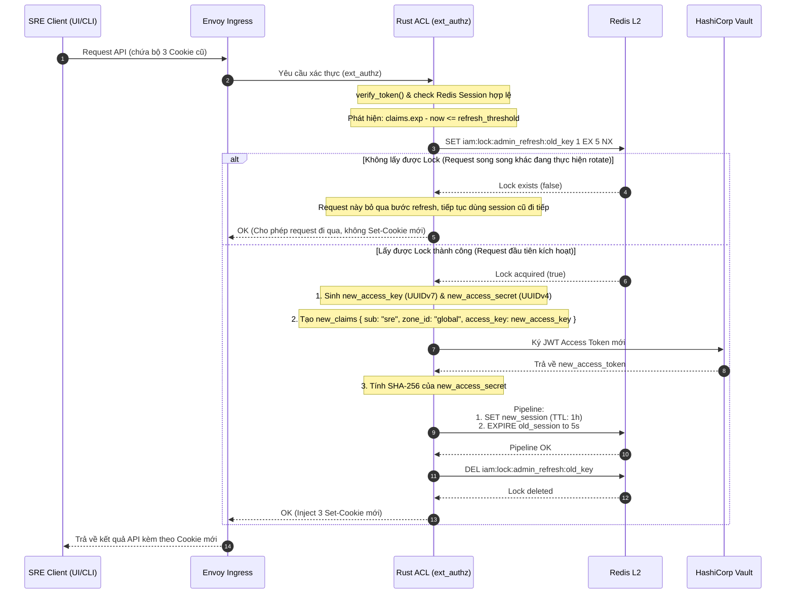

# Workflow God View: SRE Admin Sliding Session (Stateless Refresh at Edge)

## 📌 1. Tổng Quan Kiến Trúc (Architecture & Cloud-Native HA)

Nhằm đảm bảo trải nghiệm liền mạch cho SRE Admin khi vận hành hệ thống khẩn cấp/liên tục mà không bị ngắt kết nối đột ngột (do hết hạn Token), hệ thống áp dụng cơ chế **Sliding Session (Xoay vòng thông tin xác thực tự động)**.

Cơ chế này được thực thi hoàn toàn tại tầng biên (Rust ACL - ext_authz), tự động làm mới bộ ba Cookie (Trinity Cookies) của SRE khi Token sắp hết hạn mà không gây gián đoạn các request đang xử lý (Zero-Downtime Refresh).

### 🛡️ Điểm Khác Biệt Giữa User & SRE Sliding Session

1. **Không có Opaque Token**:
   - Đối với User thường, quá trình Rotation đi kèm quản lý vòng đời thiết bị (device tracking) và chỉ mục truy cập (`iam:user_access_index`).
   - Đối với SRE Admin, phiên làm việc là phiên khẩn cấp ảo toàn cục (`global`), không gắn với thiết bị cụ thể nào. Do đó, **không cần quản lý index** hay opaque tokens. Chỉ quản lý trực tiếp khóa phiên đơn lẻ trên Redis L2.
2. **Không cần Recovery Cache phức tạp**:
   - Vì phiên SRE đơn giản, không phụ thuộc vào nhiều metadata phức tạp hay thiết bị khác nhau, nên việc rotation diễn ra trực tiếp và nhanh gọn.

---

## ⚙️ 2. Trạng Thái Session Trong Redis L2

| Redis Key | Kiểu dữ liệu | Định dạng Value (Protobuf) | TTL (Thời gian sống) |
| :--- | :--- | :--- | :--- |
| `iam:admin_access_session:<access_key>` | Protobuf Binary | `AdminAccessSession { access_secret_hash }` | `session_ttl_secs` (Ví dụ: 1 giờ) |
| `iam:lock:admin_refresh:<old_access_key>` | String | `"1"` (Lock chống race condition) | 5 giây (Tự giải phóng) |

---

## 🔄 3. Chi Tiết Luồng Xoay Vòng Session (Rotation Flow)

Khi một request chứa SRE Trinity Cookies được gửi đến, Rust ACL sẽ thực hiện các bước sau để xác định và xử lý xoay vòng phiên:

```mermaid
flowchart TD
    classDef step fill:#223344,stroke:#8844ff,stroke-width:2px;
    classDef check fill:#224433,stroke:#33cc88,stroke-width:2px;
    classDef action fill:#442222,stroke:#ff5555,stroke-width:2px;

    Start["Incoming Request (Verify JWT & Redis L2 OK)"]:::step
    CheckTTL{"remaining_ttl <= refresh_threshold?"}:::check
    Proceed["Bỏ qua Rotation. Đi tiếp với Token hiện tại."]:::step
    
    AcquireLock{"SETNX lock:admin_refresh:old_key EX 5"}:::check
    LockFail["Bypass Rotation. Request đi tiếp với Token hiện tại."]:::step
    
    GenCreds["1. Sinh new_access_key (UUIDv7) & new_access_secret (UUIDv4)<br>2. Ký JWT Access Token mới qua Vault"]:::step
    Pipeline["Thực thi Redis Pipeline nguyên tử:<br>1. SET new_session (TTL = 1h)<br>2. EXPIRE old_session = 5s (Grace Period)"]:::action
    ReleaseLock["DEL lock:admin_refresh:old_key"]:::action
    SetCookies["Inject 3 Cookie mới vào HTTP Response:<br>access_token, access_key, access_secret"]:::step

    Start --> CheckTTL
    CheckTTL -- "Không" --> Proceed
    CheckTTL -- "Có" --> AcquireLock
    AcquireLock -- "Thất bại (Lock exists)" --> LockFail
    AcquireLock -- "Thành công" --> GenCreds
    GenCreds --> Pipeline
    Pipeline --> ReleaseLock
    ReleaseLock --> SetCookies
```

---

## 🔍 4. Trình Tự Thực Hiện Chi Tiết & Phòng Chống Race Condition (Sequence Diagram)

Nhằm chống lại tình trạng **Race Condition** khi nhiều request của SRE Admin đồng thời kích hoạt xoay vòng token tại một thời điểm, hệ thống sử dụng cơ chế **Distributed Lock kết hợp Grace Period**:

---

## 🛡️ 5. Ràng Buộc Grace Period & An Toàn Session

1. **Grace Period (Thời gian ân hạn 5 giây)**:
   - Thay vì xóa lập tức phiên cũ (`DEL`), hệ thống chỉ giảm thời gian sống của phiên cũ xuống còn 5 giây.
   - Điều này đảm bảo những request song song khác đã gửi đi trước đó (đang bay lơ lửng trên mạng) vẫn được xác thực hợp lệ bằng thông tin cũ, tránh lỗi `401 Unauthorized` bất ngờ cho Admin.
2. **Atomic Pipeline**:
   - Quá trình đăng ký phiên mới và gán TTL 5 giây cho phiên cũ phải được thực hiện thông qua **Redis Pipeline nguyên tử (`MULTI/EXEC`)** để đảm bảo tính toàn vẹn dữ liệu, tránh trạng thái lơ lửng nếu mạng bị gián đoạn giữa chừng.
3. **Dung lượng RAM tối ưu**:
   - Phiên cũ sẽ bị xóa hoàn toàn khỏi Redis chỉ sau 5 giây, bảo toàn tối đa dung lượng bộ nhớ cho Redis L2.
