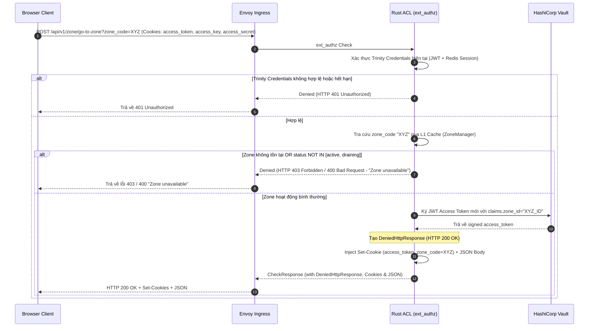
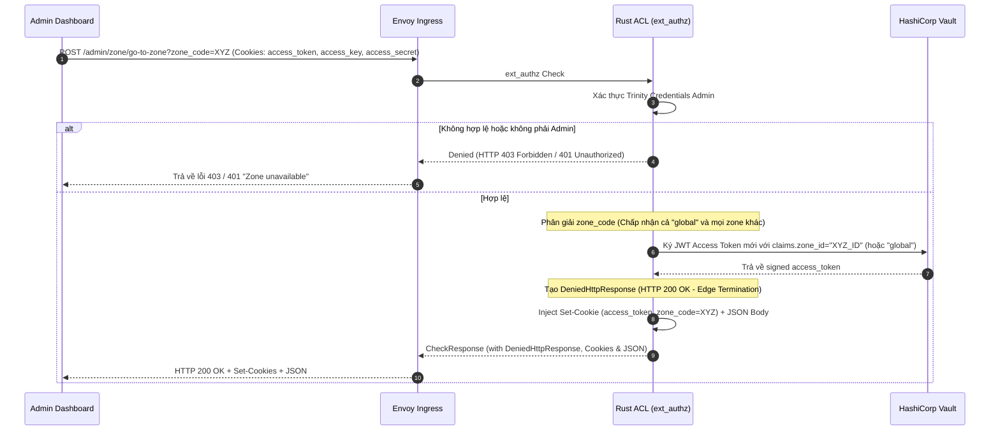

# Workflow God View: Phân Giải & Xác Thực Ngữ Cảnh Vùng Dữ Liệu (Zone Context & Switch Workflow)

## 📌 1. Tổng Quan Kiến Trúc (Architecture & Cloud-Native HA)

Hệ thống được thiết kế để hoạt động ổn định và đạt tính sẵn sàng cao (High Availability) trên môi trường Cloud-Native. Nhằm tối ưu hóa độ trễ tối đa (Low Latency) tại cổng biên (Ingress Gateway), toàn bộ quá trình phân giải và kiểm tra Zone được xử lý bất đồng bộ/stateless tại tầng Rust ACL (`ext_authz`) thông qua bộ nhớớ đệm cục bộ L1 Cache (đồng bộ không chặn từ Control Plane).

### 🛡️ Ràng Buộc Bảo Mật & Phòng Chống Race Condition

1. **Loại bỏ tự động ký lại JWT ngầm (No Implicit Resigning)**:
   - Các request nghiệp vụ thông thường gửi kèm mã zone không khớp với zone hiện tại trong JWT Claims sẽ bị từ chối trực tiếp với lỗi `403 Forbidden` ("Zone unavailable").
   - Hệ thống **tuyệt đối không tự động ký lại JWT** trên các đường dẫn API thông thường để ngăn chặn lỗi race condition (tranh chấp token) khi client gửi nhiều request song song cùng lúc.
2. **Quy trình chuyển đổi ngữ cảnh tường minh (Explicit Context Switch)**:
   - Client bắt buộc phải gọi API `/api/v1/zone/go-to-zone?zone_code=...` để yêu cầu đổi zone.
   - Quá trình này được xử lý hoàn toàn tại tầng biên (Edge Termination) mà không cần chuyển tiếp request về các microservices phía sau hoặc gửi gRPC kiểm tra sang Go Controlplane, tiết kiệm tài nguyên mạng và tăng tốc độ xử lý.
3. **Mô hình Cookies & Token**:
   - `access_token` (JWT): Lưu trữ claim `zone_id` đã được ký số bằng HashiCorp Vault. Cookie này được bảo vệ bằng các cờ `HttpOnly`, `Secure`, `SameSite=Lax`.
   - `zone_code`: Được lưu dưới dạng cookie thông thường (không có `HttpOnly`) giúp Client UI có thể đọc trực tiếp để hiển thị trạng thái vùng dữ liệu hiện tại của người dùng.

---

### 📊 Ma Trận Phân Quyền Vùng Dữ Liệu (Access Control Matrices)

#### A. Ma Trận Phân Quyền Zone Context (Khi Truy Cập API Nghiệp Vụ)

| Vai trò | Trạng thái đăng nhập | Ma trận quyền hạn zone chấp nhận |
| :--- | :--- | :--- |
| **Admin (SRE)** | **Đã đăng nhập** (Có claims) | Chấp nhận toàn bộ zone bao gồm cả zone ảo `"global"` (Không kiểm tra trạng thái hoạt động của zone) |
| | **Chưa đăng nhập** (Anonymous) | Chấp nhận các zone ở trạng thái `active`, `draining` và zone ảo `"global"` |
| **User thường** | **Đã đăng nhập** (Có claims) | Chỉ chấp nhận các zone ở trạng thái `active` và `draining`. Tuyệt đối cấm zone `"global"` |
| | **Chưa đăng nhập** (Anonymous) | Chỉ chấp nhận các zone ở trạng thái `active` và `draining` (Không kèm global) |

#### B. Ma Trận Phân Quyền hiển thị Zone Catalog (API Danh Mục Zone)

| Trạng thái | Admin | User |
| :--- | :--- | :--- |
| **Đã đăng nhập** | Toàn bộ zone kèm `"global"` | Chỉ các zone `active` và `draining`, không kèm `"global"` |
| **Chưa đăng nhập** | Các zone `active`, `draining` kèm `"global"` | Chỉ các zone `active`, `draining` (Không `"global"`) |

---

## 🔄 2. Sơ Đồ Kiến Trúc & Luồng Dữ Liệu (System Architecture)

```mermaid
graph TD
    classDef client fill:#332244,stroke:#8844ff,stroke-width:2px;
    classDef gateway fill:#112233,stroke:#3388ff,stroke-width:2px;
    classDef edgeService fill:#113322,stroke:#33cc88,stroke-width:2px;
    classDef storage fill:#333311,stroke:#cccc33,stroke-width:2px;
    classDef control fill:#331111,stroke:#ff5555,stroke-width:2px;

    Client["💻 Client (Browser/UI)"]:::client
    Envoy["🛡️ Envoy Ingress Gateway"]:::gateway
    ACL["🦀 Rust ACL (ext_authz)"]:::edgeService
    Vault["🔑 HashiCorp Vault"]:::control
    Redis[("⚡ Redis L2 (Session Store)")]:::storage

    Client -- "1. Yêu cầu chuyển zone (POST /api/v1/zone/go-to-zone)" --> Envoy
    Envoy -- "2. ext_authz intercept" --> ACL
    ACL -- "3. Xác thực JWT & Redis L2" --> Redis
    ACL -- "4. Phân giải zone_code -> zone_id (L1 Cache)" --> ACL
    ACL -- "5. Ký JWT mới với claims.zone_id cập nhật" --> Vault
    ACL -- "6. Response 200 OK + Set-Cookie (access_token, zone_code)" --> Envoy
    Envoy -- "7. Trả cookie mới & JSON cho Client" --> Client
```



---

## 🔍 3. Chi Tiết Các Nhánh Xử Lý (Processing Branches)

### 📌 Nhánh 1: Xác Thực & Ràng Buộc Zone Trên Request Thông Thường (Route Interception)

Mỗi request nghiệp vụ đi qua Envoy Ingress sẽ được chuyển đến Rust ACL qua Ext-Authz. Rust ACL thực hiện kiểm tra đối chiếu zone tĩnh bằng cách phân nhánh xử lý tường minh:

#### 1. Sơ đồ trình tự (Sequence Diagram - Branch 1)

```mermaid
sequenceDiagram
    autonumber
    participant UI as Browser Client
    participant Envoy as Envoy Ingress
    participant ACL as Rust ACL (ext_authz)
    participant CP as Go Control Plane (gRPC)

    UI->>Envoy: Request API nghiệp vụ kèm cookie/header zone_code
    Envoy->>ACL: ext_authz Check (access_token, zone_code)
    ACL->>ACL: Xác thực Trinity Credentials
    
    rect rgb(20, 30, 40)
        Note over ACL: Quá trình Phân giải zone_code (ZoneManager.resolve_code_to_id)
        ACL->>ACL: 1. Đọc L1 Cache (RAM HashMap)
        alt L1 Cache Hit
            Note over ACL: Trả về target_zone_id trực tiếp (Fast Path)
        else L1 Cache Miss
            ACL->>ACL: 2. Kiểm tra Negative Cache (bad_codes)
            alt Negative Cache Hit (Còn trong hạn 5 phút)
                Note over ACL: Trả về None trực tiếp (Fast Fail chống Spam)
            else Negative Cache Miss
                ACL->>ACL: 3. Chờ Single Flight lock (tokio::Mutex) tránh bão Request
                ACL->>CP: 4. Gọi gRPC get_zone_list() đồng bộ (Tần suất tối đa 5 phút/lần)
                CP-->>ACL: Trả về danh sách zone mới hoạt động
                alt Zone tìm thấy trong danh sách mới
                    ACL->>ACL: Lưu L1 Cache & cập nhật last_sync
                else Không tìm thấy
                    ACL->>ACL: Ghi vào Negative Cache (bad_codes) hạn 5 phút
                end
            end
        end
    end
    
    alt Phân giải zone_code thất bại (None)
        ACL-->>Envoy: Denied (HTTP 403 Forbidden - "Zone unavailable")
        Envoy-->>UI: Trả về lỗi 403 Forbidden ("Zone unavailable")
    else Phân giải thành công (target_zone_id, zone_status)
        alt Định tuyến xử lý theo Vai trò
            Note over ACL: Gọi resolve_and_verify_zone_admin HOẶC resolve_and_verify_zone_user
            
            alt Vai trò: ADMIN (SRE)
                alt Đã đăng nhập
                    Note over ACL: Cho phép truy cập bất kỳ zone nào (kể cả global/inactive)
                    alt target_zone_id != claims.zone_id
                        ACL-->>Envoy: Denied (HTTP 403 - "Zone unavailable" chống tự động đổi zone ngầm)
                    else Khớp
                        ACL-->>Envoy: Ok (Inject x-zone-id header)
                    end
                else Chưa đăng nhập (Anonymous)
                    alt zone_code == "global" OR status là active/draining
                        ACL-->>Envoy: Ok (Chuyển tiếp đến trang đăng nhập Admin)
                    else Vi phạm
                        ACL-->>Envoy: Denied (HTTP 403 - "Zone unavailable")
                    end
                end
                
            alt Vai trò: USER THƯỜNG
                alt Đã đăng nhập
                    alt zone_code == "global" OR status NOT IN [active, draining] OR target_zone_id != claims.zone_id
                        ACL-->>Envoy: Denied (HTTP 403 - "Zone unavailable")
                    else Hợp lệ
                        ACL-->>Envoy: Ok (Inject x-zone-id header)
                    end
                else Chưa đăng nhập (Anonymous)
                    alt zone_code == "global" OR status NOT IN [active, draining]
                        ACL-->>Envoy: Denied (HTTP 403 - "Zone unavailable")
                    else Hợp lệ
                        ACL-->>Envoy: Ok (Cho phép truy cập trang public)
                    end
                end
            end
        end
    end
```

#### 2. Mô tả nghiệp vụ chi tiết

- **Cơ chế L1 Cache & gRPC Sync**:
  - **L1 Cache Hit**: Đọc trực tiếp từ HashMap bộ nhớ�---

### 📌 Nhánh 2: API Chuyển Đổi Zone Tường Minh

Client gọi các API này khi người dùng chủ động chọn chuyển đổi ngữ cảnh Zone hoạt động trên thanh Navigation Bar của giao diện UI.

#### 1. API cho User thường (`POST /api/v1/zone/go-to-zone`)

* **Sơ đồ trình tự**:



#### 2. API cho SRE Admin (`POST /admin/zone/go-to-zone`)

* **Sơ đồ trình tự**:



#### 3. Mô tả nghiệp vụ chi tiết

- **Xác thực phiên làm việc**: Rust ACL kiểm tra tính toàn vẹn của request thông qua bộ xác thực Trinity:
  - Đối với User thường: So khớp session tại `iam:user_access_session:<sub>:<access_key>`.
  - Đối với SRE Admin: So khớp session tại key tĩnh `iam:admin_access_session:<access_key>` (không chứa tiền tố/hậu tố zone_id).
- **Phân giải Zone cục bộ**: Tra cứu và ánh xạ `zone_code` sang `zone_id` thông qua L1 cache (không gọi gRPC sang Go CP).
  - Nếu là **Admin (SRE)**: Chấp nhận mọi zone đích bao gồm cả `"global"`. Do session key trên Redis L2 không chứa `zone_id`, việc đổi zone này hoàn toàn không ghi đè hay thay đổi bất cứ thông tin nào trên Redis, loại bỏ triệt để race condition đối với các request song song.
  - Nếu là **User thường**: Từ chối chuyển đổi sang `"global"` hoặc các zone có trạng thái khác `active`/`draining`. Trả về generic `403 Forbidden` / `400 Bad Request` với nội dung `"Zone unavailable"` để bảo mật.
- **Phát hành Token mới**: Ký lại token JWT thông qua Vault Transit Engine, cập nhật `claims.zone_id` sang ID của zone mới. Trả về cho client dưới dạng cookie để thay đổi ngữ cảnh an toàn.
- **Edge Termination**: Kết thúc luồng xử lý và phản hồi trực tiếp `200 OK` kèm JSON body `)]}',
{"zone_code": "xyz"}` tại Envoy Gateway (Ext-Authz Denied Response), không chuyển tiếp request đến bất kỳ backend microservice nào.

---

## 🏛️ 4. Bản Đồ Tham Chiếu File Mã Nguồn (Implementation References)

- **Định nghĩa Ext-Authz gRPC Server**: [ext_authz.rs](../../acl/src/service/ext_authz.rs#L54-L404) - Lắng nghe request, định tuyến các API đặc biệt và ủy quyền xử lý phân giải zone.
- **Dịch vụ Phân giải & Xác thực Zone của Admin**: [zone_resolution.rs](../../acl/src/service/zone/zone_resolution.rs#L68-L138) - Hàm `resolve_and_verify_zone_admin` đối chiếu và thực thi ma trận bảo mật vùng dữ liệu cho SRE.
- **Dịch vụ Phân giải & Xác thực Zone của User**: [zone_resolution.rs](../../acl/src/service/zone/zone_resolution.rs#L140-L223) - Hàm `resolve_and_verify_zone_user` thực thi ma trận bảo mật vùng dữ liệu cho khách hàng thường.
- **Bộ quản lý Zone Cache cục bộ (L1 Cache)**: [zone.rs](../../acl/src/core/zone.rs) - Lưu trữ danh sách map giữa `zone_code` và `zone_id`/`status`.
- **API Chuyển đổi Zone của User**: [zone_switch.rs](../../acl/src/service/zone/zone_switch.rs#L76-L303) - Triển khai hàm xử lý `handle_zone_switch` phục vụ API `/api/v1/zone/go-to-zone`.
- **API Chuyển đổi Zone của Admin**: [zone_switch.rs](../../acl/src/service/zone/zone_switch.rs#L305-L500) - Triển khai hàm xử lý `handle_admin_zone_switch` phục vụ API `/admin/zone/go-to-zone`.
