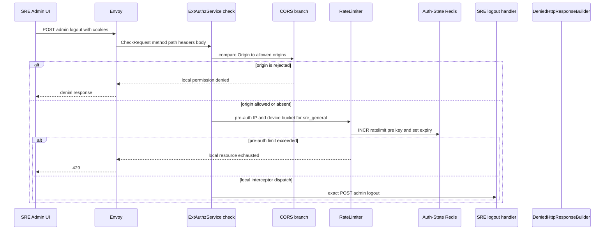
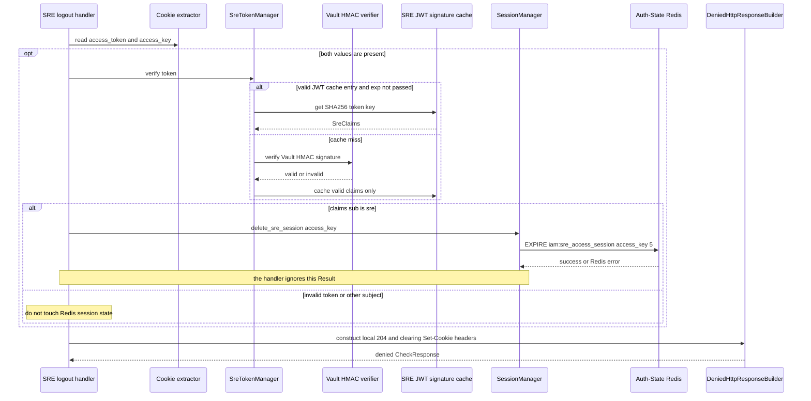
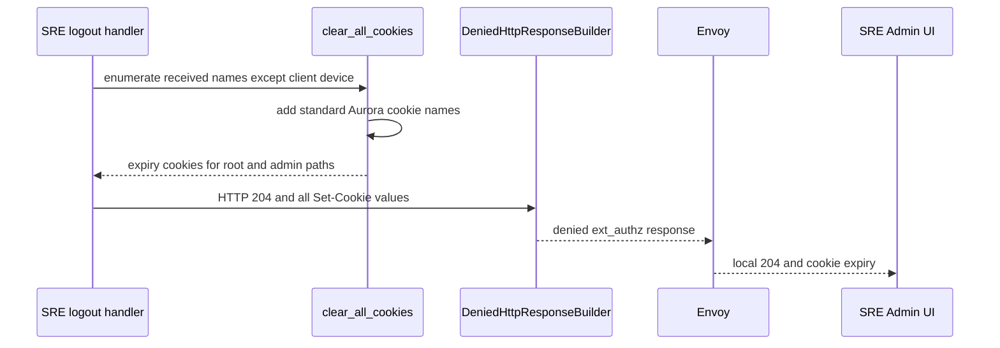

# SRE Admin Logout — ACR-local Workflow God View

This workflow ends the browser's SRE session at the edge. It is not a
Controlplane API, does not use an upstream HTTP handler, and does not revoke a
user or Billing Alias session. The only durable mutation is a best-effort
shortening of the matching SRE runtime-session TTL in Auth-State Redis.

## API-scope contract

`POST /admin/auth/logout` is an SRE-console local route. Envoy always invokes
ACR's ext_authz service first. ACR returns a local HTTP response through the
ext_authz denied-response mechanism, therefore Envoy must not forward this
request after ACR has handled it.

| Boundary | Contract |
| --- | --- |
| Browser route | `POST /admin/auth/logout` exactly, without a query string |
| Authority | SRE browser surface under `/admin`; this is neither `/me`, `/personal`, nor `/tenant` |
| Client headers used | `Origin`, `X-Forwarded-For`, Cookie, optional `client_device_id` cookie |
| Request body | ignored; no JSON command exists |
| Success | local `204 No Content` plus cookie-expiry instructions |
| Upstream forward | never |
| Durable owner | Auth-State Redis owns the runtime SRE session; the browser owns its cookies |
| Idempotency | repeated logout is intentionally successful and re-clears cookies |

No browser identity header, chosen Zone, tenant ID, workspace ID, proof marker,
or target session ID participates in the decision. The target can only be the
`access_key` carried with the supplied SRE Trinity.

## Security and state boundary

An SRE Trinity consists of an `access_token` JWT, `access_key`, and
`access_secret`. The relevant runtime state is separate from user runtime
sessions and has no user/device index.

| Item | Owner | Value / operation | Security meaning |
| --- | --- | --- | --- |
| `access_token` | browser | Vault-HMAC-signed SRE JWT | identifies `sub=sre` and the claimed access key |
| `access_key` | browser | UUID lookup capability | selects a candidate SRE Redis key |
| `access_secret` | browser | random secret | not inspected by the current logout handler |
| `iam:sre_access_session:{access_key}` | Auth-State Redis | protobuf `SreAccessSession`, `EXPIRE 5` | runtime revocation and five-second in-flight grace |
| `client_device_id` | browser | stable device cookie | pre-auth rate-limit dimension only; logout deliberately preserves it |
| `zone_code` | browser | SRE display/context cookie | cleared, but no Zone resolution occurs |

The SRE session value contains an SHA-256 access-secret hash and an optional
Ed25519 public key. Neither is read before the current handler calls
`delete_sre_session`; the handler only requires a JWT that verifies as
`sub=sre` and an `access_key` cookie.

## Phase 1 — Client → Envoy → ExtAuthz dispatcher

ACR's `ExtAuthzService::check` obtains method and path from Envoy's HTTP
attribute context, falling back to pseudo-headers only if necessary. It runs
global CORS and pre-auth rate limiting before every local interceptor. The SRE
logout handler is reached before normal SRE session verification, post-auth
rate limiting, CSRF validation, Zone resolution, trusted-header construction,
and any Controlplane route rewrite.

| CheckRequest field | Dispatcher use | Not used by this workflow |
| --- | --- | --- |
| HTTP method/path | exact interceptor match | no route rewrite or query parsing |
| `Origin` | allowed-origin comparison when the header is present | no response CORS header is built here |
| `X-Forwarded-For` | pre-auth IP limiter input | not persisted as session state |
| `Cookie` | extracts `client_device_id`, then handler extracts Trinity | no arbitrary cookie is trusted as identity |
| request body | carried by Envoy but ignored | no JSON/body digest validation |
| host/authority | parsed by dispatcher | not an SRE logout authority switch |

The rate-limiter's Redis failure policy is fail-open: connection or command
failure logs an error and permits this request to continue. Its L1 Moka block
cache records only a previously exceeded limiter key for 30 seconds. It is not
session state and cannot authenticate an SRE caller.

## Phase 2 — local SRE logout and best-effort revocation

`handle_sre_logout` reads the Cookie header. It does not call
`verify_sre_edge_session`; it performs only enough work to identify a likely
SRE session to expire. If either access token or access key is absent, or the
JWT is invalid/not SRE, the durable operation is skipped and the local cookie
clear still succeeds.

`delete_sre_session` does not delete the key immediately. It gives any request
that already loaded session state up to five seconds to finish, while new
requests normally fail after expiry. A missing Redis key is harmless because
`EXPIRE` is ignored by the caller just as a Redis transport error is.

## Phase 3 — cookie destruction and Envoy settlement

The local response uses a non-OK gRPC status with a `DeniedHttpResponse` so
Envoy renders the HTTP response locally. This is the convention used by ACR
local handlers; it does not mean the browser receives a gRPC authentication
error.

| Response element | Exact behavior |
| --- | --- |
| HTTP status | `204 No Content` |
| Body | none |
| `Set-Cookie` selection | every cookie name present in the received Cookie header except `client_device_id`, plus all standard Aurora cookie names |
| Cookie paths | both `/` and `/admin` |
| Expiry | `Max-Age=0`, `Secure`, `SameSite=Lax`; credential cookie names also use `HttpOnly` |
| Domain | omitted when `app_public_domain` is blank; otherwise configured domain is appended |
| Envoy action | terminates locally; no trusted identity headers and no upstream request |

The generic cookie clearer includes `access_token`, `access_key`,
`access_secret`, `refresh_token`, `zone_code`, `tenant_id`, `tenant_domain`,
and `workspace_id` even when a browser omitted them. It also mirrors any
additional incoming cookie name except `client_device_id`. This is an AS-IS
behavior, not an allowlist.

## Result and failure matrix

| Condition | Redis mutation | Browser result | Retry / recovery |
| --- | --- | --- | --- |
| valid SRE JWT and key, Redis available | session TTL becomes five seconds | `204`, cookies cleared | repeated logout remains safe |
| missing token/key | none | `204`, cookies cleared | no server state to repair |
| invalid/expired/non-SRE JWT | none | `204`, cookies cleared | client must log in again if still needed |
| Redis `EXPIRE` error | attempted but error ignored | `204`, cookies cleared | Redis TTL, later admin action, or natural session expiry settles state |
| rejected CORS | none | edge permission denial | retry only from allowed origin |
| pre-auth rate limit | none | `429` | wait for limiter window or L1 block TTL |

## AS-IS security-contract discrepancies

These are observations of code, not a proposed silent behavior change.

| Expected stronger boundary | Current code path | Consequence |
| --- | --- | --- |
| logout mutation should require CSRF protection | SRE logout is dispatched before the normal CSRF check | a cross-site POST can clear an SRE browser session, subject to CORS and pre-auth limiting |
| revocation should bind JWT claim to cookie key and secret | handler verifies only JWT subject then expires the cookie `access_key`; it does not compare claim key or access-secret hash | an authenticated SRE JWT paired with a different key can shorten that key's SRE TTL if guessed or obtained |
| durable revoke error should be visible if logout promises server revocation | `delete_sre_session` error is deliberately ignored | browser logout can succeed while a stolen server session remains until natural expiry |

No direct caller-controlled `x-user-*`, `x-zone-*`, proof, tenant, or workspace
header reaches an upstream service because no upstream exists.

## Observability and code map

| Component | Responsibility | Code |
| --- | --- | --- |
| Envoy auth filter | creates CheckRequest and renders local response | deployment Envoy ext_authz configuration |
| dispatcher | CORS, pre-auth rate limit, interceptor order | `acr/src/gateway/ext_authz.rs` |
| limiter | Redis counters plus L1 temporary block cache | `acr/src/gateway/ratelimit.rs` |
| local handler | token/key lookup, best-effort TTL reduction, cookie clear | `acr/src/sre/logout.rs` |
| SRE JWT verifier | L1 valid-claims cache and Vault HMAC verification | `acr/src/sre/claims.rs` |
| SRE session store | `EXPIRE 5` implementation | `acr/src/sre/session.rs` |
| cookie clearer | default and received cookie expiry generation | `acr/src/pkg/cookie.rs` |

Logs use `sre.logout` for interception and the common authz/limiter logger for
dispatcher decisions. Raw cookies, JWTs, secrets and request bodies must not be
added to those logs.
