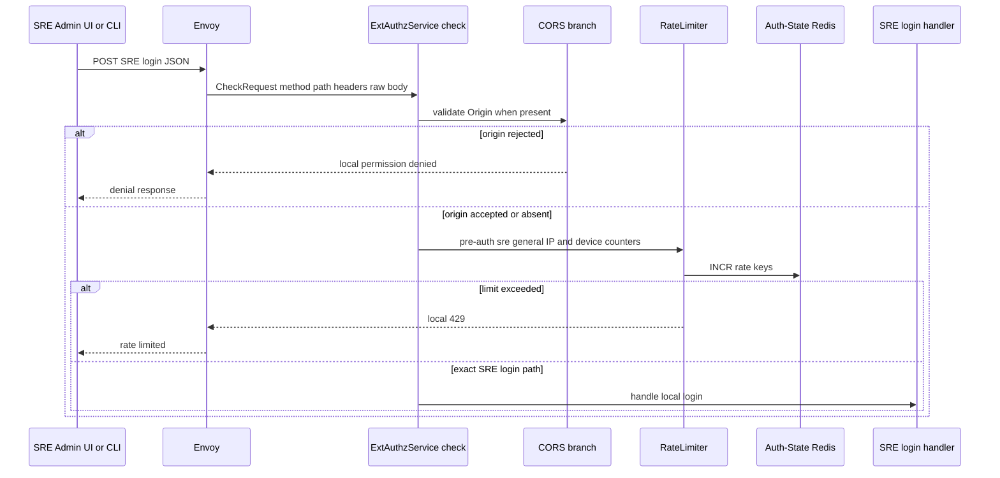
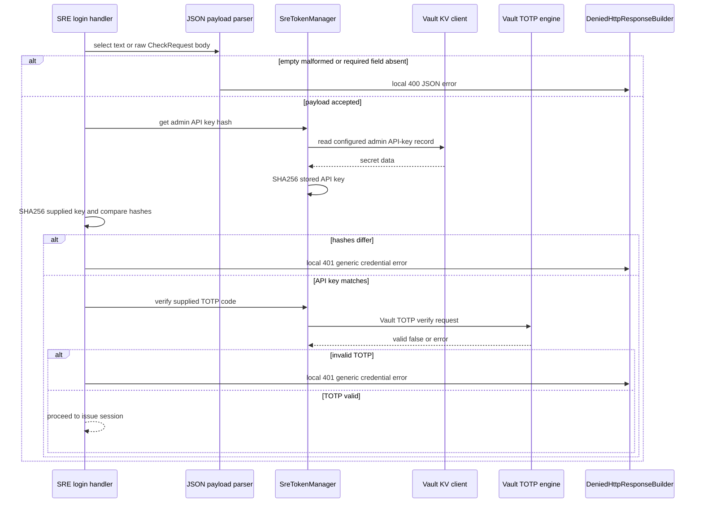
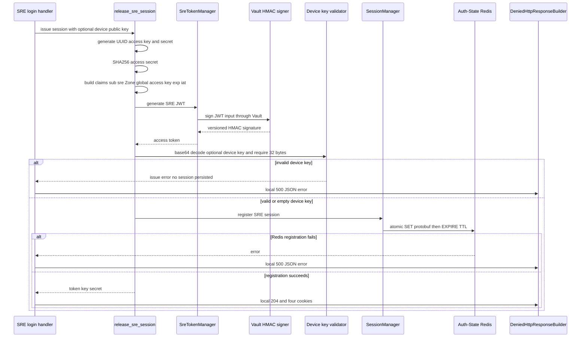
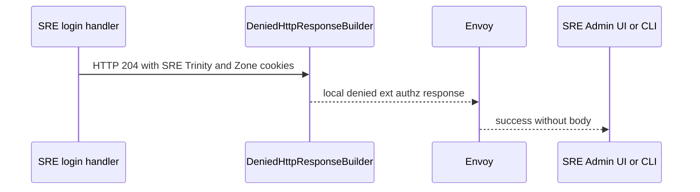

# SRE Admin Login — ACR-local Workflow God View

This workflow issues the privileged SRE Trinity entirely at ACR. It is an edge
credential issuance route, not an IAM user login and not a Controlplane HTTP
call. Vault is the source of the SRE API-key material, TOTP verification and
JWT HMAC signing; Auth-State Redis is the durable runtime-session boundary.

## API-scope contract

| Boundary | Contract |
| --- | --- |
| Method/path | exact `POST /admin/auth/login` |
| Principal before success | anonymous SRE login attempt |
| JSON body | `api_key`, `totp_code`, optional base64 standard Ed25519 `device_public_key` |
| Headers used | Origin, `X-Forwarded-For`, optional `client_device_id` cookie for edge gates; body is taken from Envoy HTTP attributes |
| Success | local `204 No Content`, four SRE cookies on Path `/admin` |
| Failure payload | `{"error_message":"..."}` local JSON |
| Upstream HTTP | never |
| Durable success owner | Auth-State Redis SRE session keyed by generated access key |

This route does not accept a user/tenant/Zone/workspace selection. A successful
SRE JWT always starts with `sub=sre`, access key generated by ACR, and
`zone_id=global`. A physical Zone is selected later by the separate SRE Zone
switch workflow.

## Request and response contract

### REST input

| Field | Required | Handler rule | Security purpose |
| --- | --- | --- | --- |
| `api_key` | yes | JSON string, nonempty after trim | candidate for SHA-256 comparison to Vault-sourced secret hash |
| `totp_code` | yes | JSON string, nonempty after trim | passed to Vault TOTP engine; secret never enters ACR |
| `device_public_key` | no | base64 standard decode must be exactly 32 bytes when nonempty | becomes critical-request Ed25519 verification key |
| body source | yes | Envoy text body, otherwise raw body bytes | no separate HTTP server body parser |
| `Content-Type` | no code check | client convention should be JSON | handler accepts JSON bytes regardless of header |

### REST output

| Outcome | HTTP status | Body | Cookies |
| --- | --- | --- | --- |
| issued | `204` | none | `access_token`, `access_key`, `access_secret`, `zone_code=global` |
| empty/malformed body or missing API key/TOTP | `400` | JSON error message | none |
| API key/TOTP mismatch | `401` | JSON `Invalid API key or OTP code` | none |
| Vault API-key/TOTP failure | `500` | JSON engine/configuration error | none |
| Vault signing, device-key validation, Redis registration failure | `500` | JSON error | none |
| CORS/pre-auth rate denial | dispatcher denial/`429` | edge-specific body | none |

The success cookies are `HttpOnly; Secure; SameSite=Lax; Path=/admin` except
`zone_code`, which is readable by browser code. Credential max age is
`session_ttl_secs`; Zone cookie max age is one year. Domain is omitted when
`app_public_domain` is empty and otherwise appended from config.

## Session, Vault and key contract

| Item | Owner | Operation | Invariant |
| --- | --- | --- | --- |
| Vault admin API-key record | Vault KV at configured `admin_api_key_path` | read, extract `data.data.api_key`, SHA-256 | raw API key is not stored by ACR after request processing |
| Vault TOTP | configured Vault TOTP key | verify supplied code | ACR never receives TOTP seed |
| Vault Transit HMAC | configured transit key | sign JWT input | signing key never leaves Vault |
| `iam:sre_access_session:{access_key}` | Auth-State Redis | atomic `SET` protobuf then `EXPIRE session_ttl_secs` | holds SHA-256 secret and optional device public key |
| SRE JWT cache | per-pod Moka | populated later only after valid token verification | login does not write this cache |
| `zone_code` | browser cookie | set to `global` | virtual context only, not a physical Zone record |

`SreAccessSession` contains `access_secret_hash` and `device_public_key`. It
has no user ID, tenant ID or generic user session index. Its key space is
different from `iam:user_session:*` and cannot be interpreted as a user session.

## Phase 1 — Client → Envoy → ExtAuthz dispatcher

Envoy sends the request body and HTTP attributes to the gRPC ext_authz check.
ACR runs allowed-origin validation and the pre-auth `sre_general` limiter before
local interceptor dispatch. The SRE login handler runs after the other local
user/Billing session interceptors have declined the route, and before normal
SRE authentication, post-auth limiting, CSRF, Zone resolution and upstream
header construction.

The generic limiter fails open if its Redis counter cannot be reached. The
credential-validation operations below do not fail open: a Vault or session
registration error produces a local server error without cookies.

## Phase 2 — parse credentials and authenticate against Vault

The handler uses Envoy's text body when nonempty and otherwise its raw body.
It rejects an empty byte slice and then deserializes JSON. It reads the current
API key record from Vault through `SreTokenManager.get_admin_api_key_hash`,
hashes the supplied API key with SHA-256, compares the hexadecimal strings, and
only then asks Vault to verify TOTP.

The current implementation reads the admin API-key secret for each handler call;
there is no API-key hash cache in `SreTokenManager`. The JWT signature Moka cache
is only used later by verification requests. TOTP codes have no explicit Redis
replay key in this workflow; Vault's TOTP decision is the only code validation.

## Phase 3 — generate, sign and persist an SRE Trinity

After both credentials pass, `release_sre_session` generates UUIDv4 access key
and secret, hashes the secret, creates claims, requests a Vault HMAC signature,
validates an optional device public key, then registers the protobuf session.

Device-key validation currently happens after Vault has signed the newly built
JWT, but before any Redis session is registered or cookie is issued. An invalid
key therefore leaves no usable session; the signing call is an unobservable
orphan from the browser's perspective.

The generated JWT contains `sub`, `zid`, `access_key`, optional `iss`, `exp`
and `iat`. It deliberately contains no user UUID, tenant ID, RBAC role or
workspace. Critical SRE requests later use the stored device public key, their
own nonce, and Vault TOTP step-up; login itself creates none of that nonce
state.

## Phase 4 — local response settlement

The handler constructs `DeniedHttpResponse` with gRPC unauthenticated status.
Envoy interprets it as an edge-local HTTP response and never forwards login
JSON to Controlplane.

| Cookie | Value source | Path | Purpose |
| --- | --- | --- | --- |
| `access_token` | Vault-signed SRE JWT | `/admin` | signed identity/context |
| `access_key` | fresh UUIDv4 | `/admin` | selects SRE Redis runtime record |
| `access_secret` | fresh UUIDv4 | `/admin` | validates against stored hash |
| `zone_code` | literal `global` | `/admin` | browser SRE context display/selection seed |

## Failure, replay and security boundaries

| Event | HTTP result | State settlement |
| --- | --- | --- |
| repeated valid login | new independent SRE session each time | older sessions are not revoked by this workflow |
| invalid API key or TOTP | `401` generic error | no session/nonce state |
| Vault unavailable | `500` | no cookies; caller retries with fresh request |
| Redis session registration unavailable | `500` | no cookies; signed token is not usable because no session exists |
| invalid device key | `500` | no session/cookies |
| pre-auth rate overflow | `429` | limiter counter/L1 block only |

### AS-IS security observations

| Current execution fact | Implication |
| --- | --- |
| local login runs before normal CSRF check | the route relies on CORS and pre-auth budget rather than CSRF middleware |
| API-key hash comparison is ordinary string equality | no explicit constant-time comparison is used in handler code |
| optional device key may be empty | later SRE critical signature verification cannot validate a usable Ed25519 key for such a session |
| device-key validation follows Vault JWT signing | failed key validation still consumed a signing operation but persists no credential |

These facts describe AS-IS code. Any hardening is a separate change requiring
an explicit security-contract decision.

## Observability and code map

| Component | Responsibility | Code |
| --- | --- | --- |
| dispatcher | CheckRequest extraction, CORS, pre-auth rate limit, route order | `acr/src/gateway/ext_authz.rs` |
| local handler | body parsing, API key/TOTP decision, cookie response | `acr/src/sre/login.rs` |
| token manager | Vault secret read, TOTP verification, JWT sign/verify cache | `acr/src/sre/claims.rs` |
| runtime session | Redis protobuf registration and later verification | `acr/src/sre/session.rs` |
| cookie definitions | cookie names and common clear semantics | `acr/src/pkg/cookie.rs` |

Logs may identify that an SRE login attempt succeeded or failed, but must never
record API keys, TOTP values, raw JWTs, access secrets, or device public keys.
