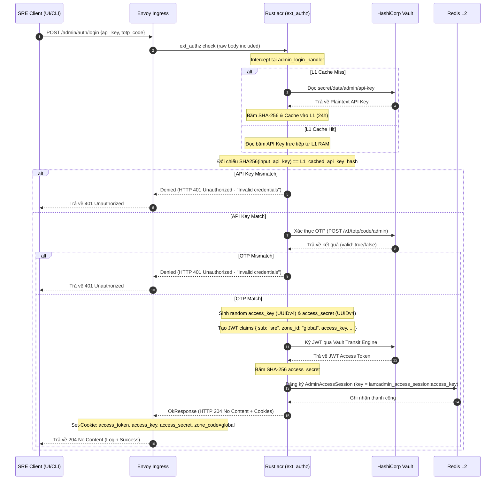
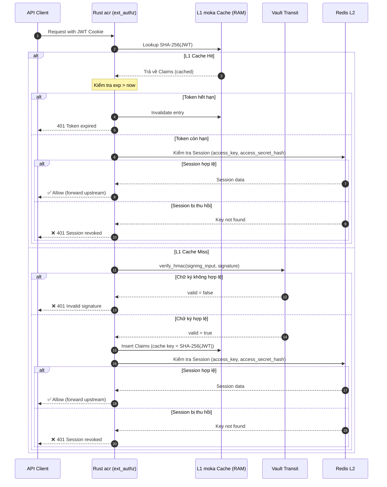

# Workflow God View: SRE Admin Login Workflow (Stateless Interception at Edge)

## 📌 1. Tổng Quan Kiến Trúc (Architecture & Cloud-Native HA)

SRE Admin là phương thức truy cập khẩn cấp/quản trị hệ thống cấp cao (Emergency Access Method) chứ không phải là một tài khoản người dùng tĩnh trong cơ sở dữ liệu Postgres. Để đảm bảo tính sẵn sàng cao (High Availability), độ trễ thấp và kiến trúc Zero-Trust trên môi trường Cloud-Native, luồng đăng nhập SRE Admin được thiết kế và thực thi hoàn toàn tại tầng biên (Edge Gatekeeper) thông qua **Rust acr (ext_authz)** mà không đi qua Go Control Plane hay Database.

### 🛡️ Ràng Buộc Bảo Mật & Phòng Chống Race Condition

1. **Ủy thác và bảo vệ Secrets qua Vault (Zero-Store Plaintext & Vault Verification)**:
   - Plaintext SRE API Key được lưu trữ tại HashiCorp Vault (`secret/data/admin/api-key`). Rust acr chỉ nạp động từ Vault, tính băm SHA-256 rồi lưu vào L1 Cache trong vòng 24 giờ. Plaintext API Key tuyệt đối không lưu trữ lâu dài.
   - SRE TOTP Secret không được tải về acr. Quá trình xác minh OTP được gửi trực tiếp lên Vault TOTP secrets engine (`POST /v1/totp/code/admin`) để thực thi. Đảm bảo khóa bí mật 2FA không bao giờ xuất hiện trong không gian RAM của acr.
2. **Không áp dụng Replay Protection cho OTP**:
   - Nhằm tránh gián đoạn các kịch bản tự động hóa hoặc các thao tác khẩn cấp liên tục của SRE trong vòng 30s, hệ thống KHÔNG thực hiện khóa OTP cũ trong Redis L2.
3. **Cơ chế Trinity Cookie & Session độc lập (Phase 3)**:
   - Khi đăng nhập thành công, Rust acr tự phát hành và ký số JWT Access Token (claims: `sub="sre"`, `zone_id="global"`, không có `role` hay `lvl` vì đây là tài khoản kỹ thuật quản trị khẩn cấp, không phải thực thể user).
   - Session của SRE Admin được đăng ký trực tiếp trên Redis L2 dạng `AdminAccessSession { access_secret_hash, device_public_key }` dưới key `iam:admin_access_session:<access_key>` để phục vụ xác thực phi trạng thái ở các request sau.
   - acr phản hồi `204 No Content` cùng các cookie `access_token`, `access_key`, `access_secret`, `zone_code=global`.
4. **Không mở rộng Port HTTP**:
   - Tránh việc mở thêm các cổng lắng nghe HTTP mới trên acr gây rủi ro an ninh mạng. Envoy Ingress bắt trực tiếp route `/admin/auth/login` (POST) và định tuyến tới Ext-Authz của acr để thực hiện Edge Termination.
5. **JWT Signature L1 Cache (Vault Transit Offload)**:
   - Sau khi đăng nhập thành công, các request tiếp theo của SRE sẽ được xác thực chữ ký JWT qua L1 moka Cache (RAM, per-Pod) thay vì gọi Vault Transit mỗi request. Chi tiết kiến trúc 2 lớp xem mục 5 bên dưới.
6. **Dynamic Device Binding & Edge Signature Verification**:
   - Khi đăng nhập SRE, client (Admin UI / CLI) tạo cặp khóa Ed25519 (private key non-extractable lưu trong IndexedDB, public key base64-encoded) gửi lên API đăng nhập qua tham số `device_public_key`.
   - Public key này được đính kèm vào `AdminAccessSession` lưu trên Redis L2.
   - Các request Critical (đường dẫn chứa `/critical/`) bắt buộc phải gửi kèm chữ ký Ed25519, timestamp, và nonce qua các header tương ứng để Rust acr verify trực tiếp tại biên, chống Replay và giả mạo request.

---

## 🔄 2. Sơ Đồ Kiến Trúc & Luồng Dữ Liệu (System Architecture) - End-to-End

```mermaid
graph TD
    classDef client fill:#332244,stroke:#8844ff,stroke-width:2px;
    classDef gateway fill:#112233,stroke:#3388ff,stroke-width:2px;
    classDef edgeService fill:#113322,stroke:#33cc88,stroke-width:2px;
    classDef control fill:#331111,stroke:#ff5555,stroke-width:2px;
    classDef cache fill:#112211,stroke:#33aa55,stroke-width:2px;

    Client["💻 SRE Client (Admin UI / CLI)"]:::client
    Envoy["🛡️ Envoy Ingress Gateway"]:::gateway
    acr["🦀 Rust acr (ext_authz)"]:::edgeService
    Vault["🔑 HashiCorp Vault"]:::control
    Redis["🗄️ Redis L2 Session Store"]:::cache

    Client -- "1. POST /admin/auth/login {api_key, totp_code}" --> Envoy
    Envoy -- "2. Intercept check request" --> acr
    acr -- "3. Lazy-load & Cache API Key Hash (24h)" --> Vault
    acr -- "4. Gửi TOTP code đi xác thực" --> Vault
    acr -- "5. Lưu AdminAccessSession" --> Redis
    acr -- "6. Response 204 No Content + Cookies" --> Envoy
    Envoy -- "7. Set-Cookie & Trả kết quả thành công" --> Client
```



---

## 🔍 3. Chi Tiết Trình Tự Thực Hiện (Sequence Diagram) - End-to-End



---

## 🏛️ 4. Bản Đồ Tham Chiếu File Mã Nguồn (Implementation References)

- **Định tuyến & Intercept tại Biên**: [ext_authz.rs](../../acr/src/service/ext_authz.rs) - Định tuyến request `/admin/auth/login` qua bộ điều hướng đăng nhập tại biên.
- **Xử lý đăng nhập SRE**: [admin_login_handler.rs](../../acr/src/service/login/admin_login_handler.rs) - Chặn bắt đường dẫn `/admin/auth/login`, phân tách payload, đối chiếu băm API Key, gửi OTP sang Vault xác thực, đăng ký session và phát hành cookies.
- **Tương tác Vault REST Client**: [vault.rs](../../acr/src/infra/vault.rs) - Cung cấp hàm `read_secret` đọc an toàn cấu hình mật và `verify_totp` để xác thực mã OTP.
- **Quản lý Token & Claims**: [token.rs](../../acr/src/core/token.rs) - Định nghĩa `Claims`, cung cấp cơ chế Cache L1 cho API Key Hash và L1 JWT Signature Cache (moka).
- **L2 Cache & Session Store**: [session.rs](../../acr/src/core/session.rs) - Lưu trữ trạng thái phiên làm việc của SRE.
- **Dependencies**: [Cargo.toml](../../acr/Cargo.toml) — `moka = { version = "0.12", features = ["future"] }`.

---

## 🔐 5. JWT Signature L1 Cache — Vault Transit Offload

Mỗi request API đi qua Envoy Ext-Authz đều yêu cầu acr xác thực chữ ký JWT. Nếu mỗi lần đều gọi Vault Transit (`verify_hmac`), Vault sẽ trở thành điểm nghẽn (bottleneck) và điểm sập duy nhất (SPOF) cho toàn bộ traffic hệ thống.

**Giải pháp**: Tách xác thực JWT thành **2 lớp độc lập**:

- **Lớp 1 — L1 Signature Cache (Stateless, moka)**: Cache kết quả xác thực chữ ký toán học của JWT trong RAM mỗi Pod. Chỉ cache token đã được Vault xác nhận hợp lệ.
- **Lớp 2 — L2 Session Store (Stateful, Redis)**: Luôn kiểm tra trạng thái phiên (session tồn tại, `access_secret_hash` khớp) trên Redis L2 sau khi qua lớp chữ ký. Đảm bảo session revocation có hiệu lực **ngay lập tức** trên tất cả Pod.

### 🛡️ Ràng Buộc Bảo Mật & An Toàn Dữ Liệu

1. **Chỉ cache Token hợp lệ (Valid-Only Cache)**:
   - Token giả, hết hạn, hoặc chữ ký sai **không bao giờ vào cache**. Kẻ tấn công không thể làm tràn RAM bằng garbage tokens.
2. **Giới hạn RAM cứng (Bounded Memory)**:
   - Max capacity = **50,000 entries** (~6.4 MB RAM). Khi đầy, moka tự động trục xuất entry ít được truy cập nhất (LRU).
3. **Tự phục hồi khi hết hạn (Self-Healing Expiry)**:
   - Khi cache hit, luôn kiểm tra lại `exp > now`. Nếu token đã hết hạn cứng → loại bỏ khỏi cache và từ chối.
4. **Multi-Pod Scale-Out an toàn**:
   - Mỗi Pod duy trì L1 cache độc lập. Tổng dung lượng nhân với số Pod nhưng vẫn cực nhỏ (50k entries × N pods).
   - Session revocation vẫn tức thì vì lớp L2 Redis luôn được kiểm tra sau L1.
5. **Không lưu trữ Key Material**:
   - L1 cache **không chứa Vault signing key** — chỉ chứa kết quả xác thực (Claims struct). Vault key không bao giờ rời khỏi Vault.

---

## 🔄 6. Sơ Đồ Kiến Trúc 2 Lớp (Two-Layer Verification)

```mermaid
graph TD
    classDef request fill:#332244,stroke:#8844ff,stroke-width:2px;
    classDef l1 fill:#113322,stroke:#33cc88,stroke-width:2px;
    classDef vault fill:#331111,stroke:#ff5555,stroke-width:2px;
    classDef l2 fill:#112211,stroke:#33aa55,stroke-width:2px;

    Request["📨 Incoming API Request (JWT Cookie)"]:::request
    L1["🧠 L1 moka Cache (RAM, per-Pod)"]:::l1
    Vault["🔑 Vault Transit (verify_hmac)"]:::vault
    L2["🗄️ Redis L2 Session Store"]:::l2
    Allow["✅ Allow Request"]:::l1
    Deny["❌ Deny Request"]:::request

    Request -- "1. SHA-256(JWT) → cache key" --> L1
    L1 -- "Cache Hit & exp valid" --> L2
    L1 -- "Cache Miss" --> Vault
    Vault -- "Signature Invalid" --> Deny
    Vault -- "Signature Valid → insert cache" --> L2
    L2 -- "Session exists & secret match" --> Allow
    L2 -- "Session not found / revoked" --> Deny
```



---

## 🔍 7. Chi Tiết Trình Tự Xác Thực Sau Đăng Nhập (Post-Login Verification Sequence)



---

## 📊 8. Phân Tích Dung Lượng RAM (Memory Budget)

| Thành phần Entry | Kích thước |
| :--- | :--- |
| Cache Key (SHA-256 hex) | 64 bytes |
| Claims struct (serialized) | ~200 bytes |
| moka overhead (bucket, pointers) | ~56 bytes |
| **Tổng 1 entry** | **~320 bytes** |

| Số Session đồng thời | RAM tiêu thụ (per Pod) |
| :--- | :--- |
| 10,000 | ~3.2 MB |
| 50,000 (max cap) | ~16 MB |

→ Với giới hạn cứng 50,000 entries, mỗi Pod tiêu thụ tối đa **~16 MB RAM** cho L1 cache — an toàn cho mọi cấu hình Kubernetes Pod.

---

## 📋 9. Đặc Tả Dữ Liệu & API Contract (Data Specs & API Contract)

### 9.1. Cấu Trúc JWT Claims cho SRE Admin

Sau khi xác thực thành công SRE API Key và TOTP, JWT được tạo ra đại diện cho quyền truy cập khẩn cấp toàn cục mà không đại diện cho bất kỳ User cụ thể nào.

| Claim | Kiểu dữ liệu | Giá trị mẫu / Định dạng | Mô tả |
| :--- | :--- | :--- | :--- |
| `sub` | String | `"sre"` | Định danh đối tượng (Subject) cố định cho SRE |
| `role` | String | `""` | Không gán Role cho thực thể ảo SRE |
| `lvl` | i32 | `0` | Default level hệ thống |
| `tenant_id` | String / Null | `null` | Không thuộc bất kỳ tenant cụ thể nào |
| `zone_id` | String | `"global"` | Zone quản trị tối cao của SRE |
| `access_key` | String (UUIDv4) | `"e1a38f38-a15d-4f10-9c4c-7033502213e8"` | Key định danh phiên, dùng làm khóa tra cứu trong Redis L2 |
| `jti` | String (UUIDv4) | `"552d76a7-0e62-4217-b087-20224e772cc4"` | ID duy nhất bảo vệ chống trùng lặp token (JWT ID) |
| `iss` | String | `"acr"` | Nguồn phát hành (Issuer) |
| `exp` | i64 (Unix timestamp) | `1782278400` | Thời điểm hết hạn của Token |
| `iat` | i64 (Unix timestamp) | `1782274800` | Thời điểm phát hành Token |

---

### 9.2. Danh Sách Cookies Thiết Lập (Trinity Credentials)

Khi đăng nhập thành công, Envoy / acr phản hồi 4 cặp Cookie độc lập nhằm phân mảnh bảo mật:

| Tên Cookie | Giá trị lưu trữ | Phân vùng Cookie Specs | Mô tả bảo mật |
| :--- | :--- | :--- | :--- |
| `access_token` | JWT Token (Ví dụ: `v1_abcd...`) | `HttpOnly; Secure; SameSite=Lax; Path=/` | Chứa JWT ký bởi Vault, dùng để verify stateless ở L1 |
| `access_key` | UUIDv4 (Ví dụ: `e1a38f38...`) | `HttpOnly; Secure; SameSite=Lax; Path=/` | Dùng để định vị địa chỉ Session Key trên Redis L2 |
| `access_secret`| UUIDv4 (Ví dụ: `9fa8b12c...`) | `HttpOnly; Secure; SameSite=Lax; Path=/` | Secret ngẫu nhiên để verify tính toàn vẹn (khớp với băm ở L2) |
| `zone_code` | `"global"` | `HttpOnly; Secure; SameSite=Lax; Path=/` | Xác định zone truy cập hiện tại của SRE |

---

### 9.3. Danh Mục Secrets Trong HashiCorp Vault

Tất cả dữ liệu nhạy cảm được ủy quyền lưu trữ và xử lý trực tiếp tại Vault:

| Path / Engine | Key / Parameter | Kiểu | Mô tả bảo mật |
| :--- | :--- | :--- | :--- |
| `/v1/secret/data/admin/api-key` | `api_key` | KV Version 2 | Lưu API Key tĩnh dạng plaintext của SRE. acr chỉ nạp, băm SHA-256 và cache trong RAM 24h. |
| `/v1/totp/code/admin` | `code` | TOTP Engine | Key name `admin`. acr gửi trực tiếp code lên để xác thực. TOTP Secret Key gốc nằm hoàn toàn trong Vault. |
| `/v1/transit/hmac/trinity` | `input`, `algorithm` | Transit Engine | Ký số JWT (`sign_hmac`) dùng thuật toán `sha2-256`. Trả về chữ ký dạng `vault:v1:base64`. |
| `/v1/transit/verify/trinity` | `input`, `hmac` | Transit Engine | Xác thực chữ ký JWT (`verify_hmac`). Trả về trạng thái `valid: true/false`. |

---

### 9.4. Đặc Tả API Contract (Endpoint: `/admin/auth/login`)

#### A. Request Spec

- **Method**: `POST`
- **Path**: `/admin/auth/login`
- **Headers**:
  - `Content-Type: application/json`

**Body**:

```json
{
  "api_key": "sre_super_secret_static_key_configured_in_vault",
  "totp_code": "685934",
  "device_public_key": "base64_encoded_ed25519_public_key_bytes"
}
```

#### B. Response Spec (Thành công - 204 No Content)

- **Status**: `204 No Content`
- **Headers**:
  - `Set-Cookie: access_token=eyJhbGciOi...v1_xyz; Path=/; HttpOnly; Secure; SameSite=Lax`
  - `Set-Cookie: access_key=e1a38f38-a15d-4f10-9c4c-7033502213e8; Path=/; HttpOnly; Secure; SameSite=Lax`
  - `Set-Cookie: access_secret=9fa8b12c-cb5b-4c28-bbbe-e283cb73aa8b; Path=/; HttpOnly; Secure; SameSite=Lax`
  - `Set-Cookie: zone_code=global; Path=/; HttpOnly; Secure; SameSite=Lax`

#### C. Response Spec (Thất bại do thông tin không hợp lệ)

- **Status**: `401 Unauthorized`
- **Headers**:
  - `Content-Type: application/json`

**Body**:

```json
{
  "error": "Invalid credentials"
}
```

#### D. Response Spec (Lỗi hệ thống / Vault không kết nối)

- **Status**: `500 Internal Server Error`
- **Headers**:
  - `Content-Type: application/json`

**Body**:

```json
{
  "error": "Internal server error"
}
```
