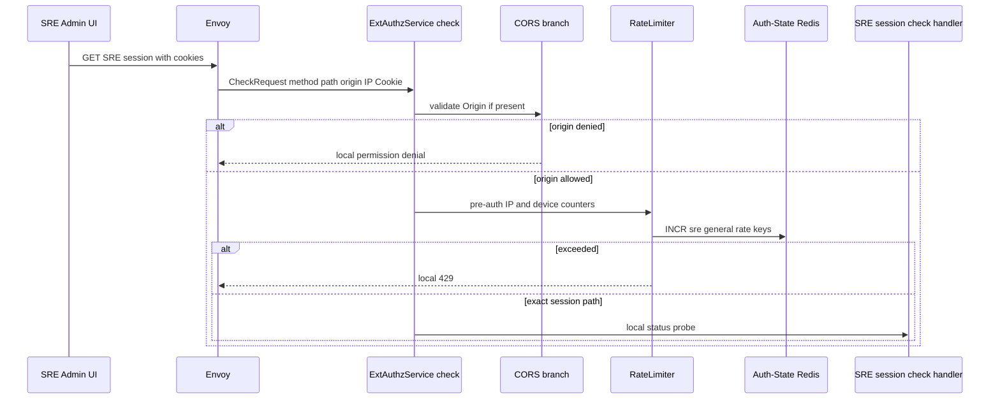
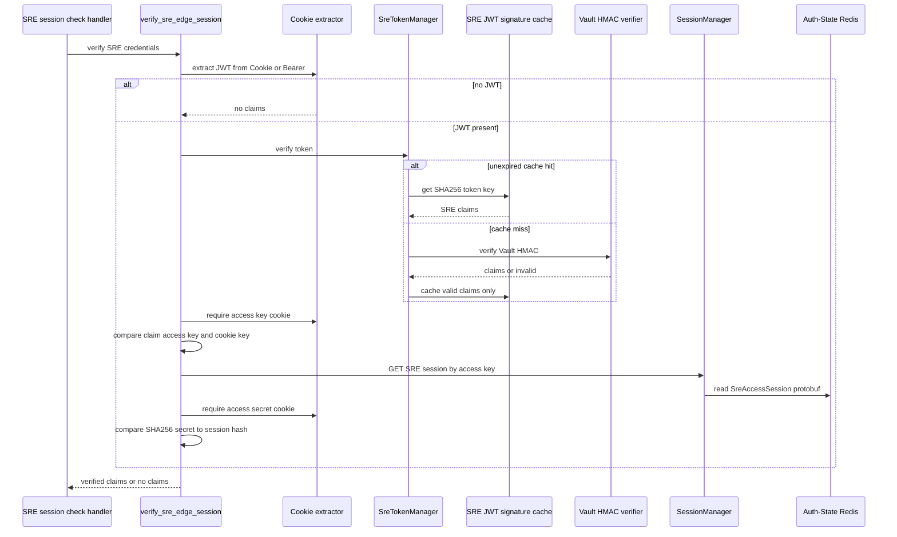
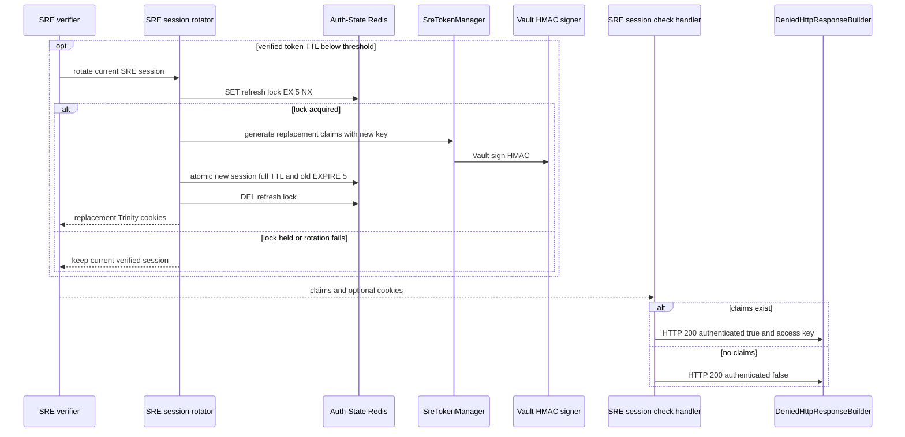
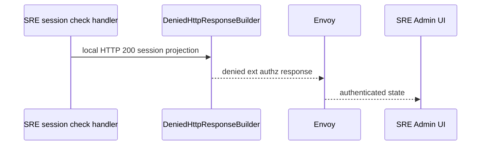

# SRE Session Check — ACR-local Workflow God View

This workflow projects the current SRE browser session into a small UI status
response. It is local to ACR, does not call Controlplane, and does not forward
an HTTP request after Envoy invokes ext_authz. It never creates an SRE session
or performs login recovery; a missing or invalid session is simply reported as
unauthenticated.

## API-scope contract

| Boundary | Contract |
| --- | --- |
| Method/path | exact `GET /admin/auth/session` |
| Principal | SRE Trinity only; user Trinity and Billing Alias are not accepted |
| Inputs used | SRE cookies or Bearer JWT, Origin, source IP, optional device cookie |
| Success body | `{"data":{"authenticated":true,"access_key":"..."}}` |
| Unauthenticated body | `{"data":{"authenticated":false}}` |
| HTTP status after handler | always local `200` |
| Optional mutation | transparent SRE session rotation when token remaining TTL crosses configured threshold |
| Upstream forward | never |

The `access_key` in the true response is presentation data for Admin UI. It is
not a new credential and it does not reveal any tenant, user, role or physical
Zone entitlement.

## Credential and key contract

| Item | Source | Validation |
| --- | --- | --- |
| `access_token` | Cookie, otherwise `Authorization: Bearer` | syntax, payload expiry, then Vault HMAC or valid per-pod cache entry |
| `access_key` | Cookie only | must equal SRE JWT claim and select a live SRE runtime key |
| `access_secret` | Cookie only | SHA-256 must equal `SreAccessSession.access_secret_hash` |
| `iam:sre_access_session:{access_key}` | Auth-State Redis | protobuf read gives secret hash and device public key |
| `iam:lock:sre_refresh:{old_access_key}` | Auth-State Redis | five-second `SET EX NX` rotation mutex |
| SRE JWT cache | ACR Moka | max 50,000 valid claims, invalidated when cached expiry passes |

The token cache accelerates HMAC verification but never replaces the dedicated
Redis session lookup. Removing/expiring the Redis key revokes every ACR pod
even if its local token cache still holds valid signed claims.

## Phase 1 — Client → Envoy → ExtAuthz dispatcher

The dispatcher reads AttributeContext method/path, applies configured-origin
validation, and performs the `sre_general` pre-auth rate limit before matching
this handler. It does not enter normal SRE verification flow because the
handler invokes the verifier locally.

The pre-auth limiter can fail open on Redis error. All authentication reads in
the next phase remain fail closed or become an unauthenticated status.

## Phase 2 — JWT, key and runtime-session verification

`handle_sre_session_check` calls `verify_sre_edge_session`. Missing or invalid
JWT returns no claims; an otherwise valid JWT missing a key/secret, wrong key,
missing session, secret mismatch, or session-store error returns no claims or a
denial response. The session-check projection treats all of these as false.

If a verified old SRE JWT has no Zone claim, the verifier normalizes only the
in-memory claims to `global`. It does not write a Zone cookie in this handler.

## Phase 3 — transparent rotation and local response

When a verified token expires within `refresh_threshold_secs`, the verifier
attempts a transparent replacement. A lost rotation race or error is not a
session-check failure because the old credentials already passed validation.

The rotation stores a new session with the old device public key, full session
TTL and new secret hash. It expires the old session after five seconds. The
response sets replacement `access_token`, `access_key`, and `access_secret`
cookies with Path `/admin`; it does not rotate `zone_code`.

## Phase 4 — Envoy settlement and failure matrix

`DeniedHttpResponseBuilder` is used with HTTP status `200` and gRPC
unauthenticated status so Envoy emits the local JSON rather than proxies the
request to an SRE backend.

| Condition | Browser body | Cookies | Durable effect |
| --- | --- | --- | --- |
| verified session | authenticated true plus access key | optional rotation set | last session state unchanged or rotation transaction |
| no token or invalid signature | authenticated false | none | none |
| key/secret mismatch or session revoked | authenticated false | none | none |
| Auth-State read failure | authenticated false | none | none |
| rotation cannot complete | authenticated true | none | none |
| CORS/pre-auth denial | handler is not reached | none | rate counters only |

No cookies are cleared on the false SRE status path. The UI owns the next
action, normally showing login; SRE logout is the separate workflow that clears
cookie state.

## Invariants and code map

1. Valid signed JWT plus stale Redis session is not authenticated.
2. User/Billing sessions are not valid SRE sessions even if cookie names match.
3. This endpoint has no recovery credential path and cannot mint a session.
4. No `x-user-*`, `x-zone-*`, proof or owner header is injected because there
   is no upstream request.
5. Logs must not record tokens, access keys, secrets, or device keys.

| Component | Responsibility | Code |
| --- | --- | --- |
| dispatcher | CORS, pre-auth limiter and local route dispatch | `acr/src/gateway/ext_authz.rs` |
| local session check and verifier | status projection, Trinity verification | `acr/src/sre/verify.rs` |
| token manager | Vault HMAC validation and valid-only Moka cache | `acr/src/sre/claims.rs` |
| rotator and session store | lock, five-second grace, replacement Trinity state | `acr/src/sre/rotate.rs`, `acr/src/sre/session.rs` |
| rate limiter | pre-auth counters and temporary block cache | `acr/src/gateway/ratelimit.rs` |
