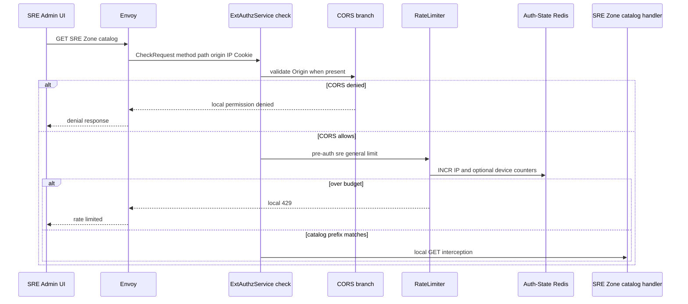
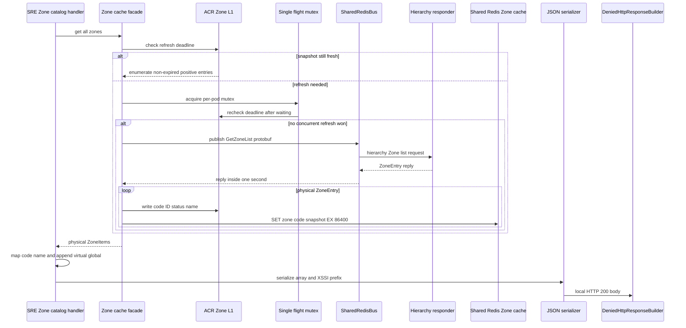
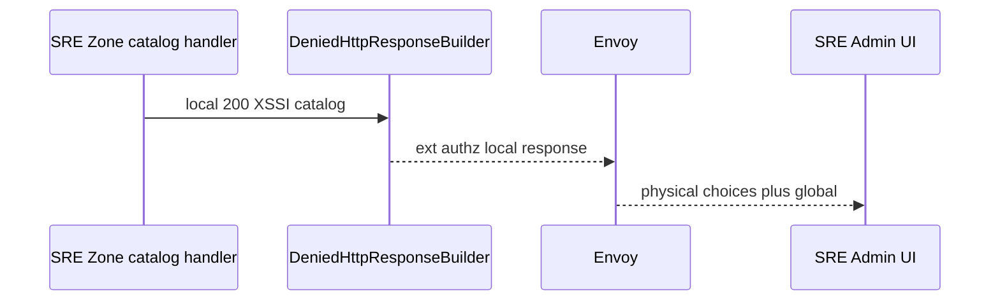

# SRE Zone Catalog — ACR-local Workflow God View

This workflow serves the SRE UI's Zone chooser directly from ACR. It includes
every cached physical Zone and one virtual `global` entry. It is a presentation
catalog only: it does not prove an SRE session, validate access to a physical
Zone, or make a Controlplane HTTP request.

## API-scope contract

| Boundary | Contract |
| --- | --- |
| Method/path matched | `GET` and a path beginning `/admin/hierarchy/zones/catalog` |
| Browser authority | public SRE catalog route under `/admin` |
| Authentication | none in this handler; Trinity is not read |
| Inputs used | method/path, Origin, source IP, optional `client_device_id` for global edge gates |
| Inputs ignored | SRE JWT, `access_key`, `access_secret`, Zone cookie, request body, all identity headers |
| Physical entries | every non-expired Zone returned by ACR L1, without lifecycle status filtering |
| Virtual entry | `{code:"global",name:"Global Zone"}` appended by the handler |
| Response | local `200`, `application/json`, XSSI prefix, code/name entries only |
| Upstream HTTP | none |

The handler matches a prefix, not an exact query-free path. Query values do not
alter catalog construction and must not be used as a control signal.

### Envoy transport boundary

The central Envoy HTTP connection manager applies its CORS filter before the
ext_authz filter. The ext_authz call uses the `acr_cluster`, has a three-second
gRPC timeout, and buffers a complete request body up to 2 MiB. This catalog is
a GET and does not consume that body, but its CheckRequest still carries the
same bounded transport contract as every other central ACR workflow.

| Envoy concern | Catalog consequence |
| --- | --- |
| ext_authz unavailable or exceeds three seconds | Envoy cannot obtain the local catalog response; this is distinct from a bounded cache refresh failure inside ACR |
| static `/` Admin UI routes | ext_authz is disabled only for static assets; the `/admin/` API prefix reaches ACR |
| Controlplane route cluster | selected by Envoy only if ACR authorizes a forward; this local interceptor does not |
| CORS filter and ACR CORS branch | both are present in the central path; ACR documents its own configured-origin decision here |

## Cache and transport contract

| Component | State | TTL / bound | Purpose |
| --- | --- | --- | --- |
| ACR Zone L1 | code to ID, ID to status/name | 30 seconds | in-process snapshot for catalogue and point resolution |
| ACR Zone L1 | catalog refresh deadline and single-flight mutex | 30 seconds after success, one second after failure | bounds Controlplane fan-out per pod |
| Shared Redis L2 | `zone:code:{normalized_code}` | 24 hours after successful catalogue refresh | rebuildable point-lookup snapshot |
| Shared Redis Bus | `hierarchy.zone.get_zone_list` request and unique reply | one-second waiting budget | live hierarchy refresh source |

The `get_all_zones` façade always attempts bounded catalog synchronization when
refresh is due. A failure is logged and leaves any still-valid L1 entries
available; it does not clear them or invent a `global` physical Zone cache key.

## Phase 1 — Client → Envoy → ExtAuthz dispatcher

As with every request, CORS and pre-auth limiting execute before local route
selection. `detect_route_group` treats the `/admin` prefix as `sre_general`, so
the pre-auth counters are IP and optional device based. The catalog interceptor
is dispatched before normal SRE JWT verification, post-auth limiting, CSRF,
Zone-context comparison, critical proof, and header injection.

Rate-limit Redis errors fail open. This is not SRE authorization and does not
change the fact that this current route is readable without a valid SRE Trinity.

## Phase 2 — cache synchronization and catalog materialization

The local handler calls `get_all_zones`. That façade is responsible for cache
freshness; the handler only maps each returned item to `code` and `name` and
then appends the virtual global choice. Unlike the user catalog, it intentionally
does not inspect a physical Zone status.

The cache's code map is backed by hash maps and no stable ordering is imposed.
Consumers must treat this response as a set. An empty response can arise from
an empty/expired snapshot during a refresh outage; it is not a permission or
availability assertion for any particular physical Zone.

### Cache-update ownership

ACR's invalidation subscriber can independently replace an L1 entry when it
receives a hierarchy Zone-invalidated event. A deleted event writes a negative
L1 entry; a non-deleted event writes its code, ID, status and name. The catalog
read does not consume that event directly and does not persist an outbox. The
30-second expiry ensures a lost invalidation cannot leave a stale entry cached
indefinitely, while the single-flight refresh prevents a thundering herd after
the expiry boundary.

## Phase 3 — local response, failures and security boundary

`DeniedHttpResponseBuilder` emits HTTP `200` plus `Content-Type:
application/json` and `)]}}',\n` before the JSON array. ACR uses a local denied
ext_authz response so Envoy returns it and never forwards a request downstream.

| Event | Response | Durable effect | Recovery |
| --- | --- | --- | --- |
| cache data or bounded refresh succeeds | `200` catalog | refresh may update rebuildable caches | no retry needed |
| hierarchy refresh fails with usable L1 | `200` bounded snapshot | one-second retry backoff | later request refreshes |
| hierarchy refresh fails without usable L1 | `200` empty physical list plus global | backoff only | retry later |
| JSON serialization fails | local `500` | none | deployment/runtime retry |
| CORS/pre-auth failure | edge denial or `429` | rate counters only | use allowed origin or wait |

### AS-IS exposure note

The public-before-auth placement is deliberate code behavior, not inferred
security policy. It exposes physical Zone code/name and lifecycle-independent
catalog membership to callers that pass CORS and pre-auth limiting. It does
not expose IDs, statuses, session data, tenancy, keys, or permissions. If this
route later requires SRE authentication, its interceptor ordering and rate/CSRF
semantics must change in the same workflow contract.

## Invariants and code map

1. `global` is virtual and exists only in the response; it is never fetched or
   written as a physical Zone record.
2. The response never carries `x-user-*`, `x-zone-*`, session proof or rewrite
   headers because no upstream forward is authorized.
3. A browser Zone cookie cannot add, remove, reorder, or filter catalog entries.
4. The SRE Zone switch workflow must independently validate an operator Trinity
   and the chosen target before reissuing a token.

| Component | Responsibility | Code |
| --- | --- | --- |
| edge dispatcher | CORS, pre-auth rate limit and route order | `acr/src/gateway/ext_authz.rs` |
| SRE catalog handler | exact local response and virtual global append | `acr/src/sre/zone_catalog.rs` |
| Zone cache | bounded hierarchy sync, L1/L2 state and failure backoff | `acr/src/infra/zone.rs` |
| Shared Redis Bus | correlated request/reply and reconnect behavior | `acr/src/infra/shared_redis.rs` |
