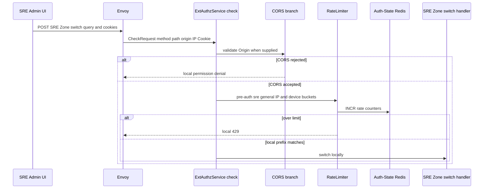
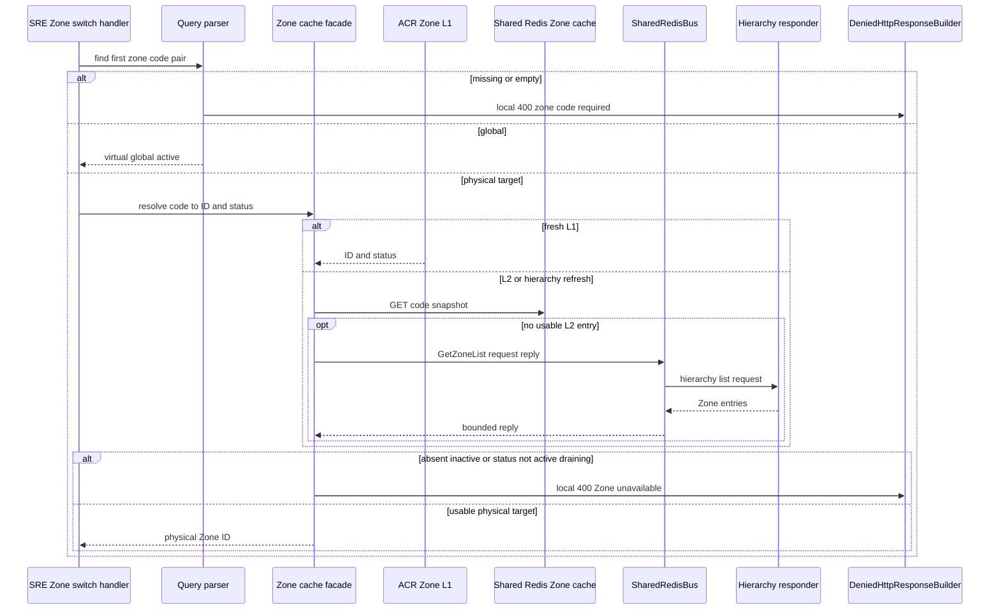
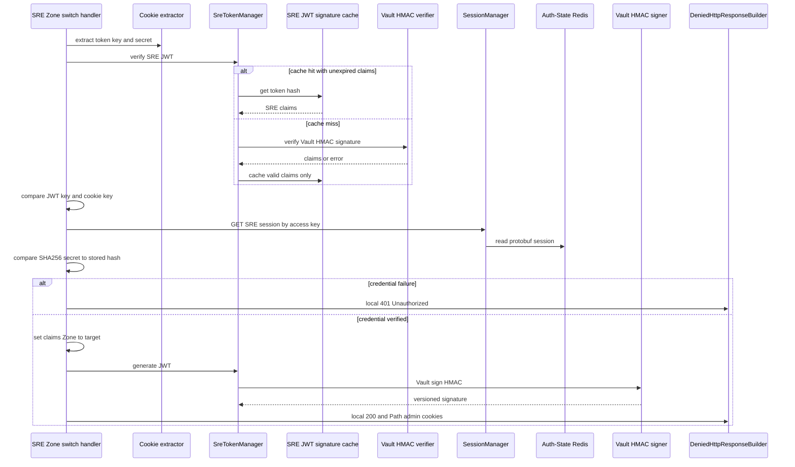
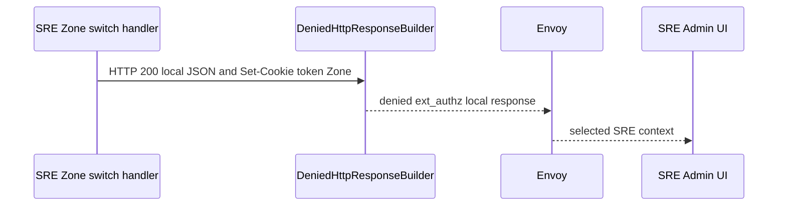

# SRE Zone Switch — ACR-local Workflow God View

This workflow changes the Zone claim in an already authenticated SRE JWT. It
is local to ACR and never makes an HTTP request to Controlplane. It does not
create a new SRE Redis session, change the device public key, or grant a
Controlplane role; it changes the signed operator context that future requests
will present.

## API-scope contract

| Boundary | Contract |
| --- | --- |
| Method/path matched | `POST` and a path beginning `/admin/zone/go-to-zone` |
| Candidate | first raw query pair beginning `zone_code=`, trimmed and lowercased |
| Input credentials | SRE `access_token`, `access_key`, `access_secret` cookies |
| Allowed targets | virtual `global`, or physical cached Zone with status `active` or `draining` |
| Output | local `200` XSSI JSON `{zone_code}` plus replacement `access_token` and `zone_code` cookies on Path `/admin` |
| Unchanged cookies | `access_key` and `access_secret` remain the current session credentials |
| Upstream forward | never |

There is no browser-supplied owner, tenant, workspace, user ID or physical Zone
ID. A physical code becomes a candidate only after ACR cache resolution. Global
is accepted without a physical lookup because it is SRE's virtual context.

## State contract

| State | Store | Operation | Invariant |
| --- | --- | --- | --- |
| `iam:sre_access_session:{access_key}` | Auth-State Redis | read `SreAccessSession` | validates secret hash and retains device key |
| SRE JWT signature cache | ACR per pod | valid unexpired claims cached by SHA-256 raw JWT | Vault remains signature authority on cache miss |
| Zone L1/L2 entries | ACR and Shared Redis | physical candidate resolution | rebuildable routing/lifecycle data only |
| Vault HMAC Transit | Vault | verifies old JWT and signs replacement JWT | local ACR has no signing key |

The Redis SRE session contains `access_secret_hash` and `device_public_key`.
The switch reads it only to compare the secret; no session TTL, session record,
or nonce state is changed.

## Phase 1 — Client → Envoy → ExtAuthz dispatcher

The request passes global CORS and the pre-auth `sre_general` limiter, then the
local SRE switch interceptor. Like the user switch, it runs before normal SRE
verification, post-auth limiting, CSRF, normal Zone cookie/JWT comparison,
critical proof and trusted-header construction.

The rate counter failure policy is fail-open. It is not a substitute for the
SRE session proof performed by the handler.

## Phase 2 — target selection and Zone-cache branch

The handler parses and resolves the candidate before checking the SRE Trinity.
For `global`, it synthesizes `(global,active)`. For physical candidates it uses
the same L1, L2 and bounded Shared Redis hierarchy refresh as all ACR Zone
operations.

The parser does not URL-decode `zone_code`. A caller that needs reserved URL
characters cannot rely on this route to normalize them. L1 positive entries are
30 seconds, negative misses are 180 seconds, and hierarchy refresh is
single-flight with a one-second wait budget.

## Phase 3 — SRE Trinity verification and JWT reissue

After target acceptance, the handler loads cookie credentials. It verifies the
old JWT with `SreTokenManager`, compares JWT `access_key` to the cookie, reads
the dedicated SRE Redis key, and compares SHA-256 of `access_secret` with the
stored hash. It then alters only `claims.zone_id` and asks Vault to HMAC-sign
the replacement token.

The new JWT keeps the same subject `sre`, access key, issuer, `iat`, and `exp`;
only the Zone claim and JWT signature change. The handler does not call the
sliding rotation function and does not rotate keys, which is why only the JWT
and Zone cookie are set.

## Phase 4 — response, failure and security boundaries

| Condition | Result | Redis / Vault mutation |
| --- | --- | --- |
| valid target and SRE Trinity | local `200` XSSI body and replacement token | Vault signing only |
| missing candidate | `400 zone_code is required` | none |
| unknown/inactive physical candidate | `400 Zone unavailable` | possible rebuildable cache refresh only |
| invalid/missing JWT/key/secret/session | `401 Unauthorized` | none |
| Vault token signing failure | `500 Zone unavailable` | none |
| CORS/pre-auth limiter fails | dispatcher denial/`429` | rate counters only |

### AS-IS security observations

| Current behavior | Consequence |
| --- | --- |
| target resolution precedes SRE authentication | unauthenticated callers can receive target-specific `400` outcomes |
| normal CSRF gate is not reached | cross-site POST can attempt a context switch after CORS/pre-auth checks |
| no post-auth rate-limit applies | only the pre-auth SRE-general budget protects the handler |
| normal `resolve_and_verify_zone_admin` does not run | the standard Zone cookie/JWT mismatch repair path is bypassed |

These observations are documentation of execution order, not a code change.
Any hardening requires a separately approved workflow change.

## Invariants and code map

1. Only SRE can receive `global`; a user Zone switch rejects it.
2. No upstream identity headers are injected because this local response never
   authorizes an upstream request.
3. A physical Zone's cached lifecycle status is a target availability check, not
   an authorization decision for any future SRE action.
4. Raw credentials and device keys must not appear in logs.

| Component | Responsibility | Code |
| --- | --- | --- |
| dispatcher | CORS, pre-auth limiter and interceptor sequence | `acr/src/gateway/ext_authz.rs` |
| local switch | raw query parsing, target policy, direct credential check | `acr/src/sre/zone_switcher.rs` |
| SRE token manager | Vault HMAC verification/signing and valid-only cache | `acr/src/sre/claims.rs` |
| SRE session store | secret-hash session lookup | `acr/src/sre/session.rs` |
| Zone cache | L1/L2 resolution and bounded hierarchy refresh | `acr/src/infra/zone.rs` |
