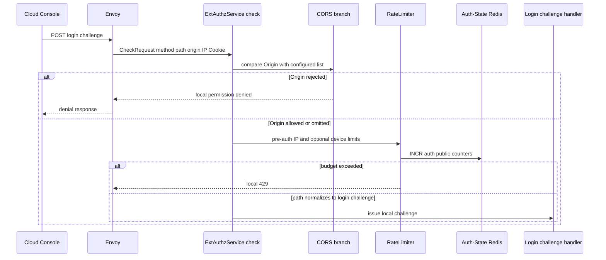
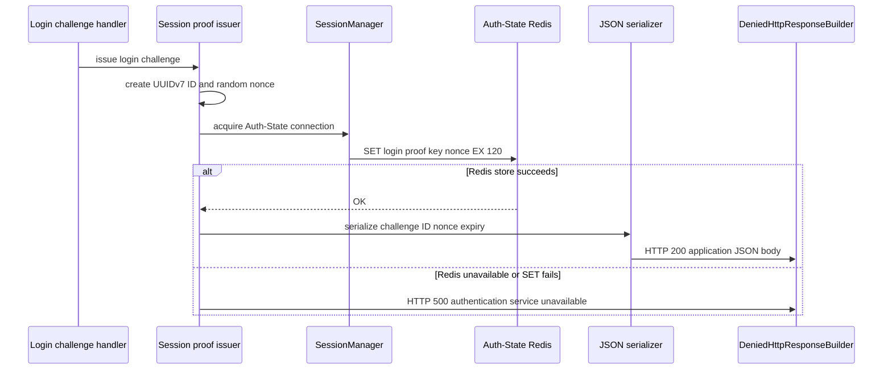
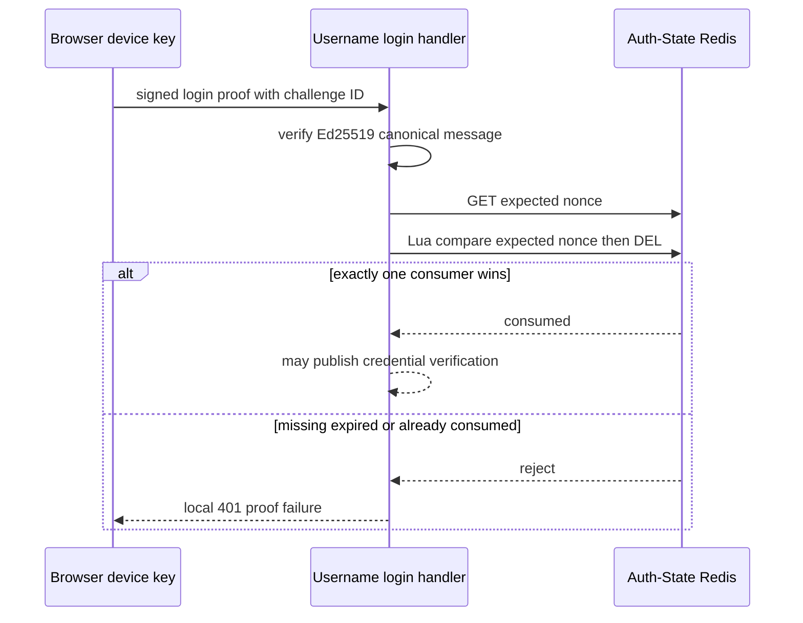

# User Login Proof Challenge — ACR-local Workflow God View

This workflow creates the one-time Ed25519 challenge that must be consumed by
the subsequent username/password login request. It is an anonymous edge-local
API: no Controlplane HTTP or Pub/Sub request occurs, no user identity is
selected, and no session is issued.

## API-scope contract

| Boundary | Contract |
| --- | --- |
| Method/path | `POST /api/v1/auth/login/challenge`; query string and one trailing slash are normalized for matching |
| Client input | `Origin`, `X-Forwarded-For`, optional `client_device_id` cookie; body is ignored |
| Client identity | none; Trinity, tenant, Zone, user and proof headers are not authority inputs |
| Success | local `200` JSON `challenge_id`, `nonce`, `expires_in=120` |
| Failure | local `500` when Auth-State Redis cannot persist state |
| Upstream forward | never |

The returned nonce is public challenge material, not a bearer credential. The
following login signs it together with canonical username, tenant domain, Zone
code, remember-device flag and timestamp using the device public key supplied
on the login request.

## Key contract

| Key | Store | Operation | TTL and invariant |
| --- | --- | --- | --- |
| `iam:session_proof:login:{challenge_id}` | Auth-State Redis | `SET nonce EX 120` | challenge ID is UUIDv7; nonce is SHA-256 of two fresh UUIDv4 values, one use only after later Lua compare-delete |
| `ratelimit:pre:ip:{ip}:auth_public` | Auth-State Redis | `INCR`, first writer `EXPIRE 60` | maximum 30 requests per minute before L1 temporary block |
| `ratelimit:pre:device:{device}:auth_public` | Auth-State Redis | optional `INCR`, first writer `EXPIRE 60` | maximum eight requests per minute when device cookie exists |
| pre-auth block key | ACR Moka | 30 second in-memory marker | optimization after overflow, not a security credential |

No nonce is held only in process memory, so a challenge issued by one ACR pod
can be consumed by another. Redis persistence failure must not return a nonce
that cannot later be verified.

## Phase 1 — Client → Envoy → ExtAuthz dispatcher

Envoy calls ACR ext_authz with its method/path/header AttributeContext. The
central configuration has a three-second ext_authz gRPC budget and may buffer
up to 2 MiB request body, although this endpoint has no business payload. ACR
performs CORS and pre-auth `auth_public` rate limiting before local interception.

The rate limiter fails open on counter-store error. Challenge issuance itself
does not fail open: it requires a successful Auth-State Redis write.

## Phase 2 — nonce creation, persistence and local response

The handler strips the query string, trims only a trailing slash for matching,
then invokes `issue_login_challenge`. `store_challenge` generates UUIDv7 ID,
hashes two independently generated UUIDv4 values into a base64 nonce, and
writes the key with the 120-second TTL.

ACR uses a denied ext_authz response with HTTP 200/500 so Envoy returns it
locally. There are no trusted headers, cookies, rewrites or upstream route
selection in either outcome.

## Phase 3 — later consumption boundary

The challenge is not consumed by this endpoint. Username login later constructs
the exact `aurora.login-proof.v1` message and verifies a 32-byte Ed25519 public
key and 64-byte signature. Only after cryptographic verification does it run a
Lua compare-and-delete of this key. A missing/expired/replayed key fails login
before credentials reach the IAM verification request-reply flow.

## Failure and security invariants

| Event | Response | Durable state | Recovery |
| --- | --- | --- | --- |
| successful issue | `200` challenge JSON | one Redis key with 120-second TTL | obtain a new challenge after expiry |
| Redis unavailable | `500` | none | retry endpoint; no partial state is valid |
| CORS denied | edge denial | none | use allowed origin |
| rate overflow | `429` | counter and short L1 block | wait for window/block |
| challenge replay at login | login `401` | key remains absent | obtain a completely new challenge |

1. The challenge does not bind an account, tenant, Zone or public key until the
   later signed login request.
2. A client cannot pre-supply a nonce, ID, identity header, or Redis key name.
3. Raw nonce and later signature must not be logged.
4. This endpoint is not a user session or a substitute for CSRF; its anonymous
   state-change boundary is protected only by CORS, pre-auth limiting and the
   bounded Redis issuance operation.

## Code map

| Component | Code |
| --- | --- |
| dispatcher and global gates | `acr/src/gateway/ext_authz.rs`, `acr/src/gateway/ratelimit.rs` |
| endpoint handler | `acr/src/user/login.rs` |
| nonce generation and later consume primitive | `acr/src/user/session_proof.rs` |
| Auth-State Redis access | `acr/src/infra/redis.rs` |
