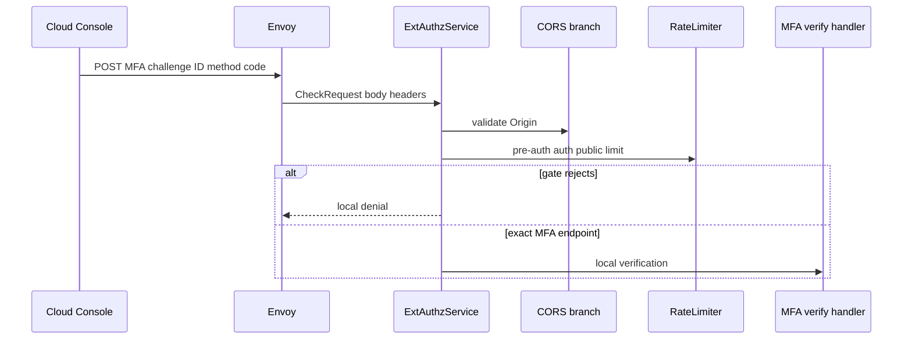
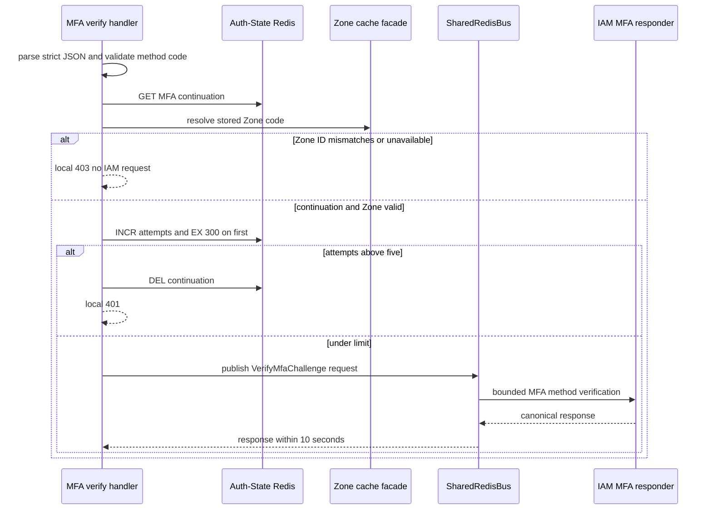
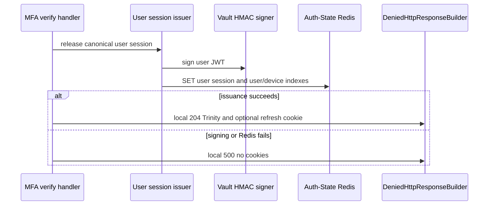

# User MFA Login Verification — ACR-local Workflow God View

This workflow completes the MFA continuation created by a successful primary
username or OAuth login. ACR owns the short-lived continuation, Zone recheck,
bounded attempt counter, runtime session issuance and browser cookies. IAM owns
verification of the chosen MFA method and durable refresh/device effects.

## API-scope contract

| Boundary | Contract |
| --- | --- |
| Method/path | `POST /api/v1/auth/mfa/verify`, query ignored for matching |
| JSON body | exactly `challenge_id`, `method`, `code`; unknown fields rejected |
| Method values | `totp` six ASCII digits or `recovery_code` 16 characters from the allowed alphabet |
| Success | local `204` with user Trinity and optional IAM-issued refresh cookie |
| Failure | `400` malformed input, `401` invalid/expired/failed MFA, `403` unavailable Zone, `500` dependency/decode failure |
| Upstream HTTP | never; IAM call is Shared Redis request-reply |

The continuation contains the primary-login user, tenant domain, MFA setting,
concrete Zone ID/code, device context, proof key and trust-device choice. The
browser cannot replace any of them through this endpoint.

## Key contract

| Key | Store | Operation / TTL | Rule |
| --- | --- | --- | --- |
| `iam:mfa:challenge:{challenge_id}` | Auth-State Redis | JSON context `SET NX EX 300`, later `GET` | only primary-login success creates it |
| `iam:mfa:challenge:{challenge_id}:attempts` | Auth-State Redis | `INCR`, first writer `EXPIRE 300` | sixth attempt deletes continuation and returns generic failure |
| Zone L1/L2 entries | ACR and Shared Redis | re-resolve stored Zone code | resolved ID must equal stored ID and status must be active/draining |
| `iam.auth.verify_mfa_challenge` | Shared Redis | protobuf request/reply, 10-second wait | IAM validates TOTP/recovery code and returns canonical login continuation result |
| user runtime session/indexes | Auth-State Redis | issued only after valid IAM response | same durable/runtime boundary as username login |

## Phase 1 — Client → Envoy → ACR local dispatch

The request passes CORS and pre-auth `auth_public` rate limiting. MFA verify is
intercepted before public bypass and before normal session/CSRF flow because it
is not yet an authenticated browser session.

## Phase 2 — continuation fence, Zone recheck and IAM verification

ACR parses the bounded CheckRequest body, validates syntax before Redis, reads
the continuation, then independently resolves its stored Zone code. It counts
attempts before publishing to IAM. The code is not persisted by ACR beyond the
in-flight protobuf request.

IAM receives user/context copied from the continuation plus method/code and
current edge device metadata. It returns `valid` and canonical user/session
fields; an invalid response, mismatched user/context, or unavailable reply is
fail closed. Raw primary password, login proof nonce, and browser-generated
identity headers do not participate.

## Phase 3 — issue session and settle locally

On valid IAM response ACR releases a user session with the stored concrete Zone
and canonical device proof key, registers the runtime protobuf/indexes, and
sets Trinity cookies. If trust-device is set, only an IAM-issued opaque refresh
token with future expiry is set. Envoy returns the response locally.

The current handler does not show a deletion of the MFA continuation after a
successful IAM response in this local function. Its expiry/attempt fence remains
the AS-IS replay boundary and must not be assumed to be consumed unless IAM or
surrounding code is changed to do so.

## Invariants and code map

1. MFA cannot select another user, tenant, Zone or device than primary login.
2. A Zone lifecycle change between primary login and MFA blocks issuance.
3. No MFA failure creates a session or refresh credential.
4. CORS/limiter errors, Redis errors, IAM timeout/decode failure and Vault
   signing errors all fail closed for session issuance.

| Component | Code |
| --- | --- |
| dispatcher | `acr/src/gateway/ext_authz.rs` |
| MFA continuation and handler | `acr/src/user/login.rs` |
| Zone cache | `acr/src/infra/zone.rs` |
| request/reply transport | `acr/src/infra/shared_redis.rs` |
| session issuance | `acr/src/user/login.rs`, `acr/src/user/session.rs`, `acr/src/token.rs` |
