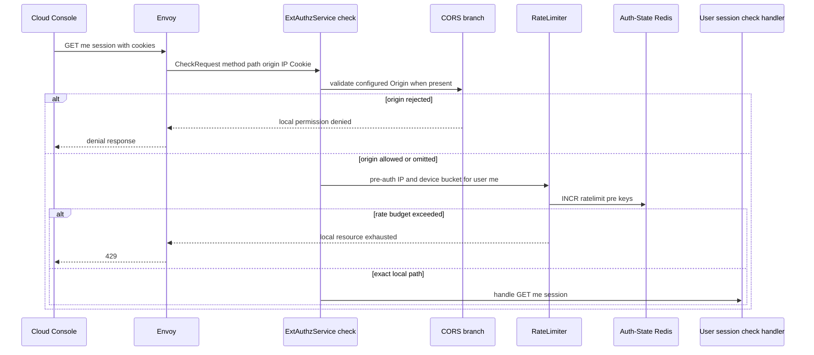
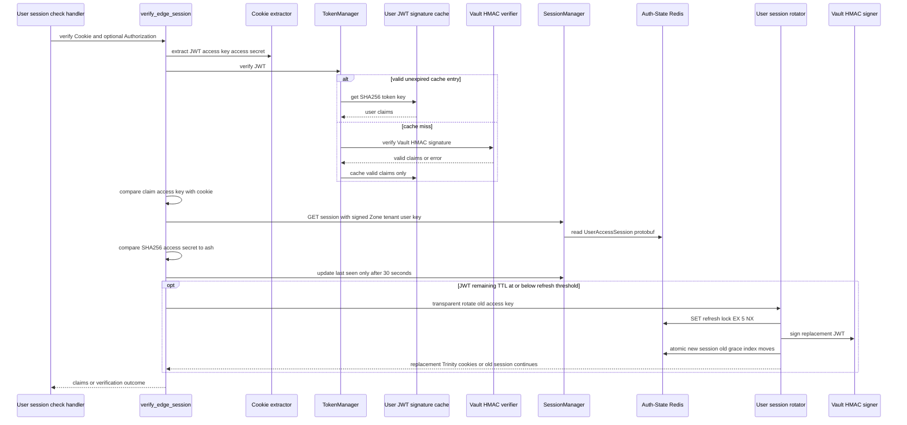
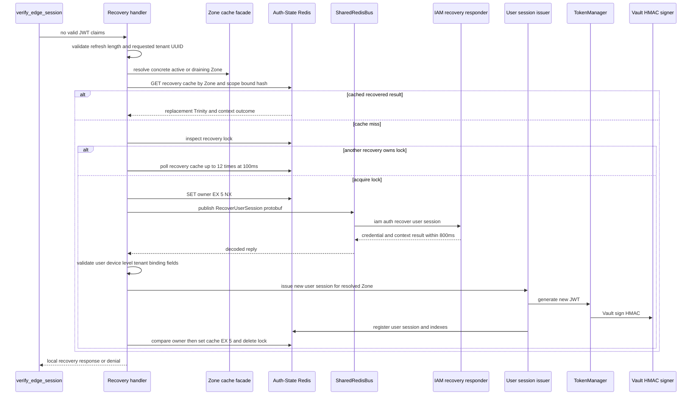
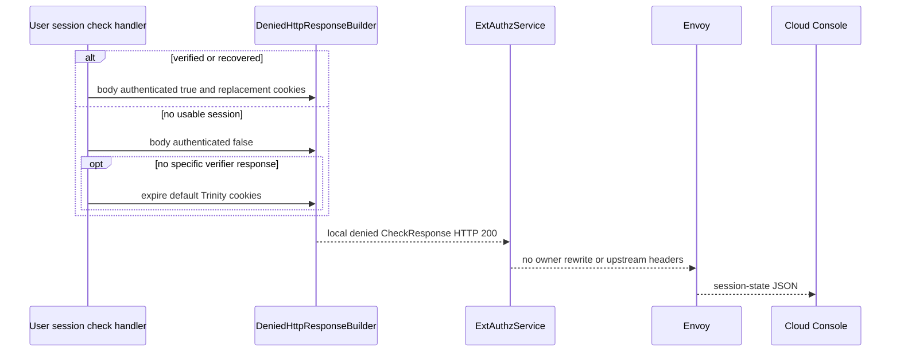

# User Session Check — ACR-local Workflow God View

This workflow is the browser's session-state probe. It terminates at ACR and
always presents a local HTTP `200` with `authenticated=true` or `false`; it
does not forward a self API request to Controlplane. A successful recovery is
also settled locally, although recovery sends a bounded request-reply message
to the IAM Controlplane consumer.

## API-scope contract

| Boundary | Contract |
| --- | --- |
| Method/path | exact `GET /api/v1/me/session` |
| Scope | self session status only; no `/personal` or `/tenant` rewrite and no authorization middleware |
| Input credentials | Trinity cookies, optionally opaque `refresh_token`; Bearer token may substitute only for JWT lookup |
| Success body | `{"data":{"authenticated":true}}` |
| Anonymous or invalid status | `{"data":{"authenticated":false}}` with HTTP `200` |
| Response headers | `Content-Type: application/json`; optionally replacement or clearing `Set-Cookie` values |
| Upstream HTTP | never |
| Cross-component recovery | Shared Redis request-reply to IAM, never a browser-forwarded HTTP call |

The route is deliberately `/me`: the target is solely the verified session.
Client `x-user-id`, tenant, Zone, owner, proof and workspace headers neither
choose a target nor become trusted headers in this local response.

## State and key contract

| State | Store | Read/write behavior | Authority |
| --- | --- | --- | --- |
| user JWT signature cache | ACR per-pod Moka | valid unexpired claims only, key is SHA-256 raw JWT | optimization, not revocation authority |
| `iam:user_session:{zone}:{tenant}:{user}:{access_key}` | Auth-State Redis | protobuf read, secret-hash comparison, last-seen write, optional rotation | runtime session and revocation boundary |
| `iam:lock:refresh:{old_access_key}` | Auth-State Redis | `SET EX 5 NX` | prevents concurrent transparent rotation |
| `iam:recovery_cache:{recovery_key}` | Auth-State Redis | short JSON replay result | returns one issued replacement to racing probes |
| `iam:lock:recovery:{recovery_key}` | Auth-State Redis | owner-value `SET EX 5 NX`, compare-delete | single-flight recovery fence |
| recovery request/reply channels | Shared Redis | `iam.auth.recover_user_session` with one unique reply channel | IAM validates opaque refresh credential and requested tenant context |
| Zone snapshot | ACR L1 and Shared Redis | resolve current Zone for recovery only | prevents issuing recovery into global/inactive Zone |

`recovery_key = SHA256(SHA256(refresh_token) : resolved_zone_id : requested_scope)`.
The requested scope is tenant UUID from the `tenant_id` cookie or `platform`.
That binding prevents one opaque refresh credential from replaying a cached
recovered session into a different Zone or concurrent tenant context.

## Phase 1 — Client → Envoy → ExtAuthz dispatcher

The dispatcher runs CORS and the pre-auth rate limiter before calling the local
session-check handler. The route group is `UserMe`. The handler then owns
verification itself, so normal dispatcher post-auth limiting, CSRF, Zone
resolution, tenant resolution, rewrite, proof, and trusted-header emission are
not reached.

The limiter fails open if Auth-State Redis is unavailable. This does not make a
session valid: later session/recovery reads have their own fail-closed response
paths.

## Phase 2 — normal Trinity verification and optional rotation

`handle_user_session_check` delegates to `verify_edge_session`. It first reads
`access_token` from Cookie, or `Authorization: Bearer` only as an alternate JWT
source. When a JWT verifies, the cookie `access_key` must match the claim, and
the session key derived from signed Zone/tenant/user/access key must exist.
The SHA-256 of `access_secret` then must equal the protobuf field `ash`.

`update_last_seen` errors are ignored. It reads/modifies/writes the protobuf
while preserving current TTL only when last-seen is at least 30 seconds old.
Rotation is best effort: an unavailable signer, lost lock, or Redis error keeps
the already verified current request successful without replacement cookies.

The rotation transaction creates a new user session with full TTL, expires the
old record after five seconds, moves its user and device index membership, and
preserves the session's Ed25519 client-proof public key. It does not call IAM.

## Phase 3 — expired/missing Trinity recovery

Only when JWT verification produced no claims does ACR attempt recovery, and
only if an opaque `refresh_token` cookie exists. It never decodes an expired
JWT to recover identity. The refresh credential is passed as a protobuf field
to IAM over Shared Redis, while the requested tenant comes only from the
validated `tenant_id` cookie.

IAM can authorize the requested tenant, reject it, or authorize a personal
fallback. For a personal fallback, recovery sets `x-aurora-context-reset:
personal` and clears `tenant_domain` and `workspace_id` cookies. The intercepted
request still ends locally; recovery never forwards it under the fallback owner.

| Recovery result | Handler effect | Session-check projection |
| --- | --- | --- |
| valid credential and requested context | issue session, cache short result | authenticated true and copied replacement cookies |
| valid credential with approved personal fallback | issue personal session, reset tenant UI context | authenticated true and copied reset/replacement cookies |
| invalid credential | clear credentials | authenticated false and copied clearing cookies |
| context unavailable | no new session | authenticated false |
| Zone absent/global/inactive | no IAM request | authenticated false |
| lock stays busy after 1.2 seconds | no new session | authenticated false |
| IAM publish/reply/decode/issue failure | no new session | authenticated false |

The recovery function returns a local response whose gRPC status can be OK on
success. The session-check handler unwraps that response, copies `Set-Cookie`
headers, and projects the browser payload to its small boolean-only contract.

## Phase 4 — local response settlement and cleanup

Regardless of normal verification or recovery branch, session check builds a
`DeniedHttpResponse` with HTTP 200 so Envoy does not proxy the request.

| Branch reaching session check | Cookie treatment |
| --- | --- |
| normal verified session | attach only rotation cookies when rotation won |
| successful recovery | copy recovery's replacement cookies and optional context reset |
| recovery denial response | copy any clearing cookies emitted by recovery |
| no JWT and no recovery credential | expire default `access_token`, `access_key`, `access_secret` cookies |
| normal verification denial, such as secret mismatch | respond false; no extra default cleanup is added by this branch |

## Failure semantics, invariants and code map

1. A valid JWT cache hit is not sufficient: Auth-State Redis session and secret
   checks are always required after it.
2. Expired/missing JWT material alone cannot identify a recovery subject.
3. A recovery cache entry is bound to the opaque token hash, Zone and requested
   scope and lasts five seconds only.
4. The endpoint's HTTP 200 is a UI-state contract, not proof that all
   infrastructure is healthy. CORS and pre-auth limiter failures happen before
   the handler and can return non-200 edge denials.
5. No authentication result, raw refresh token, JWT, access secret, or recovery
   key may be logged.

| Component | Responsibility | Code |
| --- | --- | --- |
| dispatcher and route order | global CORS/rate-limit then local session interceptor | `acr/src/gateway/ext_authz.rs` |
| normal verifier and local projection | Trinity checks, recovery invocation, HTTP 200 body | `acr/src/user/verify.rs` |
| recovery owner | lock/cache, IAM request-reply, fallback reset and session issue | `acr/src/user/recovery.rs` |
| session store and rotation | protobuf session, indexes, five-second grace | `acr/src/user/session.rs`, `acr/src/user/rotate.rs` |
| token manager | Vault HMAC verification/signing and per-pod valid-only cache | `acr/src/token.rs` |
| shared transport and Zone cache | correlated reply routing and concrete Zone validation | `acr/src/infra/shared_redis.rs`, `acr/src/infra/zone.rs` |
