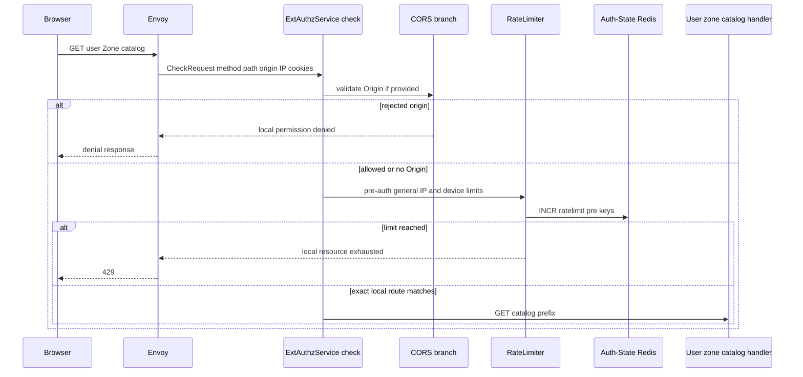
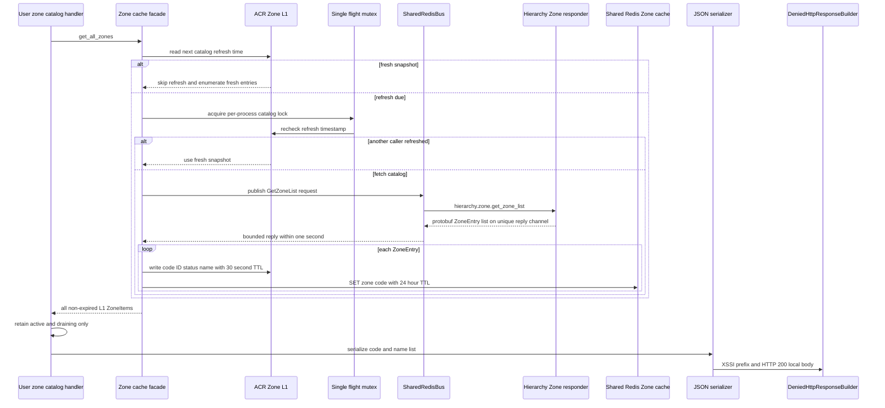
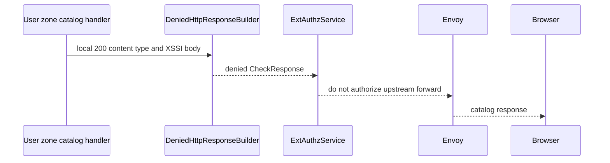

# User Zone Catalog — ACR-local Workflow God View

This workflow gives an unauthenticated browser the list of physical Zones that
a normal user may select before login or while changing login context. It is a
local ACR read, not a Controlplane HTTP API, and it must never be confused with
proof that the caller is signed in or authorized for a Zone.

## API-scope contract

| Boundary | Contract |
| --- | --- |
| Method/path accepted by handler | `GET` and a path beginning `/api/v1/zones/catalog` |
| Request authority | public catalog; no Trinity, tenant, workspace, or user ID is required |
| Client inputs used | method/path, `Origin`, `X-Forwarded-For`, optional `client_device_id` cookie |
| Client inputs ignored | all identity, tenant, Zone, proof and owner headers; request body |
| Response | local `200` JSON with XSSI prefix `)]}}',\n` followed by `[{code,name}]` |
| Zone population | only cached physical Zones whose status is `active` or `draining` |
| Virtual global Zone | never included for a user catalog |
| Upstream HTTP | none |
| Canonical protobuf | `proto/hierarchy/zone_catalog/v1/zone_catalog.proto` |

The browser chooses a display code only. This call does not store a zone cookie,
rewrite an owner path, inject trusted headers, validate a session, or grant a
right to use a Zone. A later login, session recovery, or zone-switch workflow
must independently resolve and validate the chosen code.

## Key and cache contract

The catalog has a deliberately rebuildable cache chain. Auth-State Redis is not
involved: this path uses the separate Shared Redis connection for hierarchy
data and request-reply transport.

ACR generates only protobuf messages from the local contracts. It does not
generate or use a `ZoneService` gRPC client/server: the catalog request above
travels through `SharedRedisBus`. This does not change the message wire format
or ACR's Envoy ext_authz server, which comes from `envoy-types`.

| Layer | Key / state | TTL | Writer | Reader and rule |
| --- | --- | --- | --- | --- |
| ACR L1 | code-to-ID, ID-to-status and ID-to-name entries | 30 seconds | catalog sync and invalidation subscriber | catalogue snapshot only when entries remain fresh |
| ACR L1 | next catalog refresh timestamp | 30 seconds after successful sync, one second after failure | catalog sync | suppresses repeated synchronous refreshes |
| ACR L1 | negative code entry | 180 seconds | point Zone lookup only | not emitted by catalog enumeration |
| Shared Redis L2 | `zone:code:{normalized_code}` equals `zone_id:status` | 24 hours after catalog sync | ACR catalog sync | supports later point lookup, not catalog enumeration directly |
| Shared Redis transport | `hierarchy.zone.get_zone_list` and unique reply channel | request timeout one second | Controlplane hierarchy responder | bounded refresh source |

`get_all_zones` first calls the sync routine, then enumerates only non-expired
positive L1 entries. A failed sync does not erase a bounded old snapshot. It
sets a one-second retry backoff so a failure does not turn every browser request
into another Controlplane request.

## Phase 1 — Client → Envoy → ExtAuthz dispatcher

Envoy serializes the HTTP request into `CheckRequest`. ACR derives the exact
method/path from the AttributeContext and runs global checks before it discovers
this local interceptor. The catalog is handled before public-bypass evaluation
and before all normal user session, tenant, Zone, CSRF and owner-rewrite code.

| CheckRequest part | Dispatcher behavior |
| --- | --- |
| method and path | select `handle_user_zone_catalog` only for `GET` plus catalog prefix |
| `Origin` | compared against configured `APP_ALLOWED_ORIGINS` if sent |
| `X-Forwarded-For` | IP dimension of the `general` pre-auth rate key |
| Cookie `client_device_id` | optional device dimension of the same pre-auth rate key |
| Cookie Trinity / Bearer token | not read by this handler |
| request body | not parsed or forwarded |

The limiter fails open when its Auth-State Redis counter is unavailable. That
does not make hierarchy data public beyond the normal route; it only avoids an
availability dependency for a read catalog.

## Phase 2 — local catalog handler and cache refresh

`handle_user_zone_catalog` owns presentation filtering, not Zone authority.
It invokes `get_all_zones`, keeps `active` and `draining`, maps only code/name,
then emits an Envoy local denied response carrying HTTP 200. Status is not
returned to prevent callers from treating the catalog as lifecycle authority.

On refresh failure, the cache facade logs the failure, advances the refresh
deadline by one second, and returns whatever non-expired L1 entries remain.
That means an empty list is a legitimate bounded-degradation result; it is not
an assertion that no Zones exist in Controlplane.

## Phase 3 — local response settlement

The handler does not construct `OkHttpResponse`. It creates a
`DeniedHttpResponse` with HTTP status `200` and gRPC unauthenticated status so
Envoy returns it directly instead of sending an HTTP request upstream.

| Response field | Value / invariant |
| --- | --- |
| HTTP status | `200 OK` on successful serialization |
| `Content-Type` | `application/json` |
| body prefix | exactly `)]}}',\n` before JSON |
| body item | `code` and `name` only |
| Set-Cookie | none |
| request-header mutation | none |
| identity/proof header injection | none |
| upstream target | none |

## Failure, freshness and abuse semantics

| Event | Local result | Durable effect | Browser recovery |
| --- | --- | --- | --- |
| Origin rejected | edge permission denial | none | use a configured origin |
| pre-auth limiter over budget | `429` | rate counter and temporary L1 block only | retry after window/block TTL |
| Shared Redis/Controlplane refresh fails with old L1 entries | `200` with bounded old snapshot | one-second refresh backoff | retry later, then later calls refresh |
| refresh fails with no usable L1 data | `200` with empty list | backoff only | retry later |
| JSON serialization fails | local `500` | none | retry after deployment/runtime fault is fixed |
| request has user token or Zone cookie | same catalog semantics | none | token cannot change result |

The code does not apply a deterministic sort before serializing the hash-map
backed L1 snapshot. Consumers must treat the payload as a set, not rely on its
order. This is an AS-IS presentation property rather than a stable API ordering
guarantee.

## Security invariants

1. `global` is never emitted from this workflow.
2. `inactive`, `provisioning`, `deleted`, or unknown statuses are never emitted
   by the user filter.
3. The browser cannot force a Controlplane HTTP call, choose an owner branch,
   or inject headers into an upstream because this is a local response.
4. A stale list is bounded by the L1 TTL; an unavailable refresh does not make
   expired L1 entries live again.
5. The catalog cannot establish membership. A later authenticated request must
   re-resolve a concrete Zone and compare it with signed session context.

## Observability and code map

| Component | Actual responsibility | Code |
| --- | --- | --- |
| edge dispatcher | request extraction, CORS, pre-auth limiter, interceptor ordering | `acr/src/gateway/ext_authz.rs` |
| rate limiter | Redis counter plus Moka temporary block cache | `acr/src/gateway/ratelimit.rs` |
| local user handler | exact-route handling, visibility filter, local response | `acr/src/user/zone_catalog.rs` |
| Zone cache facade | L1/L2 lookup, one-second request-reply, single flight, failure backoff | `acr/src/infra/zone.rs` |
| Shared Redis bus | correlation, publish, timeout, reply-router reconnect | `acr/src/infra/shared_redis.rs` |

Operational logs may contain the normalized Zone code and cache failure reason,
but must not include cookies or any token that arrived incidentally on this
public endpoint.
