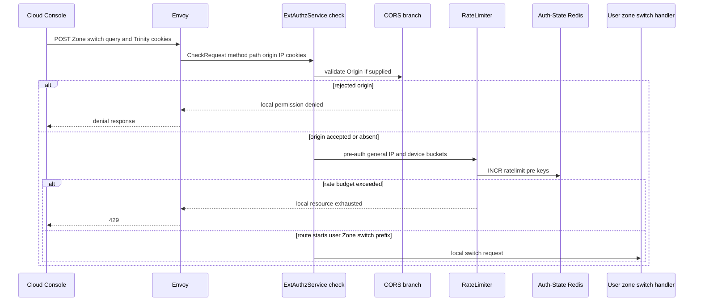
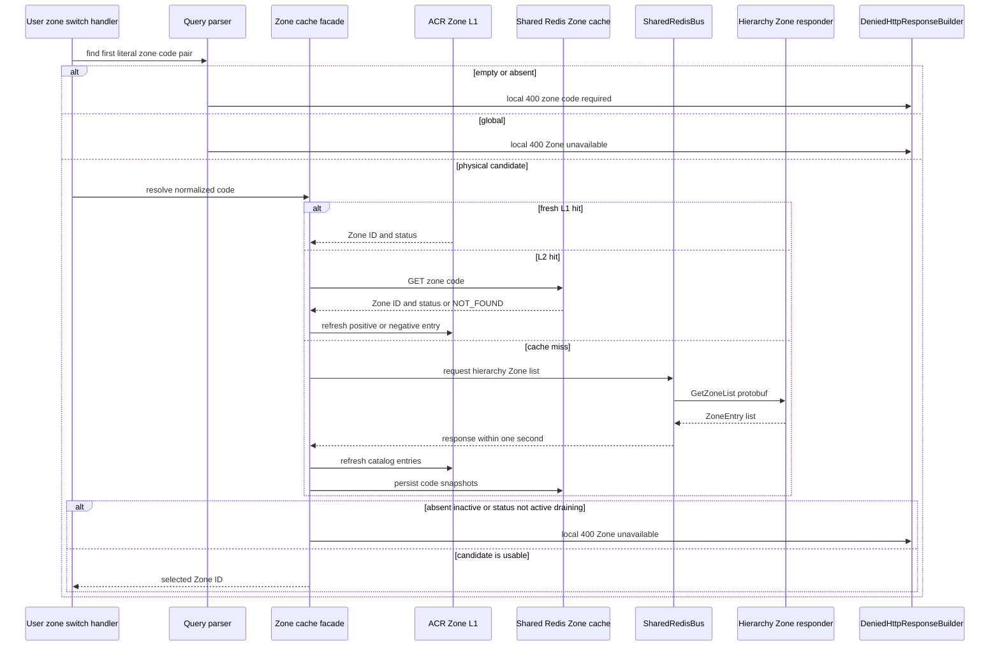
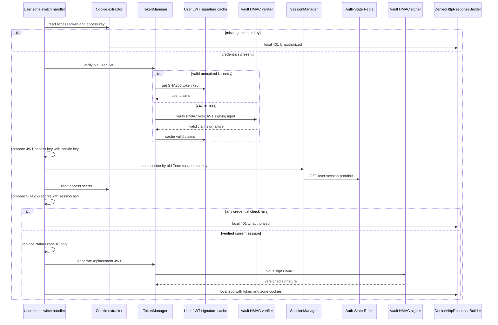
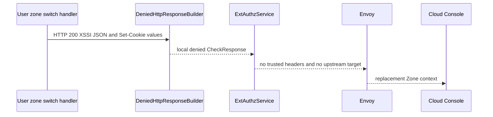

# User Zone Switch — ACR-local Workflow God View

This workflow reissues the current user's JWT with a different concrete
physical Zone. It is a local edge response: no Controlplane HTTP handler sees
the browser request, and it does not create a new user session, change tenant
membership, or grant permission in the destination Zone.

## API-scope contract

| Boundary | Contract |
| --- | --- |
| Method/path matched | `POST /api/v1/zone/go-to-zone?zone_code={code}` with a path beginning that prefix |
| Scope | self session context only; it is not `/me`, `/personal`, or `/tenant` business routing |
| Candidate selection | caller supplies `zone_code` query text only |
| Required credentials | user Trinity `access_token`, `access_key`, `access_secret` cookies |
| Target policy | physical Zone whose cached status is `active` or `draining` |
| Forbidden target | `global` is SRE-only and always rejected before cache lookup |
| Success | local `200`, XSSI JSON `{zone_code}`, replacement JWT cookie and Zone cookie |
| Upstream forward | never |

The query does not select a session key. ACR first uses the currently signed
JWT Zone and tenant to load runtime session state, validates the cookie secret
against that session, then replaces only the signed JWT Zone claim. The old
runtime record remains at its original Zone key.

## Input, output and key contract

| Input | Owner | Validation or use |
| --- | --- | --- |
| `zone_code` query pair | browser | first literal `zone_code=` pair, trimmed and lowercased; empty is `400` |
| `access_token` | browser credential | Vault-HMAC verified user JWT, then claims decoded |
| `access_key` | browser credential | must equal JWT `access_key` claim |
| `access_secret` | browser credential | SHA-256 must equal Auth-State session `ash` |
| `Origin`, IP, `client_device_id` | edge | CORS and pre-auth rate-limit only in this local path |
| request body | none | not parsed |

| State | Store | Operation | Invariant |
| --- | --- | --- | --- |
| `zone:code:{normalized_code}` | Shared Redis L2 and ACR Zone L1 | resolve code to `(zone_id,status)` | cache data is rebuildable, never membership authority |
| `iam:user_session:{old_zone}:{tenant}:{user}:{access_key}` | Auth-State Redis | read protobuf `UserAccessSession` | session binds the existing Trinity context and secret hash |
| Vault token HMAC | Vault plus per-pod token cache | verify old JWT then sign replacement JWT | ACR never signs with local key material |
| old session indexes | Auth-State Redis | untouched | switch is not rotation or new-login registration |

## Phase 1 — Client → Envoy → ExtAuthz dispatcher

The generic dispatcher applies CORS and the pre-auth `general` rate limit. It
then dispatches this exact local route before normal user verification. Thus
normal post-auth rate limiting, CSRF, `update_last_seen`, transparent session
rotation, tenant validation, and trusted upstream-header construction do not
run for this request.

The pre-auth limiter is fail-open on Redis connection/command failure and its
30-second Moka block cache is only an optimization after an observed overflow.
It is unrelated to the session Redis read in the next phase.

## Phase 2 — candidate parsing and Zone cache resolution

The handler reads the raw query string itself. It takes the first pair whose
text begins `zone_code=`; it does not URL-decode or accept another parameter
name. The candidate is resolved before the handler authenticates the Trinity.
This order is important for accurate latency and information-boundary tracing.

Point resolution maintains a 30-second L1 positive entry and, after a complete
miss, a 180-second negative entry in L1 and Shared Redis. The full-catalog
request is guarded by a per-pod single-flight mutex and a one-second timeout.
It can serve an old bounded snapshot after refresh failure.

## Phase 3 — current Trinity verification and reissue

Only a usable physical target proceeds to credential processing. The old JWT
is verified before ACR reads the current runtime record. The JWT verification
may use a valid unexpired Moka cache entry keyed by SHA-256 of the raw token;
otherwise ACR verifies the Vault HMAC and caches valid claims. Invalid tokens
are never cached.

The replacement retains `sub`, `uid`, level, tenant ID, issuer, `exp`, `iat`,
and the same access key; only the Zone claim and JWT signature change. The
handler does not create a destination-Zone Redis session, rotate the access
secret, migrate indices, check tenant membership, or call Controlplane
authorization. It only makes later normal requests carry a JWT whose Zone claim
is the selected Zone.

## Phase 4 — Envoy local response and cookie boundary

| Result | HTTP response | Cookies | Durable effect |
| --- | --- | --- | --- |
| usable target and verified Trinity | `200` XSSI JSON `{"zone_code":...}` | replacement `access_token`, `zone_code`; both Path `/` | none beyond Vault signing audit/logs |
| malformed or unavailable candidate | `400` XSSI error body | none | none |
| missing, invalid, expired or revoked Trinity | `401` XSSI error body | none | none |
| Vault signing failure | `500` XSSI `Zone unavailable` error | none | none |
| CORS/limiter denial before handler | dispatcher denial/`429` | none | limiter counters only |

`access_key` and `access_secret` cookies are deliberately not replaced. The
new JWT therefore remains bound to the same runtime session key. Cookies are
host-only when `app_public_domain` is blank; otherwise the configured Domain is
appended. The response has `Content-Type: application/json` and ends at Envoy.

## AS-IS security and recovery observations

| Observation | Evidence in current execution order | Effect |
| --- | --- | --- |
| candidate is resolved before user authentication | local switch handler parses and resolves before JWT/session validation | unauthenticated callers can distinguish some candidate failures via local `400` |
| no CSRF gate on this state-changing local endpoint | handler returns before normal dispatcher CSRF verification | a permitted cross-site POST can attempt a Zone-context change subject to CORS and pre-auth limits |
| no post-auth rate limiter | handler runs before normal authentication flow | only the pre-auth general budget protects this route |
| no current-context Zone revalidation | handler directly verifies JWT and Redis session | Zone-cookie mismatch and normal Zone-resolution rules are not applied here |
| session record remains keyed at old Zone | only JWT claim is changed | a later normal request may fail its runtime-session lookup unless another workflow establishes a compatible session context |

These rows document the code path as it exists. They are not an authorization
decision for a future implementation; changing any of them requires a separate
workflow and security-contract change.

## Invariants and code map

1. A user JWT is never reissued with `zone_id=global`.
2. Client `x-zone-id`, `x-zone-code`, identity and owner headers do not select
   the destination; only query text is a candidate and cache resolution decides
   whether it exists.
3. No user/tenant/workspace header is injected because no upstream request is
   authorized.
4. The zone cache is availability data, not tenant authority. The next owner
   workflow must perform its own tenant and durable authorization checks.

| Component | Responsibility | Code |
| --- | --- | --- |
| dispatcher | CORS, pre-auth limit, local interceptor order | `acr/src/gateway/ext_authz.rs` |
| switch handler | query parsing, target status policy, direct Trinity verify, local response | `acr/src/user/zone_switcher.rs` |
| token manager | Vault-HMAC JWT verification/signing and valid-only L1 cache | `acr/src/token.rs` |
| session manager | current user runtime session protobuf lookup | `acr/src/user/session.rs` |
| Zone cache | L1/L2 point lookup and hierarchy request-reply refresh | `acr/src/infra/zone.rs` |
