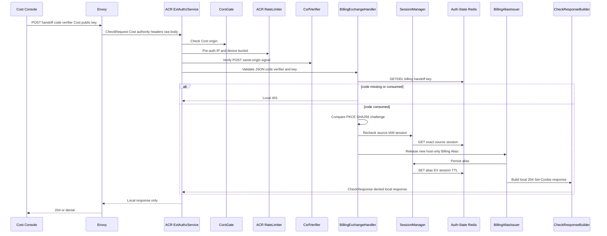

# Billing Alias Exchange — God View (Master SoT)

This ACR-local workflow consumes one Cost PKCE handoff and creates a host-bound
Billing Alias. The alias points to the original IAM session; it contains neither
JWT nor role/permission snapshot.

## API scope and edge-routing contract

`POST /api/v1/billing/auth/exchange` is not an owner API and is never forwarded
to Cost Manager. It accepts only a Cost-origin handoff code, verifier and Cost
Ed25519 public key; the owner context comes solely from the consumed handoff.

Before this exchange, Cost Console's `/auth/start` boot code uses its injected
`cloudConsoleUrl` runtime value to navigate to
`https://cloud.aurora.local/billing/authorize`. That value must name the public
Cloud authority, never the developer-only `https://localhost`; a stale local
origin would redirect the browser to a separate host with no Cloud Trinity
cookies and incorrectly prompt for sign-in. The Cost Console origin itself is
independently selected by Cloud's `costConsoleUrl` runtime value.

## Phase 1 — Cost Console → Envoy → ACR exchanges code

### REST input and output

| Part | Contract |
|---|---|
| Headers used | Cost `Origin`, `User-Agent`; no Cloud cookie is readable on this host |
| JSON payload | opaque `code`, PKCE `code_verifier`, 32-byte Cost `device_public_key` |
| Success | `204`, host-only `__Host-billing_session` and `__Host-billing_session_secret` cookies |
| Failure | state/code/verifier/key invalid, consumed or expired: `401/400`; no Cost API forward |

### Key contract

| Key | Store | Operation / TTL | Invariant |
|---|---|---|---|
| `billing:handoff:{sha256(code)}` | Auth-State Redis | `GETDEL`, 60s | Burned even when verifier is wrong |
| `iam:domain_alias:billing:{alias_id}` | Auth-State Redis | `SET EX SESSION_TTL_SECS` | Alias stores identity/routing, source access key, source proof key, Cost proof public key and secret hash; no source reverse index |

## Complete edge execution

### CheckRequest and headers

The Cost authority sends a `CheckRequest` with the exact exchange path and
bounded raw JSON body. This endpoint is local; no Cost API request exists.

| Header/cookie | Read by | Purpose | Forwarded? |
|---|---|---|---|
| `Origin` | ACR CORS gate | Allow-listed Cost origin check | No |
| `X-Forwarded-For` and `client_device_id` cookie | ACR rate limiter | Pre-auth bucket before exchange | No |
| `X-Requested-With` or `Sec-Fetch-Site` | CSRF verifier | POST same-origin/same-site requirement | No |
| JSON `handoff_code` | exchange handler | Exactly 64 characters; only hashed form addresses Redis | No |
| JSON `code_verifier` | exchange handler | 43–128 byte PKCE verifier; SHA-256 compares to stored challenge | No |
| JSON `device_public_key` | exchange handler | Standard-base64 decoded Ed25519 public key, exactly 32 bytes | Stored as Cost proof public key only |

Cost has no readable Cloud cookies. Client `x-user-*`, source-access fields,
tenant/Zone headers and `x-session-proof-*` cannot select alias identity and
are neither accepted nor emitted.

### Ordered ACR processing

1. Global CORS validation and pre-auth IP/device rate limiting run before the
   local exchange interceptor.
2. `handle_billing_handoff_exchange` matches only `POST` and exact
   `/api/v1/billing/auth/exchange`; it checks CSRF before parsing JSON.
3. It validates handoff code shape, PKCE verifier bounds and device public-key
   encoding/length without logging any value.
4. `GETDEL billing:handoff:{sha256(code)}` atomically consumes the record.
   Missing, expired, malformed or already consumed record is `401`; a failed
   verifier does not restore it.
5. ACR recomputes base64url-no-padding `SHA-256(code_verifier)` and compares it
   exactly to stored `code_challenge`.
6. `SessionManager.get_session` rereads the stored source Zone/tenant/user/
   access-key session and requires its proof public key equal the record's
   source key.
7. `release_billing_alias` generates UUIDv7 alias ID and 64 hex secret,
   stores only SHA-256(secret) in a Prost alias, and writes that single alias
   key with the configured session TTL. Source-session verification remains
   the revocation authority; no cross-slot reverse-index write is required.
8. ACR returns a local `204` with two host-only Cost cookies. It never creates
   a JWT, refresh token, permission snapshot or upstream request.

### Local REST output

| Result | Response headers | Response payload | Upstream |
|---|---|---|---|
| `204` | two `Set-Cookie` values for `__Host-billing_session` and secret; `HttpOnly; Secure; SameSite=Lax; Path=/; Max-Age=session_ttl`; `Cache-Control: no-store` | empty | None |
| `400` | `Content-Type: application/json`, `Cache-Control: no-store` | generic `error_message` for invalid input/key | None |
| `401` | same | generic expired/consumed code, PKCE mismatch or revoked source session | None |
| `403` | ACR CSRF/CORS denial | no alias cookie | None |
| `429` | ACR rate-limit denial | no alias cookie | None |
| `503` | ACR unavailable denial | no alias cookie | None |

Alias registration errors return gRPC `Internal` with
`Failed to save billing alias: ...`, not `Unavailable`. The issuer returns a
compact `AcrError`; the exchange handler constructs that same transport status.
The `503` row applies to earlier unavailable source-session operations, not to
alias registration. Envoy owns rendering a transport-level gRPC error.

## Failure, replay and revocation semantics

`GETDEL` is the consumption boundary: retrying after a network loss cannot
produce a second alias from the same code. Alias registration failure after
consume returns gRPC `Internal`; the user begins a new handoff rather than
reusing burned credentials. The alias expires with session TTL. Every later
alias verification independently rechecks the source session/proof key, so a
source session revoke invalidates the alias without reverse-index enumeration
or cleanup. Billing logout may separately shorten the alias TTL to five seconds.

## State and security invariants

- `GETDEL` makes the code one-time regardless of success, blocking verifier
  brute force and replay.
- ACR rejects a missing/revoked source session before setting any alias cookie.
- Alias verification rechecks the source session on every later Cost request;
  alias existence alone is never sufficient authority.

## Code map

[`acr/src/billing/exchange.rs`](../../acr/src/billing/exchange.rs),
[`acr/src/billing/session.rs`](../../acr/src/billing/session.rs),
[`cost-console/src/lib/store/useAuthStore.ts`](../../cost-console/src/lib/store/useAuthStore.ts).
